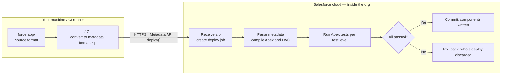
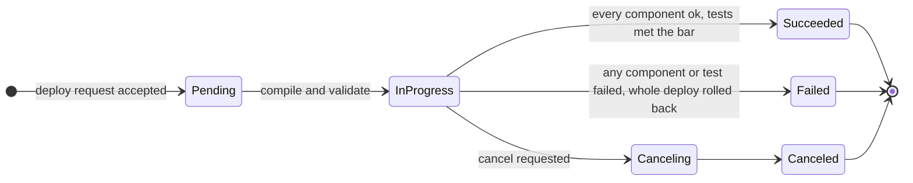

# Deployment Guide

How to deploy this PoC to a **Sandbox**, and the recommended paths to **Production** under a strict network-isolation policy (developer machines cannot reach Salesforce orgs directly).

> Key fact: a Salesforce deployment happens between *the machine running the `sf` CLI* and the Salesforce API — or, with Change Sets / DevOps Center, entirely **cloud-to-cloud inside Salesforce**. Your laptop never needs to reach Production.

**Contents**

| Part | |
|---|---|
| [1 — Deploy to Sandbox](#part-1--deploy-to-sandbox) | The procedure, start to finish |
| [2 — Paths to Production](#part-2--paths-to-production-network-isolated-environments) | Three options under network isolation |
| [3 — How a deploy actually works](#part-3--how-a-deploy-actually-works) | Mechanics: stages, async jobs, rollback, tests |
| [4 — Deleting metadata](#part-4--deleting-metadata-a-deploy-is-an-upsert) | Why `git rm` does not remove anything |
| [5 — Troubleshooting](#part-5--troubleshooting) | Symptom → actual cause → fix |

---

## Part 1 — Deploy to Sandbox

Run these steps on a machine that **can** reach the Sandbox (corporate workstation, VDI, or an approved jump host).

**What this deploy does to the org: it adds things, and changes nothing that is already there.**
That is worth stating precisely, because the target org holds real Account and Contact data
this project does not own:

- It creates three custom objects — `Marketing_Event__c`, `Event_Attendee__c`,
  `Event_Invitee__c` — and the Apex, LWCs, reports, approval process and permission sets that
  work on them. All new; none of it exists in the org today.
- It **modifies no standard object**. No field, layout, record type, picklist or sharing
  setting on Account, Contact or Lead is touched, and the permission sets grant nothing on any
  of them. The import reads and writes exactly one object, and it is one of ours — asserted in
  `AttendeeImportControllerTest.importNeverTouchesContactsLeadsOrAccounts`.
- It **deletes nothing**, so there are no destructive manifests to run. See
  [Part 4](#part-4--deleting-metadata-a-deploy-is-an-upsert) for why that is a deliberate
  absence rather than an omission.
- It adds one **Custom Metadata Type**, `Approval_Chain_Setting__mdt`, with a single `Default`
  record holding the regional-head title markers and the level cap. Configuration, editable in
  Setup without a deploy, and it names nobody.
- Everything the feature needs from outside its own objects — activating a record page,
  assigning permission sets, ★R9 the reporting line and Account ownership the approval chain
  walks — is a **manual post-deploy step**, so an admin decides rather than a deploy imposing
  it. ★R9 That list grew with the multi-level chain: the chain reads `User.ManagerId`,
  `User.Title` and `Account.OwnerId`, and **writes to none of them**. Reading the org chart is
  what routing is; changing it is the org's business.

A failed deploy rolls back whole, so the worst case is an org exactly as it was.

### Step 0: Get the code into the corporate environment

Pick whichever your isolation policy allows:

- **A. Corporate machine can reach GitHub:**
  ```bash
  git clone git@github.com:avence12/salesforce_event_mgmt.git
  ```
- **B. It cannot** — create a git bundle on the outside machine and transfer it through an approved file-transfer channel:
  ```bash
  git bundle create salesforce_event_mgmt.bundle --all   # run in the repo
  ```
  Then on the corporate machine:
  ```bash
  git clone salesforce_event_mgmt.bundle salesforce_event_mgmt
  ```
  A bundle preserves full git history and supports incremental updates later (`git fetch <bundle>`), unlike a zip.

### Step 1: Install the Salesforce CLI

```bash
npm install -g @salesforce/cli
```

If npm is blocked, use the offline installers from developer.salesforce.com/tools/salesforcecli.

### Step 2: Authenticate to the Sandbox

`sf org login web` needs a local browser that can complete an OAuth redirect back to a `localhost` port the CLI opens. That fails on a headless box, a jump host with no GUI, or a workstation where corporate proxy/firewall rules block the loopback callback. If that's your situation, use one of the alternatives below instead — pick the first one that fits.

#### Option A: Device flow — no local browser, no callback port

Prints a short code; you approve it from *any* browser on *any* machine (your phone, another PC) — nothing needs to reach back to the CLI machine.

```bash
sf org login device --alias poc-sandbox --instance-url https://test.salesforce.com
```

The CLI prints a URL and a one-time code. Open the URL anywhere, enter the code, log in, approve. The CLI polls in the background and picks up the session automatically. This is the right default for a browser-less jump host or CI worker that still has *someone* around to click "approve" once.

#### Option B: Auth URL — authenticate once elsewhere, carry the session over

Log in normally on a machine that *can* do the web flow (your laptop), export the resulting session as a single opaque URL, then import it on the restricted machine. No credentials or secrets appear in the file itself beyond the URL string, but treat it as a bearer credential — transfer it over an approved channel and delete it after import.

```bash
# On a machine that CAN complete the web flow:
sf org login web --alias poc-sandbox --instance-url https://test.salesforce.com
sf org display --target-org poc-sandbox --verbose --json \
  | grep sfdxAuthUrl > poc-sandbox.authurl   # contains force://...

# Transfer poc-sandbox.authurl to the restricted machine, then:
sf org login sfdx-url --sfdx-url-file poc-sandbox.authurl --alias poc-sandbox
rm poc-sandbox.authurl   # it's a live credential — don't leave it on disk
```

Good for a one-off "get this specific sandbox usable on this specific locked-down box" without setting up a connected app.

#### Option C: JWT Bearer Flow — fully non-interactive, best for repeat/unattended use

No browser anywhere, ever, once set up. Needs a one-time connected app + certificate setup in the org (an admin can do this from any machine with browser access — it does not have to be the restricted one), then every future login on the restricted machine is fully scripted:

```bash
# One-time setup (see connected app + cert instructions in Part 2, Option 3):
sf org login jwt \
  --client-id <connected-app-consumer-key> \
  --jwt-key-file server.key \
  --username you@example.com.poc-sandbox \
  --instance-url https://test.salesforce.com \
  --alias poc-sandbox
```

This is the same mechanism recommended for CI runners in [Part 2, Option 3](#option-3-in-network-cicd--most-mature-needs-it-support) — worth setting up once if you'll be re-authenticating to this sandbox repeatedly, since after that there's no browser, device code, or file transfer involved at all.

#### Option D: Session ID / access token — quick one-off, short-lived

If you (or an admin) already have a valid session ID from a logged-in browser tab (Setup → search "Sessions", or grab it from the browser's dev tools while logged in), you can hand it to the CLI directly. It expires with the session, so it's only useful for a quick, immediate task, not for scripting:

```bash
sf org login access-token --instance-url https://test.salesforce.com --alias poc-sandbox
# prompts for the access token interactively
```

| Option | Needs a browser at all? | Setup effort | Good for |
|---|---|---|---|
| A. Device flow | Yes, but on any other device | None | One-off login on a headless/jump-host machine |
| B. Auth URL | Yes, once, elsewhere | None | Moving one existing session to a locked-down box |
| C. JWT Bearer | No, never | Connected app + cert (one-time, by an admin) | Repeated logins, CI, unattended jobs |
| D. Access token | Yes, to obtain the token | None | Quick, short-lived, one-off use |

### Step 3: One-time org prechecks (Setup UI)

1. Email deliverability set to "All Email" (Setup → Deliverability) — only needed to demo the notification emails.

### Step 4: Validate, then deploy

Validate first (compiles Apex and checks metadata without changing the org):

```bash
sf project deploy start -o poc-sandbox --dry-run
```

Fix any errors it reports, then deploy and run tests:

```bash
sf project deploy start -o poc-sandbox
sf apex run test -o poc-sandbox --wait 10 --code-coverage
```

### Step 5: Post-deploy setup (~10 minutes)

Every step here is a deliberate manual action. None of it is deployed, because all of it either
touches org-wide configuration or assigns access to real users — decisions an admin should make
rather than inherit from a `git push`.

1. **Activate the record page**: Setup → Object Manager → Marketing Event → Lightning Record Pages → *Marketing Event Record Page* → Activate → **Org Default** (Desktop and Phone).
2. **Assign permission sets**: `Event AM` to the AM users, `Event Approver` to their managers.
3. **★R9 Build the approval chain out of the org's own data.** Routing no longer looks at the
   submitting AM's Manager at all. It starts at the **Account Owner** of the customer each guest
   belongs to and climbs `User.ManagerId`, stopping at the first **Regional Head**. So:
   - every Account whose Contacts will be invited needs an **owner**;
   - that owner needs a `ManagerId`, and so on up as far as you want the chain to reach;
   - whoever ends the chain needs the marker in their **`User.Title`** — shipped as
     `Regional Head`, matched case-insensitively as a substring, so "Regional Head, EMEA" works.
   Both the marker list and the level cap live in **Setup → Custom Metadata Types → Approval
   Chain Setting → Manage Records → Default**: `Regional Head Titles` and `Max Levels Above
   Account Owner` (shipped as 2, giving a three-level chain). Raising the cap to 3 or 4 adds
   levels with no deploy; five is the ceiling the metadata provides.
   **None of this degrades quietly.** A guest with no Account Owner, an inactive approver or a
   chain that reaches only the submitter each refuse the whole batch with a named error and
   leave every row in Draft.
   *If this org does not record a Regional Head in `User.Title`*, leave `Regional Head Titles`
   blank and the chain simply climbs the full cap — or change
   `ApprovalChainService.isRegionalHead`, which is the one method that reads it.
4. **Turn off per-request approval emails** for approver users (Setup → Users → *Receive Approval Request Emails* → **Never**), or they get one email per invitee instead of one per submission. See README's post-deploy step 4 for the alternative.
5. **Share the report folder**: Reports → *Event Management* → share with the AM and approver users.
6. **Seed demo data**:
   ```bash
   sf apex run --file scripts/seed-demo-data.apex -o poc-sandbox
   ```
   It creates attendees and two Marketing Events, and **no Account, Contact or Lead** — so it is safe to run in an org that already has real ones. ★R11 It also tags them via `Event_Topic__c`, reading each event's existing tags first so a re-run does not duplicate them.
7. **★R8 Decide whether AMs may see the linked Contact** — optional, and deliberately not
   deployed. `Event_Attendee__c.Contact__c` records that an imported person also exists as a
   Contact in the org. The field deploys; the **Read access on Contact** that makes it render
   as a name does not, because granting a project's users access to the org's customer data is
   an admin's decision, not a `git push`'s. Without it AMs still see `Is_Known_Contact__c`
   (yes/no), which is the half of the answer this feature actually needs.
   **★R12 The link is populated by the import**, matching each CSV row's `Cust Cd` + `Email`
   against `Account.AccountNumber` + `Contact.Email` and linking only on a single hit. This
   reverses what R8 wrote here. Screen 1 now **reads** Contact and Account; it still writes
   neither, and that is what
   `AttendeeImportControllerTest.importNeverTouchesContactsLeadsOrAccounts` asserts.
   Two consequences for you as the admin. The import needs **no** grant on Contact to do this —
   Apex does not enforce object-level CRUD, so step 7's decision remains purely about what AMs
   *see*. But it is `with sharing`, so **a Contact the importing AM cannot see will not match**;
   if your Contact OWD is Private, expect matching to vary by who runs the import.
8. **★R8 Confirm where this org keeps the customer code — ★R12 and it now matters more.** The
   code arrives in the CSV as `Cust Cd` and lands on `Event_Attendee__c.Cust_Cd__c`;
   `Event_Invitee__c.Cust_Cd__c` is snapshotted from there. What still touches your Account is
   the **matching**: the import compares the CSV's code against the standard
   `Account.AccountNumber`, because that is the field every org has and the one that means
   "customer account number". If your org keeps it on a custom field instead, change the single
   query in `AttendeeImportController.matchContacts` — no schema change here, and no field is
   ever added to Account by this project.
   **Why this is now a step you should actually do rather than note.** Under R8 a wrong guess
   meant one column read oddly. Under R12 it is half of a matching key, so a wrong guess means
   **nothing matches at all** — every attendee imports unlinked and every invitee falls back to
   free-text company, quietly and with no error.
9. **★R8 Optional — hide the approval component from users who never approve.** *Approvals by
    Company* ships on the Marketing Event record page above the attendee selector. An AM who is
    nobody's approver sees it in its empty state, which is one line of text rather than an empty
    table. If that is unwanted, add a component visibility filter on the page or assign a
    second record page by profile. Both change how your org's pages are laid out, so neither is
    deployed from here.
10. **★R9 Create the non-customer-guest Account, and reconcile the guests behind it** —
    required before any such guest can be submitted, and a decision only the business can make.
    Professors, journalists and anyone else who is nobody's customer reach no Account Owner and
    therefore have no approval chain; the submit refuses them by design rather than routing them
    to somebody's manager, because a fallback would turn a data gap into a weaker approval.

    **This project will not do any of the steps below for you.** No code in this repo creates,
    updates or deletes an Account, Contact or Lead — that invariant is what makes the deploy safe
    against a populated org, and it is asserted in the test suite
    (`importNeverTouchesContactsLeadsOrAccounts`). Everything from here is manual, admin-run data
    entry in Setup, not a deploy step.

    a. **Decide the shape.** One Account for every non-customer guest, or several — e.g. one per
       region, so a different Regional Head can own each. Either fits the design; more Accounts
       means more level-1 owners and therefore more independent approval chains to watch.
    b. **Create the Account(s).** App Launcher → Accounts → New. Name it so no customer-count
       report or downstream integration ever mistakes it for a real customer — e.g.
       `ZZ Non-Customer Guests — <region>`. Set **Owner** to whoever should be level 1 for these
       guests; that owner's manager becomes level 2, exactly as for a real customer.
    c. **Create a Contact under that Account for each non-customer guest** who needs to be
       invited. App Launcher → Contacts → New, `Account Name` = the Account from step b. This is
       ordinary Salesforce data entry — nothing in this repo does it, and nothing here needs to.
    d. **Link each guest's `Event_Attendee__c.Contact__c`** to the Contact created in step c.
       ★R12 There are now two ways to do this. Give the guest's CSV row the `Cust Cd` of the
       Account from step b and make sure their `Email` matches the Contact's, and the **import
       links them for you** on the next upload — which is the tidier route if you are seeding
       these guests from a file anyway. Otherwise a one-off manual edit on each
       `Event_Attendee__c` record does it. Either way this is admin data work, not a deploy step.
    e. **For the demo specifically, leave at least one guest unlinked.** Success Criterion 7
       depends on a guest with no Account Owner being refused by name — the seed data's
       `Hélène Dubois` is written to be that guest. Reconciling her along with everyone else
       would silently remove the one scenario that demonstrates the refusal path.
    f. **Verify, read-only, before demoing:**
       ```sql
       -- attendees still missing a Contact link (each one will refuse to submit)
       SELECT Id, Name, Company__c FROM Event_Attendee__c WHERE Contact__c = null

       -- confirms the bucket Account resolves to a level-1 owner
       SELECT Id, Name, OwnerId FROM Account WHERE Name LIKE 'ZZ Non-Customer Guests%'
       ```
11. **★R9 Verify the chain in the org before demonstrating it**, because two pieces of it cannot
    be verified from the repo:
    - **A short chain must finish where it ends.** Submit an invitee whose chain has two levels
      and confirm that approving both marks it Approved — the third step is skipped because
      `Approver_3__c` is blank. If instead it final-approves after level 1, the step's
      *else* behaviour is not what this design assumes and steps 2–5 need `Go to Next Step`.
    - **Level 2 must be told.** Approve level 1 and watch for the level-2 approver's email and
      bell. That notification comes from a step approval action updating `Current_Level__c`,
      which fires the `Invitee_Level_Advanced` flow. If the chain of events does not hold, the
      symptom is silence: the item sits in their Approvals list unannounced.
12. Demo import file: `demo-data/FinTech_Summit_2026_Attendees.csv`. Follow the demo script in [README.md](README.md).

---

## Part 2 — Paths to Production (network-isolated environments)

Three options, ordered by isolation-friendliness:

### Option 1: Change Sets — zero local connectivity (recommended first)

Deployment traffic is entirely **Salesforce cloud-to-cloud** (Sandbox → Production); no machine outside Salesforce participates.

1. Deploy the PoC to a sandbox **created from Production** (they share a deployment connection).
2. In the sandbox: Setup → Outbound Change Sets → add all components → Upload to Production.
3. In Production: Setup → Inbound Change Sets → **Validate** (runs tests) → review → **Deploy**.

*Pros*: admins need only a browser; auditable in the Setup UI; no API allow-listing.
*Cons*: manual clicking; tedious for large component lists; a few metadata types unsupported (everything in this PoC — objects, Apex, LWC, flexipages, permission sets — is supported).

Best choice for the first production deployment of this PoC.

### Option 2: Salesforce DevOps Center — official, free, runs on Salesforce

DevOps Center is a Salesforce-hosted application: the pipeline (dev sandbox → UAT → Production) executes **inside the Salesforce cloud** — no CI runner needed. It integrates with corporate Git (e.g., GitHub Enterprise). The right medium-term path if this feature keeps evolving after the PoC.

### Option 3: In-network CI/CD — most mature, needs IT support

Code lives in the internal Git; a CI runner (Jenkins / GitLab CI) in a network segment allow-listed for the Production API runs:

```bash
sf project deploy start -o prod --test-level RunLocalTests
```

Authenticate the runner with the **JWT Bearer Flow** (connected app + certificate — non-interactive, suited to unattended jobs). Developers only push code and open PRs; nobody's laptop ever touches Production. Commercial equivalents: Gearset, Copado. The long-term answer once multiple Salesforce projects share the pipeline.

### Pre-production checklist (whichever path you choose)

- **75% Apex test coverage** is a hard Salesforce requirement for production deploys — the two test classes in this repo exist for that; confirm the `--code-coverage` numbers in sandbox first.
- Close the known PoC hardening gaps (see "Known PoC limits" in [README.md](README.md)): a sharing model for `Event_Attendee__c` tighter than Public Read/Write, bulk-volume testing, and a full FLS review.
- Use **Validate + Quick Deploy**: validate against Production ahead of time (runs tests, changes nothing), then one-click quick-deploy inside the release window — cuts deployment risk to minutes. See [Part 3](#validate-deploy-quick-deploy) for the mechanics.

**Recommendation**: Change Sets for the demo/short term → DevOps Center if the PoC is productized → in-network CI/CD at scale.

---

## Part 3 — How a deploy actually works

Worth reading once, because three of the most common deployment surprises follow directly from it: why a CLI timeout does not mean the deploy failed, why a half-applied deploy never happens, and why deleting a file from the repo leaves the component sitting in the org.

A deploy is **not** a file copy. It is one API call that hands a bundle of metadata to the org; the *org* then compiles it, validates it, runs the tests, and decides to accept or reject the whole thing. Your machine only starts the job.



Only the middle arrow crosses a network boundary. Everything to its right happens inside Salesforce — which is precisely why Change Sets and DevOps Center can deploy to Production without any machine of yours reaching it.

### The seven stages

1. **Read `sfdx-project.json`** *(local)* — `packageDirectories` decides what gets packaged (here: `force-app`), and `sourceApiVersion` (61.0) tells the org which Metadata API semantics to read your components with.
2. **Source format → metadata format** *(local)* — the repo layout is split up for git's benefit (one file per custom field, for instance). The CLI reassembles it into the shape the Metadata API expects and generates a `package.xml` listing every component.
3. **Zip and upload** *(local → cloud)* — sent via the Metadata API `deploy()` call along with `checkOnly` and `testLevel`. This is the only step that crosses the network boundary.
4. **Job created, id returned** *(cloud)* — the org does not wait for completion. It queues the work and returns a job id (`0Af…`) immediately; the CLI then polls it. **A dropped connection does not cancel the deploy.**
5. **Parse and compile** *(cloud)* — Apex compiles, LWC bundles, field types and references are checked, permission sets are verified against the fields they grant. Dependency order is Salesforce's problem, not yours: objects and the Apex referencing them can go in the same deploy.
6. **Run Apex tests** *(cloud)* — per `testLevel`. Sandbox runs none by default; Production always runs them when Apex is included.
7. **Commit or roll back** *(cloud)* — **transactional and all-or-nothing.** One failed component or one failed test discards the entire deploy and the org returns to its previous state.

### It is an asynchronous job

The CLI looks like it is blocking; it is actually polling and redrawing a progress bar.

```mermaid
sequenceDiagram
  autonumber
  participant CLI as sf CLI on your machine
  participant API as Metadata API
  participant ORG as Org execution engine

  CLI->>CLI: convert source to metadata, zip
  CLI->>API: deploy(zip, checkOnly, testLevel)
  API-->>CLI: job id 0Af... returned immediately
  Note over CLI,API: the connection may drop here;<br/>the job keeps running inside the org

  loop CLI polls every few seconds
    CLI->>API: check deploy status(job id)
    API-->>CLI: Pending / InProgress + components completed
  end

  ORG->>ORG: compile, validate, run tests
  ORG-->>API: result
  API-->>CLI: Succeeded / Failed + component errors + coverage
```

So a `--wait` timeout means "stopped watching", not "failed". Reconnect rather than re-running blindly:

```bash
sf project deploy report --job-id 0Af…    # what actually happened
sf project deploy resume --job-id 0Af…    # reattach to a running deploy
sf project deploy cancel --job-id 0Af…    # stop one that has not finished
```

### Job states and the rollback guarantee



Only **Succeeded** changes the org. Failed and Canceled both guarantee a return to the pre-deploy state.

> One boundary on that guarantee: rollback covers **metadata**. It does not undo **data** written during the deploy by triggers or post-install logic. Irrelevant to this PoC, but worth knowing before a deploy with data side effects.

### Validate, deploy, quick deploy

All three run the *same* validation and tests. The only differences are the `checkOnly` flag and whether a previous validation result is reused. The value is being able to move the slow part — running the full test suite — outside the release window.

```bash
# 1. Validate ahead of time: full compile + tests, org untouched
sf project deploy start -o poc-sandbox --dry-run

# 2. Inside the release window: apply the already-validated result, tests not re-run
sf project deploy quick --use-most-recent -o poc-sandbox

# …or do both at once, which is what Part 1 Step 4 does for the sandbox
sf project deploy start -o poc-sandbox
```

Salesforce keeps a successful validation available for quick deploy for a limited window (10 days at the time of writing); past that, validate again.

### Test levels and the 75% bar

| Level | Runs | When |
|---|---|---|
| `NoTestRun` | nothing | Sandbox default. Fast iteration; Production rejects it. |
| `RunSpecifiedTests` | only the classes you name | Partial deploys in large orgs. Still subject to the coverage bar. |
| `RunLocalTests` | every test outside managed packages | **The de facto Production standard** — what a production deploy containing Apex falls back to. |
| `RunAllTestsInOrg` | everything, managed packages included | Most conservative and slowest. Full regression before a major upgrade. |

Two hard gates on Production, both computed **org-side** — local numbers do not count:

- **75% org-wide Apex coverage.** Below it, the whole deploy fails.
- **Every trigger needs at least one covered line.** Zero is not allowed.

```bash
sf apex run test -o poc-sandbox --wait 10 --code-coverage

sf project deploy start -o prod --test-level RunLocalTests

sf project deploy start -o prod --test-level RunSpecifiedTests \
  --tests AttendeeImportControllerTest --tests EventWorkflowTest
```

---

## Part 4 — Deleting metadata (a deploy is an upsert)

The counterintuitive one, and the reason orgs accumulate dead components: **removing a component from the repo does not remove it from the org.** A deploy means "make sure these components exist and look like this" — never "make the org match this directory".

It matters here the moment this project has been deployed more than once. Nothing of ours is in any org yet, so the repo ships **no destructive manifests** — there is nothing left behind to clean up, and naming a component that does not exist in the target org fails the whole deploy. The example below is the shape to reach for the first time you remove a component *after* a deploy has happened.

```mermaid
flowchart TB
  subgraph EXPECTED["What people expect"]
    W1["git rm the component"] --> W2["sf project deploy start"] --> W3["gone from the org"]
  end

  subgraph ACTUAL["What happens"]
    R1["git rm the component"] --> R2["sf project deploy start"]
    R2 --> R3["package.xml no longer lists it,<br/>so the org is never told to delete it"]
    R3 --> R4["still there, untouched"]
  end

  subgraph CORRECT["What actually removes it"]
    F1["destructiveChangesPost.xml<br/>naming the component"] --> F2["plus a package.xml"]
    F2 --> F3["deploy start --post-destructive-changes"] --> F4["removed from the org"]
  end
```



Deletions must be **declared**. `destructiveChangesPre.xml` runs *before* the rest of the deploy, `destructiveChangesPost.xml` *after* — use Post when removing something that may still be referenced until the new components land.

```xml
<!-- manifest/destructiveChangesPost.xml -->
<?xml version="1.0" encoding="UTF-8"?>
<Package xmlns="http://soap.sforce.com/2006/04/metadata">
    <types>
        <members>sheetjs</members>
        <name>StaticResource</name>
    </types>
</Package>
```

```xml
<!-- manifest/package.xml — must exist, may list no components -->
<?xml version="1.0" encoding="UTF-8"?>
<Package xmlns="http://soap.sforce.com/2006/04/metadata">
    <version>61.0</version>
</Package>
```

```bash
# Validate first — deletions cannot be undone
sf project deploy start -o poc-sandbox --dry-run \
  --manifest manifest/package.xml \
  --post-destructive-changes manifest/destructiveChangesPost.xml

# Then apply
sf project deploy start -o poc-sandbox \
  --manifest manifest/package.xml \
  --post-destructive-changes manifest/destructiveChangesPost.xml
```

For this PoC the leftover `sheetjs` is harmless dead weight — `importWizard` no longer references it in any way. Clean it up with the above when convenient; leaving it costs nothing but storage.

---

## Part 5 — Troubleshooting

| Symptom | Actual cause | Fix |
|---|---|---|
| Coverage below 75% fails the whole deploy | the number is computed org-side, not from your local run | confirm with `--code-coverage` in the sandbox before going to Production |
| A component you deleted is still in the org | a deploy is an upsert, not a sync | write a destructiveChanges manifest — [Part 4](#part-4--deleting-metadata-a-deploy-is-an-upsert). None ships in this repo; nothing of ours has been deployed yet |
| Permission set fails with "field does not exist" | it grants a field that is not in this deploy's scope | include the field in the deploy, or drop the entry |
| CLI timed out; unclear whether anything applied | deploys are async — a timeout only stops the waiting | `sf project deploy report --job-id` before re-running anything |
| Record page deployed but users cannot see it | the FlexiPage deployed; **activation is not metadata** | activate as Org Default in Setup — Part 1, Step 5 |
| Works in sandbox, fails in Production | Production forces tests; sandbox runs none by default | `--dry-run` against Production before the release window |
| `INVALID_CROSS_REFERENCE_KEY` on a flexipage | it references a component or tab not yet in the org | deploy the whole package together rather than a subset |
| `sf org login web` hangs or errors with no browser / connection refused | no local browser, or a proxy/firewall blocks the `localhost` OAuth callback | use device flow, auth URL, JWT, or access-token login instead — [Part 1, Step 2](#step-2-authenticate-to-the-sandbox) |

---
