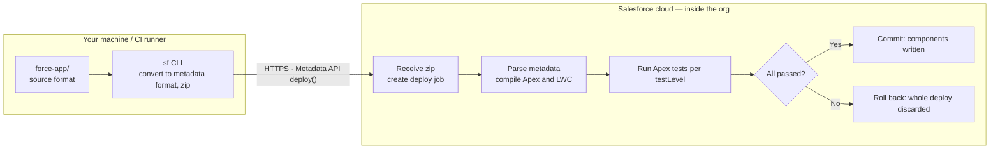
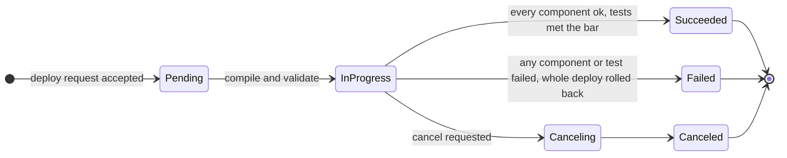

# Deployment Guide

How to deploy this PoC to a **Sandbox**, and the recommended paths to **Production** under a strict network-isolation policy (developer machines cannot reach Salesforce orgs directly).

> Key fact: a Salesforce deployment happens between *the machine running the `sf` CLI* and the Salesforce API — or, with Change Sets / DevOps Center, entirely **cloud-to-cloud inside Salesforce**. Your laptop never needs to reach Production.

**Contents**

| Part | |
|---|---|
| [1 — Deploy to Sandbox](#part-1--deploy-to-sandbox) | The procedure, start to finish |
| [2 — Paths to Production](#part-2--paths-to-production-network-isolated-environments) | Three options under network isolation |
| [3 — How a deploy actually works](#part-3--how-a-deploy-actually-works) | Mechanics: stages, async jobs, rollback, tests |
| [4 — Deleting metadata](#part-4--deleting-metadata-a-deploy-is-an-upsert) | Why `git rm` does not remove anything |
| [5 — Troubleshooting](#part-5--troubleshooting) | Symptom → actual cause → fix |

---

## Part 1 — Deploy to Sandbox

Run these steps on a machine that **can** reach the Sandbox (corporate workstation, VDI, or an approved jump host).

### Step 0: Get the code into the corporate environment

Pick whichever your isolation policy allows:

- **A. Corporate machine can reach GitHub:**
  ```bash
  git clone git@github.com:avence12/salesforce_event_mgmt.git
  ```
- **B. It cannot** — create a git bundle on the outside machine and transfer it through an approved file-transfer channel:
  ```bash
  git bundle create salesforce_event_mgmt.bundle --all   # run in the repo
  ```
  Then on the corporate machine:
  ```bash
  git clone salesforce_event_mgmt.bundle salesforce_event_mgmt
  ```
  A bundle preserves full git history and supports incremental updates later (`git fetch <bundle>`), unlike a zip.

### Step 1: Install the Salesforce CLI

```bash
npm install -g @salesforce/cli
```

If npm is blocked, use the offline installers from developer.salesforce.com/tools/salesforcecli.

### Step 2: Authenticate to the Sandbox

`sf org login web` needs a local browser that can complete an OAuth redirect back to a `localhost` port the CLI opens. That fails on a headless box, a jump host with no GUI, or a workstation where corporate proxy/firewall rules block the loopback callback. If that's your situation, use one of the alternatives below instead — pick the first one that fits.

#### Option A: Device flow — no local browser, no callback port

Prints a short code; you approve it from *any* browser on *any* machine (your phone, another PC) — nothing needs to reach back to the CLI machine.

```bash
sf org login device --alias poc-sandbox --instance-url https://test.salesforce.com
```

The CLI prints a URL and a one-time code. Open the URL anywhere, enter the code, log in, approve. The CLI polls in the background and picks up the session automatically. This is the right default for a browser-less jump host or CI worker that still has *someone* around to click "approve" once.

#### Option B: Auth URL — authenticate once elsewhere, carry the session over

Log in normally on a machine that *can* do the web flow (your laptop), export the resulting session as a single opaque URL, then import it on the restricted machine. No credentials or secrets appear in the file itself beyond the URL string, but treat it as a bearer credential — transfer it over an approved channel and delete it after import.

```bash
# On a machine that CAN complete the web flow:
sf org login web --alias poc-sandbox --instance-url https://test.salesforce.com
sf org display --target-org poc-sandbox --verbose --json \
  | grep sfdxAuthUrl > poc-sandbox.authurl   # contains force://...

# Transfer poc-sandbox.authurl to the restricted machine, then:
sf org login sfdx-url --sfdx-url-file poc-sandbox.authurl --alias poc-sandbox
rm poc-sandbox.authurl   # it's a live credential — don't leave it on disk
```

Good for a one-off "get this specific sandbox usable on this specific locked-down box" without setting up a connected app.

#### Option C: JWT Bearer Flow — fully non-interactive, best for repeat/unattended use

No browser anywhere, ever, once set up. Needs a one-time connected app + certificate setup in the org (an admin can do this from any machine with browser access — it does not have to be the restricted one), then every future login on the restricted machine is fully scripted:

```bash
# One-time setup (see connected app + cert instructions in Part 2, Option 3):
sf org login jwt \
  --client-id <connected-app-consumer-key> \
  --jwt-key-file server.key \
  --username you@example.com.poc-sandbox \
  --instance-url https://test.salesforce.com \
  --alias poc-sandbox
```

This is the same mechanism recommended for CI runners in [Part 2, Option 3](#option-3-in-network-cicd--most-mature-needs-it-support) — worth setting up once if you'll be re-authenticating to this sandbox repeatedly, since after that there's no browser, device code, or file transfer involved at all.

#### Option D: Session ID / access token — quick one-off, short-lived

If you (or an admin) already have a valid session ID from a logged-in browser tab (Setup → search "Sessions", or grab it from the browser's dev tools while logged in), you can hand it to the CLI directly. It expires with the session, so it's only useful for a quick, immediate task, not for scripting:

```bash
sf org login access-token --instance-url https://test.salesforce.com --alias poc-sandbox
# prompts for the access token interactively
```

| Option | Needs a browser at all? | Setup effort | Good for |
|---|---|---|---|
| A. Device flow | Yes, but on any other device | None | One-off login on a headless/jump-host machine |
| B. Auth URL | Yes, once, elsewhere | None | Moving one existing session to a locked-down box |
| C. JWT Bearer | No, never | Connected app + cert (one-time, by an admin) | Repeated logins, CI, unattended jobs |
| D. Access token | Yes, to obtain the token | None | Quick, short-lived, one-off use |

### Step 3: One-time org prechecks (Setup UI)

1. Email deliverability set to "All Email" (Setup → Deliverability) — only needed to demo the notification emails.

### Step 4: Validate, then deploy

Validate first (compiles Apex and checks metadata without changing the org):

```bash
sf project deploy start -o poc-sandbox --dry-run
```

Fix any errors it reports, then deploy and run tests:

```bash
sf project deploy start -o poc-sandbox
sf apex run test -o poc-sandbox --wait 10 --code-coverage
```

### Step 5: Post-deploy setup (~5 minutes)

1. **Activate the record page**: Setup → Object Manager → Marketing Event → Lightning Record Pages → *Marketing Event Record Page* → Activate → **Org Default** (Desktop and Phone).
2. **Assign permission sets**: `Event AM` to the AM demo users, `Event Approver` to the Account Owner demo users.
3. **Seed demo data** — edit the two owner usernames at the top of the script, then:
   ```bash
   sf apex run --file scripts/seed-demo-data.apex -o poc-sandbox
   ```
4. Demo import file: `demo-data/FinTech_Summit_2026_Attendees.csv`. Follow the 5-minute demo script in [README.md](README.md).

---

## Part 2 — Paths to Production (network-isolated environments)

Three options, ordered by isolation-friendliness:

### Option 1: Change Sets — zero local connectivity (recommended first)

Deployment traffic is entirely **Salesforce cloud-to-cloud** (Sandbox → Production); no machine outside Salesforce participates.

1. Deploy the PoC to a sandbox **created from Production** (they share a deployment connection).
2. In the sandbox: Setup → Outbound Change Sets → add all components → Upload to Production.
3. In Production: Setup → Inbound Change Sets → **Validate** (runs tests) → review → **Deploy**.

*Pros*: admins need only a browser; auditable in the Setup UI; no API allow-listing.
*Cons*: manual clicking; tedious for large component lists; a few metadata types unsupported (everything in this PoC — objects, Apex, LWC, flexipages, permission sets — is supported).

Best choice for the first production deployment of this PoC.

### Option 2: Salesforce DevOps Center — official, free, runs on Salesforce

DevOps Center is a Salesforce-hosted application: the pipeline (dev sandbox → UAT → Production) executes **inside the Salesforce cloud** — no CI runner needed. It integrates with corporate Git (e.g., GitHub Enterprise). The right medium-term path if this feature keeps evolving after the PoC.

### Option 3: In-network CI/CD — most mature, needs IT support

Code lives in the internal Git; a CI runner (Jenkins / GitLab CI) in a network segment allow-listed for the Production API runs:

```bash
sf project deploy start -o prod --test-level RunLocalTests
```

Authenticate the runner with the **JWT Bearer Flow** (connected app + certificate — non-interactive, suited to unattended jobs). Developers only push code and open PRs; nobody's laptop ever touches Production. Commercial equivalents: Gearset, Copado. The long-term answer once multiple Salesforce projects share the pipeline.

### Pre-production checklist (whichever path you choose)

- **75% Apex test coverage** is a hard Salesforce requirement for production deploys — the two test classes in this repo exist for that; confirm the `--code-coverage` numbers in sandbox first.
- Close the known PoC hardening gaps (see "Known PoC limits" in [README.md](README.md)): a sharing model for `Event_Attendee__c` tighter than Public Read/Write, bulk-volume testing, and a full FLS review.
- Use **Validate + Quick Deploy**: validate against Production ahead of time (runs tests, changes nothing), then one-click quick-deploy inside the release window — cuts deployment risk to minutes. See [Part 3](#validate-deploy-quick-deploy) for the mechanics.

**Recommendation**: Change Sets for the demo/short term → DevOps Center if the PoC is productized → in-network CI/CD at scale.

---

## Part 3 — How a deploy actually works

Worth reading once, because three of the most common deployment surprises follow directly from it: why a CLI timeout does not mean the deploy failed, why a half-applied deploy never happens, and why deleting a file from the repo leaves the component sitting in the org.

A deploy is **not** a file copy. It is one API call that hands a bundle of metadata to the org; the *org* then compiles it, validates it, runs the tests, and decides to accept or reject the whole thing. Your machine only starts the job.



Only the middle arrow crosses a network boundary. Everything to its right happens inside Salesforce — which is precisely why Change Sets and DevOps Center can deploy to Production without any machine of yours reaching it.

### The seven stages

1. **Read `sfdx-project.json`** *(local)* — `packageDirectories` decides what gets packaged (here: `force-app`), and `sourceApiVersion` (61.0) tells the org which Metadata API semantics to read your components with.
2. **Source format → metadata format** *(local)* — the repo layout is split up for git's benefit (one file per custom field, for instance). The CLI reassembles it into the shape the Metadata API expects and generates a `package.xml` listing every component.
3. **Zip and upload** *(local → cloud)* — sent via the Metadata API `deploy()` call along with `checkOnly` and `testLevel`. This is the only step that crosses the network boundary.
4. **Job created, id returned** *(cloud)* — the org does not wait for completion. It queues the work and returns a job id (`0Af…`) immediately; the CLI then polls it. **A dropped connection does not cancel the deploy.**
5. **Parse and compile** *(cloud)* — Apex compiles, LWC bundles, field types and references are checked, permission sets are verified against the fields they grant. Dependency order is Salesforce's problem, not yours: objects and the Apex referencing them can go in the same deploy.
6. **Run Apex tests** *(cloud)* — per `testLevel`. Sandbox runs none by default; Production always runs them when Apex is included.
7. **Commit or roll back** *(cloud)* — **transactional and all-or-nothing.** One failed component or one failed test discards the entire deploy and the org returns to its previous state.

### It is an asynchronous job

The CLI looks like it is blocking; it is actually polling and redrawing a progress bar.

```mermaid
sequenceDiagram
  autonumber
  participant CLI as sf CLI on your machine
  participant API as Metadata API
  participant ORG as Org execution engine

  CLI->>CLI: convert source to metadata, zip
  CLI->>API: deploy(zip, checkOnly, testLevel)
  API-->>CLI: job id 0Af... returned immediately
  Note over CLI,API: the connection may drop here;<br/>the job keeps running inside the org

  loop CLI polls every few seconds
    CLI->>API: check deploy status(job id)
    API-->>CLI: Pending / InProgress + components completed
  end

  ORG->>ORG: compile, validate, run tests
  ORG-->>API: result
  API-->>CLI: Succeeded / Failed + component errors + coverage
```

So a `--wait` timeout means "stopped watching", not "failed". Reconnect rather than re-running blindly:

```bash
sf project deploy report --job-id 0Af…    # what actually happened
sf project deploy resume --job-id 0Af…    # reattach to a running deploy
sf project deploy cancel --job-id 0Af…    # stop one that has not finished
```

### Job states and the rollback guarantee



Only **Succeeded** changes the org. Failed and Canceled both guarantee a return to the pre-deploy state.

> One boundary on that guarantee: rollback covers **metadata**. It does not undo **data** written during the deploy by triggers or post-install logic. Irrelevant to this PoC, but worth knowing before a deploy with data side effects.

### Validate, deploy, quick deploy

All three run the *same* validation and tests. The only differences are the `checkOnly` flag and whether a previous validation result is reused. The value is being able to move the slow part — running the full test suite — outside the release window.

```bash
# 1. Validate ahead of time: full compile + tests, org untouched
sf project deploy start -o poc-sandbox --dry-run

# 2. Inside the release window: apply the already-validated result, tests not re-run
sf project deploy quick --use-most-recent -o poc-sandbox

# …or do both at once, which is what Part 1 Step 4 does for the sandbox
sf project deploy start -o poc-sandbox
```

Salesforce keeps a successful validation available for quick deploy for a limited window (10 days at the time of writing); past that, validate again.

### Test levels and the 75% bar

| Level | Runs | When |
|---|---|---|
| `NoTestRun` | nothing | Sandbox default. Fast iteration; Production rejects it. |
| `RunSpecifiedTests` | only the classes you name | Partial deploys in large orgs. Still subject to the coverage bar. |
| `RunLocalTests` | every test outside managed packages | **The de facto Production standard** — what a production deploy containing Apex falls back to. |
| `RunAllTestsInOrg` | everything, managed packages included | Most conservative and slowest. Full regression before a major upgrade. |

Two hard gates on Production, both computed **org-side** — local numbers do not count:

- **75% org-wide Apex coverage.** Below it, the whole deploy fails.
- **Every trigger needs at least one covered line.** Zero is not allowed.

```bash
sf apex run test -o poc-sandbox --wait 10 --code-coverage

sf project deploy start -o prod --test-level RunLocalTests

sf project deploy start -o prod --test-level RunSpecifiedTests \
  --tests AttendeeImportControllerTest --tests EventWorkflowTest
```

---

## Part 4 — Deleting metadata (a deploy is an upsert)

The counterintuitive one, and the reason orgs accumulate dead components: **removing a component from the repo does not remove it from the org.** A deploy means "make sure these components exist and look like this" — never "make the org match this directory".

This repo has a live example. When the contact import moved from `.xlsx` to `.csv`, the 861 KB `sheetjs` static resource was deleted from source — but it is **still present in every sandbox it was previously deployed to**.

```mermaid
flowchart TB
  subgraph EXPECTED["What people expect"]
    W1["git rm sheetjs.js"] --> W2["sf project deploy start"] --> W3["sheetjs gone from the org"]
  end

  subgraph ACTUAL["What happens"]
    R1["git rm sheetjs.js"] --> R2["sf project deploy start"]
    R2 --> R3["package.xml no longer lists sheetjs,<br/>so the org is never told to delete it"]
    R3 --> R4["sheetjs untouched in the org"]
  end

  subgraph CORRECT["What actually removes it"]
    F1["destructiveChangesPost.xml<br/>naming StaticResource: sheetjs"] --> F2["plus a package.xml"]
    F2 --> F3["deploy start --post-destructive-changes"] --> F4["sheetjs removed from the org"]
  end
```



Deletions must be **declared**. `destructiveChangesPre.xml` runs *before* the rest of the deploy, `destructiveChangesPost.xml` *after* — use Post when removing something that may still be referenced until the new components land.

```xml
<!-- manifest/destructiveChangesPost.xml -->
<?xml version="1.0" encoding="UTF-8"?>
<Package xmlns="http://soap.sforce.com/2006/04/metadata">
    <types>
        <members>sheetjs</members>
        <name>StaticResource</name>
    </types>
</Package>
```

```xml
<!-- manifest/package.xml — must exist, may list no components -->
<?xml version="1.0" encoding="UTF-8"?>
<Package xmlns="http://soap.sforce.com/2006/04/metadata">
    <version>61.0</version>
</Package>
```

```bash
# Validate first — deletions cannot be undone
sf project deploy start -o poc-sandbox --dry-run \
  --manifest manifest/package.xml \
  --post-destructive-changes manifest/destructiveChangesPost.xml

# Then apply
sf project deploy start -o poc-sandbox \
  --manifest manifest/package.xml \
  --post-destructive-changes manifest/destructiveChangesPost.xml
```

For this PoC the leftover `sheetjs` is harmless dead weight — `importWizard` no longer references it in any way. Clean it up with the above when convenient; leaving it costs nothing but storage.

---

## Part 5 — Troubleshooting

| Symptom | Actual cause | Fix |
|---|---|---|
| Coverage below 75% fails the whole deploy | the number is computed org-side, not from your local run | confirm with `--code-coverage` in the sandbox before going to Production |
| A component you deleted is still in the org | a deploy is an upsert, not a sync | declare it in destructiveChanges — [Part 4](#part-4--deleting-metadata-a-deploy-is-an-upsert) |
| Permission set fails with "field does not exist" | it grants a field that is not in this deploy's scope | include the field in the deploy, or drop the entry |
| CLI timed out; unclear whether anything applied | deploys are async — a timeout only stops the waiting | `sf project deploy report --job-id` before re-running anything |
| Record page deployed but users cannot see it | the FlexiPage deployed; **activation is not metadata** | activate as Org Default in Setup — Part 1, Step 5 |
| Works in sandbox, fails in Production | Production forces tests; sandbox runs none by default | `--dry-run` against Production before the release window |
| `INVALID_CROSS_REFERENCE_KEY` on a flexipage | it references a component or tab not yet in the org | deploy the whole package together rather than a subset |
| `sf org login web` hangs or errors with no browser / connection refused | no local browser, or a proxy/firewall blocks the `localhost` OAuth callback | use device flow, auth URL, JWT, or access-token login instead — [Part 1, Step 2](#step-2-authenticate-to-the-sandbox) |

---

## Part 6 — R3 upgrade checklist

R3 replaced the approval console with a standard **Approval Process** and the export
screens with **reports**, and made invitees point at either a Contact or a **Lead**.
Work top to bottom; the ordering is load-bearing in sections B–D.

**Two paths.** On a **fresh org**, skip section B entirely and skip step D7 — there is
nothing to migrate. On an org that **already has R2**, every step applies, and section B
is not optional: R3 removes a value from a restricted picklist that existing records sit on.

### A. Before touching an org

- [ ] `git pull` the branch and confirm you are on the R3 commit (`git log --oneline -1`)
- [ ] `npm install && npm test` — 174 LWC tests pass
- [ ] `npm run lint` and `npx prettier --check "force-app/**/*.{js,cls}"` — clean
- [ ] `scripts/quality/run-pmd.sh` — **expect this to fail the first time.** The baseline was pruned of the deleted classes but never re-recorded against the new Lead DML. Read the new findings: if they are the same CRUD/FLS class as the existing ones, `--update`; if they are not, they are real. See [QUALITY.md](QUALITY.md)
- [ ] Read the *Known PoC limits* in [README.md](README.md) — two capabilities are gone on purpose (download tracking; formula-injection sanitising on the approved-list export)

### B. Pre-deploy data migration — existing orgs only

- [ ] Note the current counts, so you can prove the migration did what it claims:
  ```bash
  sf data query -o poc-sandbox \
    -q "SELECT Status__c, COUNT(Id) FROM Event_Invitee__c GROUP BY Status__c"
  ```
- [ ] Move every `Exported` invitee to `Approved` — **a restricted picklist cannot lose a value that records still hold**, so this must happen before the deploy, not after:
  ```bash
  sf apex run --file scripts/r3-pre-deploy.apex -o poc-sandbox
  ```
- [ ] Re-run the count query and confirm `Exported` is now zero
- [ ] Note how many rows are `Pending Approval` — section D7 adopts exactly those

### C. Deploy — fresh org

Nothing to delete, so no manifests: naming a component that does not exist in the org can
fail the whole deploy.

- [ ] Validate — compiles the Apex and checks the metadata without touching the org:
  ```bash
  sf project deploy start -o poc-sandbox --dry-run
  ```
- [ ] Deploy, once the dry run is clean:
  ```bash
  sf project deploy start -o poc-sandbox
  ```
- [ ] `sf apex run test -o poc-sandbox --wait 10 --code-coverage` — the first org-side run of the R3 Apex

Then skip to section D.

### C-upgrade. Deploy — existing R2 org

- [ ] **Validate first.** Deletions cannot be undone, and this deploy contains six:
  ```bash
  sf project deploy start -o poc-sandbox --dry-run \
    --manifest manifest/package.xml \
    --pre-destructive-changes manifest/destructiveChangesPre.xml \
    --post-destructive-changes manifest/destructiveChangesPost.xml
  ```
- [ ] Deploy for real once the dry run is clean:
  ```bash
  sf project deploy start -o poc-sandbox \
    --manifest manifest/package.xml \
    --pre-destructive-changes manifest/destructiveChangesPre.xml \
    --post-destructive-changes manifest/destructiveChangesPost.xml
  ```
- [ ] `sf apex run test -o poc-sandbox --wait 10 --code-coverage` — **the first org-side run of the R3 Apex.** `EventWorkflowTest` drives `Approval.process()` for real; if the approval process or its field updates are wrong, this is where it shows

> **Why the manifests.** A deploy is an upsert: deleting a component from source does
> not delete it from the org ([Part 4](#part-4--deleting-metadata-a-deploy-is-an-upsert)).
> Without them a sandbox keeps a dead *Approved Exports* tab and two orphaned Apex
> classes. The split matters too — `Exported_Count__c` is a roll-up filtering on
> `Status__c = 'Exported'`, so it must go **before** the payload that removes that
> picklist value; everything else is still referenced by metadata the payload rewrites,
> so it must go **after**.

### D. Post-deploy configuration

Steps 1–6 are also in [README.md](README.md); step 7 is upgrade-only.

- [ ] **1. Activate the record page** — Setup → Object Manager → Marketing Event → Lightning Record Pages → *Marketing Event Record Page* → Activate → **Org Default** (Desktop *and* Phone)
- [ ] **2. Assign permission sets** — `Event AM` to AMs, `Event Approver` to approvers
- [ ] **3. Set a Manager on every AM user** (Setup → Users). This is the last rung of the approver ladder. Without it, submitting a self-owned lead is refused — by design, and loudly
- [ ] **4. Turn off per-request approval emails** for approvers (Setup → Users → *Receive Approval Request Emails* → **Never**). This is **Option 1**: one aggregated email per submission instead of one per invitee. Skipping it is not harmless — a 40-row batch sends 40 emails
- [ ] **5. Check the Lead OWD** (Setup → Sharing Settings). Under Private, an approver may not see the Lead behind an invitee they are approving and the name/organisation columns render blank. The PoC assumes **Public Read Only**
- [ ] **6. Share the report folder** — Reports → *Event Management* → share with AM and approver users
- [ ] **7. Adopt the pre-R3 pending invitees** — existing orgs only:
  ```bash
  sf apex run --file scripts/r3-post-deploy.apex -o poc-sandbox
  ```
  Rows with an `Account_Owner__c` snapshot get it as their `Approver__c` and enter the
  approval process; rows without one go back to Draft for the AM to resubmit. Skipping
  this leaves them pending forever with nobody holding a work item
- [ ] **8. Seed demo data** (fresh demo orgs) — set the owner usernames at the top of the script first:
  ```bash
  sf apex run --file scripts/seed-demo-data.apex -o poc-sandbox
  ```

### E. Verify — the two assumptions that were never testable from the repo

Do these before demoing anything. A bad answer to the first changes the Screen 4 design.

- [ ] **Mass approve/reject at scale.** Submit ~40 invitees to one approver, open their Approvals list, and try to select and approve them in one action. If it turns out to be one-at-a-time in this org's release, switch to **Option 2**: add an approval assignment email template to `Invitee_Approval`, re-enable *Receive Approval Request Emails*, and enable Setup → Process Automation Settings → **Email Approval Response** so approvers can reply "approve" from a phone. Both halves must move together, or approvers hear nothing at all
- [ ] **The approval-email setting's real name and options** — confirm D4's wording against the org's UI

### F. Verify — the workflow end to end

- [ ] Import the demo CSV. The preview shows **New Contact** and **New Lead** as separate tiles; after Apply, the Account row count is **unchanged** — no import may ever create an Account
- [ ] Add contacts from *Add Contacts*, submit; the approver is the Account Owner
- [ ] Add a lead you own from *Add Leads*, submit; **the approver is your manager, not you.** This is the one that would look identical to success if it were broken — check the `Approver__c` field on the record, not just that the submit succeeded
- [ ] With no Manager on your user, submitting a self-owned lead fails with a named error and **nothing moves** — no half-submitted batch
- [ ] Approve on desktop, reject one, and check the **Approval History** related list on a decided invitee
- [ ] An `Event Approver` user can see a Lead invitee's name and organisation on the approval request (this is the Lead OWD check paying off)
- [ ] Both AMs get the completion email once their batch has zero pending rows left
- [ ] Reports → *Event Management* → *Approved Invitees — by Event* lists Contact and Lead invitees together, with `Invitee Type` telling them apart; export as CSV and open it in desktop Excel
- [ ] Narrow the report's `Decided At` filter to the approval day — same rows; shift it a day — none
- [ ] Confirm the *Approved Exports* tab is **gone** from the app (this is the destructive manifest paying off)

### G. If it goes wrong

- [ ] A failed deploy rolls back in full — the org is untouched, so fix and re-run ([Part 3](#part-3--how-a-deploy-actually-works))
- [ ] **A successful deploy does not roll back**, and the destructive half is irreversible. Recovering the deleted components means redeploying them from the pre-R3 commit (`git show 032fce9`), and `Exported_Count__c` would come back empty — a roll-up recalculates from current data, and section B has already moved every Exported row to Approved
- [ ] So: dry-run in a scratch or throwaway sandbox before running section C anywhere that matters

## Part 7 — R5 upgrade checklist

R5 moves imported people onto their own object, `Event_Attendee__c`, and repoints
`Event_Invitee__c` at it. `Contact__c`, `Lead__c`, `Account__c`, `Account_Owner__c`,
`Invitee_Type__c` and the whole of `Event_History__c` are deleted.

**Read this before anything else.** The migration in section B is the only thing that
carries "who was this invitee?" across the revision. Once `destructiveChangesPre.xml` has
dropped `Contact__c` and `Lead__c`, an un-migrated invitee points at nobody, permanently.
There is no recovery short of restoring the org from a backup.

**Two paths.** On a **fresh org**, skip section B and run only the additive deploy in
section C — naming components that do not exist in the org can fail the whole destructive
deploy. On an org that already has **R3 or R4**, every section applies in order.

### A. Before touching an org

- [ ] `git pull` and confirm you are on the R5 commit (`git log --oneline -1`)
- [ ] `npm install && npm test` — 167 LWC tests pass
- [ ] `npm run lint` and `npx prettier --check "force-app/**/*.{js,cls}"` — clean
- [ ] `scripts/quality/run-pmd.sh` — **expect this to fail the first time.** The baseline still names `ContactImportController`, which no longer exists, and the new Apex has not been recorded against it. Read the new findings: same CRUD/FLS class as the existing ones → `--update`; anything else is real. See [QUALITY.md](QUALITY.md)
- [ ] Read *Known PoC limits* in [README.md](README.md). Two of them are decisions somebody outside the build has to agree with: the **manager is now the only approver** (design.md Open Question 15) and **there is no link between an attendee and an existing customer** (Open Question 17)
- [ ] **Export what is about to be deleted**, whether or not you think you need it:
  ```bash
  sf data query -o poc-sandbox -r csv \
    -q "SELECT Id, Marketing_Event__c, Contact__c, Lead__c, Status__c FROM Event_Invitee__c" \
    > backup-invitees-preR5.csv
  sf data query -o poc-sandbox -r csv \
    -q "SELECT Contact__c, Lead__c, Event_Name__c, Imported_On__c, Match_Basis__c FROM Event_History__c" \
    > backup-event-history-preR5.csv
  ```
  The second file is the R4 attendance log. R5 has no equivalent by design — attendance is the invitee row now — so if anyone has come to rely on it, this CSV is all that will be left.

### B. Deploy the source, then migrate — existing orgs only

The order is deploy → migrate → delete, and the middle step is not optional.

- [ ] Note the starting counts, so the migration can be proved rather than assumed:
  ```bash
  sf data query -o poc-sandbox -q "SELECT COUNT() FROM Event_Invitee__c"
  sf data query -o poc-sandbox -q "SELECT COUNT() FROM Account"
  sf data query -o poc-sandbox -q "SELECT COUNT() FROM Contact"
  sf data query -o poc-sandbox -q "SELECT COUNT() FROM Lead"
  ```
- [ ] Deploy the source **without** the destructive manifests. This adds `Event_Attendee__c` and the new lookup while `Contact__c` / `Lead__c` are still present, which is what makes the next step possible:
  ```bash
  sf project deploy start -o poc-sandbox --dry-run
  sf project deploy start -o poc-sandbox
  ```
- [ ] **Migrate immediately.** Between this deploy and the migration, the
      `Invitee_Requires_Attendee` validation rule is live while every existing invitee still
      has a blank attendee — so approvals and any other update to those rows will fail with a
      validation error until the back-fill has run. Keep the window short; do both in one
      maintenance slot.
  ```bash
  sf apex run --file scripts/r5-pre-deploy.apex -o poc-sandbox
  ```
- [ ] Read the debug output. The last line must say **zero** invitees without an attendee. If it does not, stop — do **not** run section C. The usual causes are an invitee whose Contact or Lead had no last name, or an orphan row with neither head set; both are logged by id and have to be fixed or deleted by hand first.
- [ ] Sanity-check a migrated row in the UI: open an invitee and confirm the Name and Organisation fields are populated through the new attendee.

### C. Delete what R5 removes

Only after section B reports zero un-migrated invitees.

- [ ] Pre-manifest — drops the invitee's Contact/Lead/Account fields and the XOR rule:
  ```bash
  sf project deploy start -o poc-sandbox \
    --manifest manifest/package.xml \
    --pre-destructive-changes manifest/destructiveChangesPre.xml
  ```
- [ ] Post-manifest — drops `Invitee_Type__c`, `Event_History__c`, `ContactImportController` and `contactSelector`:
  ```bash
  sf project deploy start -o poc-sandbox \
    --manifest manifest/package.xml \
    --post-destructive-changes manifest/destructiveChangesPost.xml
  ```
- [ ] `sf apex run test -o poc-sandbox --wait 10 --code-coverage`

### D. Post-deploy configuration

- [ ] Re-activate the *Marketing Event Record Page* if the component swap detached it (Setup → Object Manager → Marketing Event → Lightning Record Pages)
- [ ] Re-assign `Event AM` / `Event Approver` — the permission sets changed shape, and an org that granted Lead access through them no longer does
- [ ] **Set a Manager on every AM user.** This is now the only approver the routing has; an AM without one cannot submit at all
- [ ] Confirm the *Event Attendees* tab appears in the Event Management app, and that Account / Contact / Lead have gone from it
- [ ] Check `Event_Attendee__c` OWD is **Public Read/Write** (Setup → Sharing Settings). Every AM needs to read every attendee, because the per-AM scoping that Account ownership provided no longer exists

### E. Verify — the workflow end to end

- [ ] Upload `demo-data/FinTech_Summit_2026_Attendees.csv`. Preview shows New / Already known / Skipped; apply, then re-upload the identical file and confirm the attendee count does **not** change
- [ ] Confirm the two Sophie Laurents (no email) collapsed to one attendee and the two Marie Duponts (different emails) did not. Both are in the file on purpose
- [ ] Confirm `Ben Nomail` imported with an empty Email and the preview said the address was not stored
- [ ] **Re-run the Account / Contact / Lead counts from section B. They must be identical.** This is the entire claim of the revision, and it is one query
- [ ] Add attendees to an event as two different AMs, submit both batches, confirm each routes to that AM's manager
- [ ] Approve from the Salesforce Mobile App; confirm the approval screen shows a **name and organisation**, not blanks — that is the repointed formulas plus the approver's read access to `Event_Attendee__c`
- [ ] Reports → *Event Management* → *Approved Invitees — by Event*: Name and Organisation populated, export to CSV, open in desktop Excel with no mojibake
- [ ] Open an Event Attendee record and confirm the Event Invitees related list shows every event that person has been put forward for
- [ ] Try to delete an attendee who has been invited — it must be refused

### F. If it goes wrong

- [ ] A failed deploy rolls back in full — the org is untouched, so fix and re-run ([Part 3](#part-3--how-a-deploy-actually-works))
- [ ] **A successful destructive deploy does not roll back.** Recovering the deleted components means redeploying them from the pre-R5 commit, and the *data* in `Event_History__c` and in the invitees' `Contact__c` / `Lead__c` does not come back with them — only the CSVs from section A have it
- [ ] The one genuinely recoverable mistake is running section C before section B. If you catch it before the pre-manifest, just run the migration. If the pre-manifest has already run, the invitee → person link is gone and `backup-invitees-preR5.csv` is the only way back
- [ ] So: dry-run the whole of Part 7 in a scratch or throwaway sandbox before running it anywhere that matters

## Part 8 — R6 upgrade checklist

R6 adds attendance (`Event_Invitee__c.Attended__c`) and a subject for events
(`Marketing_Event__c.Topic__c`), and **replaces the `Event_Type__c` picklist values** with
Symposium / OIP / Conference.

**The one thing that will bite you.** `Event_Type__c` is a *restricted* picklist. A restricted
picklist cannot lose a value that records still hold, so the deploy **fails outright** while any
event is still a Webinar, a Roadshow or a Dinner / Gala. That is a clean failure — nothing
changes — but it is not obvious from the error, so do section B first. Same trap R3 hit with
the `Exported` status.

Everything else in R6 is additive and safe to deploy on top of R5.

### A. Before touching an org

- [ ] `git pull` and confirm you are on the R6 commit
- [ ] `npm install && npm test` — 181 LWC tests pass
- [ ] `npm run lint` and `npx prettier --check "force-app/**/*.{js,cls}"` — clean
- [ ] `scripts/quality/mutate.sh` — 13 as expected, 0 unexpected
- [ ] **Decide two things that this design cannot decide for you**, both of them
      business questions rather than technical ones:
      - What do Webinar / Roadshow / Dinner-Gala events become under the new taxonomy?
        (design.md Open Question 20 — the migration script refuses to guess)
      - What is the real `Topic__c` list? The values shipped are placeholders from the demo
        data's domain (Open Question 19)

### B. Remap the retired event types — existing orgs only

- [ ] See what is out there:
  ```bash
  sf data query -o poc-sandbox \
    -q "SELECT Event_Type__c, COUNT(Id) FROM Marketing_Event__c GROUP BY Event_Type__c"
  ```
- [ ] Open `scripts/r6-pre-deploy.apex` and fill in the `REMAP` map at the top. Valid targets
      are `Symposium`, `OIP`, `Conference`, or `''` to clear the field. **The script throws and
      changes nothing until you do** — a guessed mapping writes a wrong type onto historical
      records that the recommendation work then reads as truth
- [ ] Run it:
  ```bash
  sf apex run --file scripts/r6-pre-deploy.apex -o poc-sandbox
  ```
- [ ] Read the debug output. The last count must be **zero** events still holding a retired
      value. If it is not, the deploy in section C will fail

### C. Deploy

- [ ] Validate first — this is where a missed remap shows up:
  ```bash
  sf project deploy start -o poc-sandbox --dry-run
  ```
- [ ] Deploy and run the tests:
  ```bash
  sf project deploy start -o poc-sandbox
  sf apex run test -o poc-sandbox --wait 10 --code-coverage
  ```
- [ ] No destructive manifests in R6 — nothing is deleted, so do not run them

### D. Post-deploy configuration

- [ ] **Replace the `Topic__c` values** (Setup → Object Manager → Marketing Event → Fields →
      Topic) with the real taxonomy, then **back-fill past events**. Until both are done the
      attendance history exists but nothing can be judged similar to anything, which is the
      whole point of R6
- [ ] Re-assign `Event AM` / `Event Approver` — both sets gained fields, and `Attended__c` is
      the first invitee field an AM is allowed to *write*
- [ ] Add `Topic__c` to the Marketing Event page layout if your org uses its own layout rather
      than the one shipped here
- [ ] Confirm the *Event Management* report folder now shows three reports

### E. Verify

- [ ] Open a past event → **All Invitees** → the Attended column is there, ticks are only
      possible on **Approved** rows, and Save Attendance is greyed out until something changes
- [ ] Tick two people, save, reload — the ticks persist and the summary line counts them
      against the approved total, not against everybody
- [ ] Untick one, save — attendance is reversible; a mis-tick that could not be corrected is a
      reason for people to stop ticking honestly
- [ ] Try to tick a Draft or Rejected row: it must be disabled in the UI **and** refused by the
      database (`Attended_Requires_Approved`). Check the second by editing the record directly,
      not just through the LWC
- [ ] Open an **Event Attendee** → the related list shows event name, date, type and whether
      they attended
- [ ] **Reports → Attendee Event History** — grouped by person, only rows where Attended is
      true, per-group record count is that person's event count
- [ ] **Reports → Approved Invitees — by Event** — add the Topic column and filter on one
      topic; this is the "who has been to anything about Payments" direction, which the
      attendee-side report deliberately cannot answer (Topic is a multi-select and has no
      formula counterpart)

### F. If it goes wrong

- [ ] The picklist failure is the likely one and it is harmless: the deploy rolls back whole,
      the org is untouched, and the fix is section B
- [ ] R6 deletes nothing, so unlike R5 there is no irreversible half. Rolling back means
      redeploying the previous commit — `Attended__c` and `Topic__c` would be left behind as
      unused fields rather than needing a destructive manifest
- [ ] The one thing that does **not** roll back is the `r6-pre-deploy.apex` remap, because it
      is a data change. Note the counts from section B before running it
