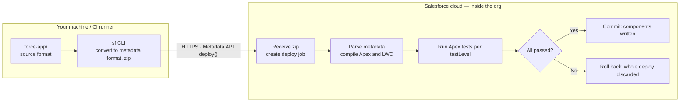
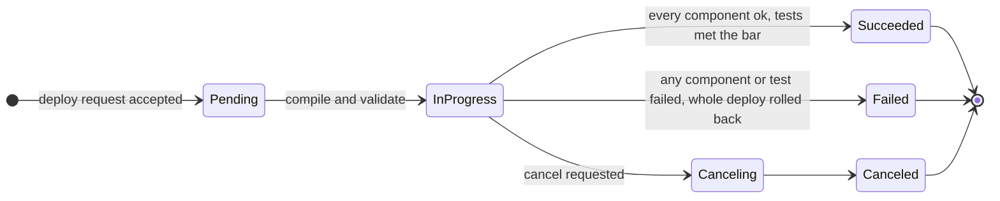

# Deployment Guide

How to deploy this PoC to a **Sandbox**, and the recommended paths to **Production** under a strict network-isolation policy (developer machines cannot reach Salesforce orgs directly).

> Key fact: a Salesforce deployment happens between *the machine running the `sf` CLI* and the Salesforce API — or, with Change Sets / DevOps Center, entirely **cloud-to-cloud inside Salesforce**. Your laptop never needs to reach Production.

**Contents**

| Part | |
|---|---|
| [1 — Deploy to Sandbox](#part-1--deploy-to-sandbox) | The procedure, start to finish |
| [2 — Paths to Production](#part-2--paths-to-production-network-isolated-environments) | Three options under network isolation |
| [3 — How a deploy actually works](#part-3--how-a-deploy-actually-works) | Mechanics: stages, async jobs, rollback, tests |
| [4 — Deleting metadata](#part-4--deleting-metadata-a-deploy-is-an-upsert) | Why `git rm` does not remove anything |
| [5 — Troubleshooting](#part-5--troubleshooting) | Symptom → actual cause → fix |

---

## Part 1 — Deploy to Sandbox

Run these steps on a machine that **can** reach the Sandbox (corporate workstation, VDI, or an approved jump host).

### Step 0: Get the code into the corporate environment

Pick whichever your isolation policy allows:

- **A. Corporate machine can reach GitHub:**
  ```bash
  git clone git@github.com:avence12/salesforce_event_mgmt.git
  ```
- **B. It cannot** — create a git bundle on the outside machine and transfer it through an approved file-transfer channel:
  ```bash
  git bundle create salesforce_event_mgmt.bundle --all   # run in the repo
  ```
  Then on the corporate machine:
  ```bash
  git clone salesforce_event_mgmt.bundle salesforce_event_mgmt
  ```
  A bundle preserves full git history and supports incremental updates later (`git fetch <bundle>`), unlike a zip.

### Step 1: Install the Salesforce CLI

```bash
npm install -g @salesforce/cli
```

If npm is blocked, use the offline installers from developer.salesforce.com/tools/salesforcecli.

### Step 2: Authenticate to the Sandbox

```bash
sf org login web --alias poc-sandbox --instance-url https://test.salesforce.com
```

On a browser-less jump host, use the device flow instead — it prints a code you enter from any intranet browser:

```bash
sf org login device --alias poc-sandbox --instance-url https://test.salesforce.com
```

### Step 3: One-time org prechecks (Setup UI)

1. Email deliverability set to "All Email" (Setup → Deliverability) — only needed to demo the notification emails.

### Step 4: Validate, then deploy

Validate first (compiles Apex and checks metadata without changing the org):

```bash
sf project deploy start -o poc-sandbox --dry-run
```

Fix any errors it reports, then deploy and run tests:

```bash
sf project deploy start -o poc-sandbox
sf apex run test -o poc-sandbox --wait 10 --code-coverage
```

### Step 5: Post-deploy setup (~5 minutes)

1. **Activate the record page**: Setup → Object Manager → Marketing Event → Lightning Record Pages → *Marketing Event Record Page* → Activate → **Org Default** (Desktop and Phone).
2. **Assign permission sets**: `Event AM` to the AM demo users, `Event Approver` to the Account Owner demo users.
3. **Seed demo data** — edit the two owner usernames at the top of the script, then:
   ```bash
   sf apex run --file scripts/seed-demo-data.apex -o poc-sandbox
   ```
4. Demo import file: `demo-data/FinTech_Summit_2026_Attendees.csv`. Follow the 5-minute demo script in [README.md](README.md).

---

## Part 2 — Paths to Production (network-isolated environments)

Three options, ordered by isolation-friendliness:

### Option 1: Change Sets — zero local connectivity (recommended first)

Deployment traffic is entirely **Salesforce cloud-to-cloud** (Sandbox → Production); no machine outside Salesforce participates.

1. Deploy the PoC to a sandbox **created from Production** (they share a deployment connection).
2. In the sandbox: Setup → Outbound Change Sets → add all components → Upload to Production.
3. In Production: Setup → Inbound Change Sets → **Validate** (runs tests) → review → **Deploy**.

*Pros*: admins need only a browser; auditable in the Setup UI; no API allow-listing.
*Cons*: manual clicking; tedious for large component lists; a few metadata types unsupported (everything in this PoC — objects, Apex, LWC, flexipages, permission sets — is supported).

Best choice for the first production deployment of this PoC.

### Option 2: Salesforce DevOps Center — official, free, runs on Salesforce

DevOps Center is a Salesforce-hosted application: the pipeline (dev sandbox → UAT → Production) executes **inside the Salesforce cloud** — no CI runner needed. It integrates with corporate Git (e.g., GitHub Enterprise). The right medium-term path if this feature keeps evolving after the PoC.

### Option 3: In-network CI/CD — most mature, needs IT support

Code lives in the internal Git; a CI runner (Jenkins / GitLab CI) in a network segment allow-listed for the Production API runs:

```bash
sf project deploy start -o prod --test-level RunLocalTests
```

Authenticate the runner with the **JWT Bearer Flow** (connected app + certificate — non-interactive, suited to unattended jobs). Developers only push code and open PRs; nobody's laptop ever touches Production. Commercial equivalents: Gearset, Copado. The long-term answer once multiple Salesforce projects share the pipeline.

### Pre-production checklist (whichever path you choose)

- **75% Apex test coverage** is a hard Salesforce requirement for production deploys — the two test classes in this repo exist for that; confirm the `--code-coverage` numbers in sandbox first.
- Close the known PoC hardening gaps (see "Known PoC limits" in [README.md](README.md)): server-side account-scope verification in `addInvitees`, bulk-volume testing, a full FLS review.
- Use **Validate + Quick Deploy**: validate against Production ahead of time (runs tests, changes nothing), then one-click quick-deploy inside the release window — cuts deployment risk to minutes. See [Part 3](#validate-deploy-quick-deploy) for the mechanics.

**Recommendation**: Change Sets for the demo/short term → DevOps Center if the PoC is productized → in-network CI/CD at scale.

---

## Part 3 — How a deploy actually works

Worth reading once, because three of the most common deployment surprises follow directly from it: why a CLI timeout does not mean the deploy failed, why a half-applied deploy never happens, and why deleting a file from the repo leaves the component sitting in the org.

A deploy is **not** a file copy. It is one API call that hands a bundle of metadata to the org; the *org* then compiles it, validates it, runs the tests, and decides to accept or reject the whole thing. Your machine only starts the job.



Only the middle arrow crosses a network boundary. Everything to its right happens inside Salesforce — which is precisely why Change Sets and DevOps Center can deploy to Production without any machine of yours reaching it.

### The seven stages

1. **Read `sfdx-project.json`** *(local)* — `packageDirectories` decides what gets packaged (here: `force-app`), and `sourceApiVersion` (61.0) tells the org which Metadata API semantics to read your components with.
2. **Source format → metadata format** *(local)* — the repo layout is split up for git's benefit (one file per custom field, for instance). The CLI reassembles it into the shape the Metadata API expects and generates a `package.xml` listing every component.
3. **Zip and upload** *(local → cloud)* — sent via the Metadata API `deploy()` call along with `checkOnly` and `testLevel`. This is the only step that crosses the network boundary.
4. **Job created, id returned** *(cloud)* — the org does not wait for completion. It queues the work and returns a job id (`0Af…`) immediately; the CLI then polls it. **A dropped connection does not cancel the deploy.**
5. **Parse and compile** *(cloud)* — Apex compiles, LWC bundles, field types and references are checked, permission sets are verified against the fields they grant. Dependency order is Salesforce's problem, not yours: objects and the Apex referencing them can go in the same deploy.
6. **Run Apex tests** *(cloud)* — per `testLevel`. Sandbox runs none by default; Production always runs them when Apex is included.
7. **Commit or roll back** *(cloud)* — **transactional and all-or-nothing.** One failed component or one failed test discards the entire deploy and the org returns to its previous state.

### It is an asynchronous job

The CLI looks like it is blocking; it is actually polling and redrawing a progress bar.

```mermaid
sequenceDiagram
  autonumber
  participant CLI as sf CLI on your machine
  participant API as Metadata API
  participant ORG as Org execution engine

  CLI->>CLI: convert source to metadata, zip
  CLI->>API: deploy(zip, checkOnly, testLevel)
  API-->>CLI: job id 0Af... returned immediately
  Note over CLI,API: the connection may drop here;<br/>the job keeps running inside the org

  loop CLI polls every few seconds
    CLI->>API: check deploy status(job id)
    API-->>CLI: Pending / InProgress + components completed
  end

  ORG->>ORG: compile, validate, run tests
  ORG-->>API: result
  API-->>CLI: Succeeded / Failed + component errors + coverage
```

So a `--wait` timeout means "stopped watching", not "failed". Reconnect rather than re-running blindly:

```bash
sf project deploy report --job-id 0Af…    # what actually happened
sf project deploy resume --job-id 0Af…    # reattach to a running deploy
sf project deploy cancel --job-id 0Af…    # stop one that has not finished
```

### Job states and the rollback guarantee



Only **Succeeded** changes the org. Failed and Canceled both guarantee a return to the pre-deploy state.

> One boundary on that guarantee: rollback covers **metadata**. It does not undo **data** written during the deploy by triggers or post-install logic. Irrelevant to this PoC, but worth knowing before a deploy with data side effects.

### Validate, deploy, quick deploy

All three run the *same* validation and tests. The only differences are the `checkOnly` flag and whether a previous validation result is reused. The value is being able to move the slow part — running the full test suite — outside the release window.

```bash
# 1. Validate ahead of time: full compile + tests, org untouched
sf project deploy start -o poc-sandbox --dry-run

# 2. Inside the release window: apply the already-validated result, tests not re-run
sf project deploy quick --use-most-recent -o poc-sandbox

# …or do both at once, which is what Part 1 Step 4 does for the sandbox
sf project deploy start -o poc-sandbox
```

Salesforce keeps a successful validation available for quick deploy for a limited window (10 days at the time of writing); past that, validate again.

### Test levels and the 75% bar

| Level | Runs | When |
|---|---|---|
| `NoTestRun` | nothing | Sandbox default. Fast iteration; Production rejects it. |
| `RunSpecifiedTests` | only the classes you name | Partial deploys in large orgs. Still subject to the coverage bar. |
| `RunLocalTests` | every test outside managed packages | **The de facto Production standard** — what a production deploy containing Apex falls back to. |
| `RunAllTestsInOrg` | everything, managed packages included | Most conservative and slowest. Full regression before a major upgrade. |

Two hard gates on Production, both computed **org-side** — local numbers do not count:

- **75% org-wide Apex coverage.** Below it, the whole deploy fails.
- **Every trigger needs at least one covered line.** Zero is not allowed.

```bash
sf apex run test -o poc-sandbox --wait 10 --code-coverage

sf project deploy start -o prod --test-level RunLocalTests

sf project deploy start -o prod --test-level RunSpecifiedTests \
  --tests ContactImportControllerTest --tests EventWorkflowTest
```

---

## Part 4 — Deleting metadata (a deploy is an upsert)

The counterintuitive one, and the reason orgs accumulate dead components: **removing a component from the repo does not remove it from the org.** A deploy means "make sure these components exist and look like this" — never "make the org match this directory".

This repo has a live example. When the contact import moved from `.xlsx` to `.csv`, the 861 KB `sheetjs` static resource was deleted from source — but it is **still present in every sandbox it was previously deployed to**.

```mermaid
flowchart TB
  subgraph EXPECTED["What people expect"]
    W1["git rm sheetjs.js"] --> W2["sf project deploy start"] --> W3["sheetjs gone from the org"]
  end

  subgraph ACTUAL["What happens"]
    R1["git rm sheetjs.js"] --> R2["sf project deploy start"]
    R2 --> R3["package.xml no longer lists sheetjs,<br/>so the org is never told to delete it"]
    R3 --> R4["sheetjs untouched in the org"]
  end

  subgraph CORRECT["What actually removes it"]
    F1["destructiveChangesPost.xml<br/>naming StaticResource: sheetjs"] --> F2["plus a package.xml"]
    F2 --> F3["deploy start --post-destructive-changes"] --> F4["sheetjs removed from the org"]
  end
```



Deletions must be **declared**. `destructiveChangesPre.xml` runs *before* the rest of the deploy, `destructiveChangesPost.xml` *after* — use Post when removing something that may still be referenced until the new components land.

```xml
<!-- manifest/destructiveChangesPost.xml -->
<?xml version="1.0" encoding="UTF-8"?>
<Package xmlns="http://soap.sforce.com/2006/04/metadata">
    <types>
        <members>sheetjs</members>
        <name>StaticResource</name>
    </types>
</Package>
```

```xml
<!-- manifest/package.xml — must exist, may list no components -->
<?xml version="1.0" encoding="UTF-8"?>
<Package xmlns="http://soap.sforce.com/2006/04/metadata">
    <version>61.0</version>
</Package>
```

```bash
# Validate first — deletions cannot be undone
sf project deploy start -o poc-sandbox --dry-run \
  --manifest manifest/package.xml \
  --post-destructive-changes manifest/destructiveChangesPost.xml

# Then apply
sf project deploy start -o poc-sandbox \
  --manifest manifest/package.xml \
  --post-destructive-changes manifest/destructiveChangesPost.xml
```

For this PoC the leftover `sheetjs` is harmless dead weight — `importWizard` no longer references it in any way. Clean it up with the above when convenient; leaving it costs nothing but storage.

---

## Part 5 — Troubleshooting

| Symptom | Actual cause | Fix |
|---|---|---|
| Coverage below 75% fails the whole deploy | the number is computed org-side, not from your local run | confirm with `--code-coverage` in the sandbox before going to Production |
| A component you deleted is still in the org | a deploy is an upsert, not a sync | declare it in destructiveChanges — [Part 4](#part-4--deleting-metadata-a-deploy-is-an-upsert) |
| Permission set fails with "field does not exist" | it grants a field that is not in this deploy's scope | include the field in the deploy, or drop the entry |
| CLI timed out; unclear whether anything applied | deploys are async — a timeout only stops the waiting | `sf project deploy report --job-id` before re-running anything |
| Record page deployed but users cannot see it | the FlexiPage deployed; **activation is not metadata** | activate as Org Default in Setup — Part 1, Step 5 |
| Works in sandbox, fails in Production | Production forces tests; sandbox runs none by default | `--dry-run` against Production before the release window |
| `INVALID_CROSS_REFERENCE_KEY` on a flexipage | it references a component or tab not yet in the org | deploy the whole package together rather than a subset |
