# Business Process — as built (R5)

The end-to-end flow of the PoC as it stands after R3 (standard Approval Process + standard
Reports), R4 (the import stopped writing to Contact) and **R5** (it stopped reading standard
objects altogether — imported people live on `Event_Attendee__c`, an object this project owns).
This is the *current* process, not the one in [requirement.md](../requirement.md) — where the two
differ, the difference is called out under
[Where this departs from the original ask](#where-this-departs-from-the-original-ask).

Source of truth for the detail: [design.md](../design.md). Screen-by-screen summary: [README.md](../README.md).

## Who does what

**BMD is a new role.** It runs the whole proposing half — import, event creation, and putting
forward the attendee list — which leaves approving to somebody else.

| Role | Owns |
|---|---|
| **BMD** | Steps 1–4 and 7 — import the list, create the event, propose the invitees, submit them, export the approved result |
| **Approver** | Step 5. R5 resolves this to exactly one person: **the submitting BMD user's Manager** |

**The AM does not appear in the R5 flow, and that is the open question.** The intent is that the
AM approves. R5 deleted `Account__c` and `Account_Owner__c` from the invitee and never reads an
Account, so nothing in the system knows whose customer an attendee is — there is no longer a fact
the routing could use to reach an AM. Setting an AM as the BMD user's Manager makes it work today;
anything finer needs a basis R5 removed. See
[What the BMD split still needs](#what-the-bmd-split-still-needs).

## The process in one paragraph

A BMD user uploads a CSV of attendees collected elsewhere. Every row with a last name becomes an
**Event Attendee** — a person record this project owns — previewed as *New* or *Already known*
before anything is written, and upserted on a `last|first|company|email` key so re-uploading a
file refreshes people instead of duplicating them. The same BMD user creates a Marketing Event
and proposes its guests from that pool. Each BMD user submits **their own batch** into the
standard Approval Process, which routes every row to **their manager**. The approver decides from
the standard Approvals list on desktop or the mobile app. When a batch has no pending rows left,
its submitter is notified, and the approved list is read and exported from standard reports.

## Flow diagram

```mermaid
flowchart TD
    classDef bmd fill:#ede9fe,stroke:#6d28d9,color:#2e1065
    classDef approver fill:#fef3c7,stroke:#b45309,color:#3a2600
    classDef system fill:#e5e7eb,stroke:#4b5563,color:#111827
    classDef data fill:#dcfce7,stroke:#15803d,color:#052e16
    classDef stop fill:#fee2e2,stroke:#b91c1c,color:#450a0a
    classDef todo fill:#ffedd5,stroke:#c2410c,color:#431407

    %% ======== 1 · Import ========
    subgraph IMPORT["1 · Import the attendee list — BMD · LWC importWizard"]
        direction TB
        I0(["BMD holds a list collected<br/>outside Salesforce"]):::bmd
        I1["Upload .csv — strict UTF-8<br/>delimiter sniffed · max 500 rows"]:::bmd
        I2["Parse in the browser<br/>de-dup within the file"]:::system
        I3{"Row has a last name?"}:::system
        SKIP["Skipped — someone with no name<br/>is unrecognisable later<br/>nothing written"]:::stop
        I4["previewMatches — nothing is written<br/>look up Unique_Key__c =<br/>last | first | company | email, normalised"]:::system
        I5{"Key already<br/>in the pool?"}:::system
        KNOWN["Already known<br/>title, mobile and source file refresh"]:::system
        NEW["New<br/>will be created"]:::system
        I6["BMD reviews the preview and ticks rows<br/>Skipped unticked by default"]:::bmd
        I7["applyChanges — re-classified server-side<br/>upsert on Unique_Key__c, so a re-run<br/>refreshes rather than duplicates"]:::system
        POOL[("Event_Attendee__c — the pool<br/>one row per person, reused across events<br/>Company__c is free text, bound to no Account")]:::data
        NOWRITE["No Contact, Lead or Account<br/>created, read, changed or deleted"]:::stop

        I0 --> I1 --> I2 --> I3
        I3 -- no --> SKIP
        I3 -- yes --> I4 --> I5
        I5 -- yes --> KNOWN --> I6
        I5 -- no --> NEW --> I6
        I6 --> I7 --> POOL
        I7 -.-> NOWRITE
    end

    POOL -.->|"the same pool the selector reads —<br/>import and invitation are one object now"| B2

    %% ======== 2-3 · Event + selection ========
    subgraph BUILD["2–3 · Create the event, propose the invitees — BMD · LWC attendeeSelector"]
        direction TB
        B1(["BMD creates Marketing_Event__c<br/>standard record form"]):::bmd
        B2["Add Attendees tab — the whole pool<br/>grouped by Company text · no per-user scoping<br/>capped at 2 000, says so when it truncates"]:::bmd
        B3{"Already an invitee<br/>on this event?"}:::system
        HIDDEN["Filtered out of the list"]:::stop
        B4["Create Event_Invitee__c — Status = Draft<br/>Added_By__c = me<br/>Unique_Key__c forbids duplicates"]:::system
        B5["Reset the existing row to Draft<br/>decision timestamps cleared"]:::system

        B1 --> B2 --> B3
        B3 -- "no" --> B4
        B3 -- "yes, and Rejected" --> B5
        B3 -- "yes, still live" --> HIDDEN
    end

    %% ======== 4 · Submit ========
    subgraph SUBMIT["4 · Submit — each BMD user submits only their own batch"]
        direction TB
        S1["Submit My Invitees for Approval<br/>acts on my Draft rows only"]:::bmd
        S2{"Does the submitter<br/>have a Manager?"}:::system
        S3["All-or-nothing refusal<br/>named error · rows stay Draft"]:::stop
        S4["Approver__c = the submitter's Manager<br/>resolved once, frozen · the whole ladder,<br/>now that no Account Owner exists to climb past"]:::system
        AMQ["⚠ Where the AM was meant to be.<br/>R5 deleted Account__c / Account_Owner__c,<br/>so nothing knows whose customer this is.<br/>Name an AM as the Manager, or give<br/>routing a new basis"]:::todo
        S5["Approval.process — the process's initial<br/>submission action sets Pending Approval<br/>record locked while pending"]:::system
        S6["notifyApproversOfSubmission<br/>ONE aggregated email + bell<br/>per distinct approver"]:::system

        S1 --> S2
        S2 -- no --> S3
        S2 -- yes --> S4 --> S5 --> S6
        S4 -.-> AMQ
    end

    B4 --> S1
    B5 --> S1

    %% ======== 5 · Approve ========
    subgraph APPROVE["5 · Approve — standard Approval Process, no custom code"]
        direction TB
        P1["Approver opens the bell or email link,<br/>then the standard Approvals list<br/>desktop or Salesforce Mobile App"]:::approver
        P2["Mass-select the pending items"]:::approver
        P3{"Approve or reject?"}:::approver
        P4["Status → Approved<br/>Decided_At__c stamped"]:::system
        P5["Status → Rejected<br/>Decided_At__c stamped · final, single step"]:::system
        P6["Back into the pool: re-adding on Screen 3<br/>resets this same row to Draft<br/>a second row is impossible — Unique_Key__c"]:::stop

        P1 --> P2 --> P3
        P3 -- approve --> P4
        P3 -- reject --> P5 -.-> P6
    end

    S6 --> P1

    %% ======== 6 · Completion ========
    subgraph DONE["6 · Completion notice"]
        direction TB
        C1["Flow Invitee_Decision_Completion<br/>after update, Status → Approved or Rejected<br/>the Flow is only the trigger"]:::system
        C2["EventNotificationService.notifyCompletions<br/>bulk-safe: 40 decisions in one transaction,<br/>one call, one email"]:::system
        C3{"Zero Pending rows left for the<br/>submitting BMD user on this event?"}:::system
        C4["Email + bell to the BMD submitter<br/>X approved / Y rejected"]:::system
        C5["Say nothing yet"]:::system
        ROLLUP[("Marketing_Event__c roll-ups<br/>Approved / Pending / Rejected counts —<br/>counts, not a status: batches are independent")]:::data

        C1 --> C2 --> C3
        C3 -- yes --> C4
        C3 -- no --> C5
    end

    P4 --> C1
    P5 --> C1
    P4 -.-> ROLLUP
    P5 -.-> ROLLUP

    %% ======== 7 · Report ========
    subgraph REPORT["7 · Read and export — BMD · standard reports, no custom code"]
        direction TB
        R1["Reports → Event Management<br/>Approved Invitees — by Event<br/>My Approved Invitees = my own batch"]:::bmd
        R2["Filter: one event or all events ·<br/>Decided_At range, evaluated in the<br/>running user's timezone by the platform"]:::bmd
        R3(["Export → CSV or XLSX"]):::bmd

        R1 --> R2 --> R3
    end

    C4 --> R1
```

## Reading the diagram

**The two halves meet now — that is R5's biggest structural change.** Through R4 the import wrote
an `Event_History__c` log that nothing else read, and invitation state lived on a separate pair of
Contact/Lead lookups; the two branches never touched. R5 collapses them: the import fills one pool,
and the selector proposes out of that same pool. "Which events has this person been put forward
for?" is now the Event Invitees related list on the attendee record, which is what the deleted
history object used to answer — except it is live rather than a parallel annotation that could
disagree.

**The routing ladder is gone, not shortened.** R3's three rungs existed because an invitee could
be a customer Contact (→ Account Owner) or a Lead (→ Lead Owner). R5 has neither, so `Approver__c`
resolves to one thing: the submitter's Manager. That is why the diagram has a decision on
*whether a Manager exists* rather than on *which rung applies* — and why a BMD user with no
Manager cannot submit anything at all.

**Nothing scopes the attendee pool.** `getSelectableAttendees` filters only on "not already
invited to this event". Any user who can reach the selector can propose anybody in the org's pool.
For BMD this is exactly right — a marketing department proposing across the whole list is the
point — but it is also the reason per-user scoping cannot come back without a new basis for it.

**Status is per invitee, never per event.** Several BMD users can submit independent batches
against one shared event, so an event-level state machine would deadlock: one pending batch would
block another's. The event carries roll-up counts instead.

**Two of the dead ends are refusals, not gaps.** A row with no last name is skipped rather than
imported as an unrecognisable record; a submit by someone with no Manager fails whole rather than
partially, so the submitter's Draft count still matches what they just sent.

## What the BMD split still needs

R5 removed the blocker the previous revision of this document recorded. The contact selector used
to narrow to accounts the running user owned — fatal for a BMD user, who owns none. R5 deleted
that scoping along with the Account, so **BMD can now propose from the whole pool with no code
change at all.** What is left is one open question and two pieces of configuration.

**1 · The AM has nothing to be routed by — decide before the demo.** This is the open item, and it
is [design.md](../design.md)'s Open Question 15 seen from the role side. The intent is that the AM
signs off guests from their own accounts. R5 knows nothing about accounts, so:

- **Config, no code:** set the approving AM as the **Manager** of each BMD user. Works today,
  needs nothing built, and is the honest demo path. It only expresses *one* approver per BMD user,
  so it cannot mean "each attendee goes to whoever owns that customer".
- **Code, and a new fact:** give `Event_Attendee__c` a field that names who approves for that
  person — an owner, an account reference, a team — and resolve `Approver__c` through it at submit
  time. This is re-introducing, on this project's own object, the thing R5 deliberately removed
  from the standard ones, so it needs to be a decision rather than a patch. Open Question 17 in
  design.md ("no link between an attendee and an existing customer") is the same gap from the data
  side, and one field could close both.

Note which way the trade runs: R5 bought an import with no blast radius by giving up all knowledge
of who a person is to the business. The AM-approves model is the first requirement that wants that
knowledge back.

**2 · The permission sets are named for the old model, not split wrongly.** `Event_AM` grants
exactly BMD's job — the import tab, `AttendeeImportController`, `InviteeSelectorController`, event
create, the reports — and `Event_Approver` grants the approver's. The fix is a rename to
`Event_BMD`, not a new set. A rename is a delete plus a create in metadata terms, so it needs the
destructive-changes treatment the [R5 upgrade checklist](../DEPLOYMENT.md#part-7--r5-upgrade-checklist)
already establishes, and assignments have to be re-applied afterwards. Keeping the old name and
assigning it to BMD users also works and costs nothing — at the price of a permission set whose
name says AM and whose contents say BMD.

**3 · Every BMD user needs a Manager.** Already true before, but it was a fallback then and it is
the entire routing now: a BMD user with no Manager cannot submit a single invitee. The validation
rule refuses the batch, loudly and by design.

**Not a problem, worth confirming anyway:** the completion notice and *My Approved Invitees* both
key off `Added_By__c`, so they follow the submitter. BMD — not the approver — is told when a batch
finishes and is the one who exports. If the approver is meant to receive the finished list too,
that is a report subscription, not code.

## Where this departs from the original ask

| [requirement.md](../requirement.md) | As built | Why |
|---|---|---|
| The **AM** imports the list, picks the guests and submits them | **BMD** does all of it | The proposing work is a marketing-department job |
| Compare the upload against existing Contacts and **update** those whose title or company changed | Every row becomes an `Event_Attendee__c`. **No Contact, Lead or Account is created, read, changed or deleted.** | R4 stopped writing to Contact; R5 stopped reading it. The feature now has no blast radius outside the one object it owns — and no idea which guests are customers |
| Attendees are Contacts | Attendees are `Event_Attendee__c` | An Account means a transacting customer, and R5 satisfies that premise by never reaching an Account rather than by working around it |
| Send to the **Account Owner** for sign-off | The submitter's **Manager**, and only that | The Account Owner rung retired with the Account. requirement.md's own gloss on Account Owner — "一般是AM的manager/director" — is what survives; the customer-specific half does not. **Open Question 15** |
| A "select all" button on a custom approval screen | Mass-select in the standard **Approvals** list view | R3 — the custom console was a hand-built reimplementation of a platform feature; the standard one also brings record locking and a full approval history |
| The submitter exports the approved contacts from the event | Standard **reports**, filtered to one event or across all | R3 — a report is stateless and re-runnable; it also brings scheduled subscriptions for free |

Two costs of that last row are real and are not written off: the `Exported` status and
`Exported_Count__c` roll-up are gone, because a report cannot write back to the rows it exported,
so "who has already been downloaded" is no longer tracked; and CSV formula-injection
sanitisation no longer covers the approved-invitee export, only the import wizard's
skipped-row download. Both are recorded in [design.md](../design.md) and in the README's known limits.
