# Business Process — as built (R4)

The end-to-end flow of the PoC as it stands after R3 (standard Approval Process + standard
Reports) and R4 (the import records attendance instead of writing to Contact). This is the
*current* process, not the one in [requirement.md](../requirement.md) — where the two differ,
the difference is called out under [Where this departs from the original ask](#where-this-departs-from-the-original-ask).

Source of truth for the detail: [design.md](../design.md). Screen-by-screen summary: [README.md](../README.md).

## The process in one paragraph

An AM uploads a CSV of attendees collected elsewhere. The import **identifies** each person
against records already in the org and writes an attendance log — it never creates or edits a
Contact, and only creates a Lead for someone who matches nobody. Separately, the AM creates a
Marketing Event and adds invitees to it from their own Accounts' Contacts and their own Leads.
Each AM submits **their own batch** into the standard Approval Process, which routes each row
to a single resolved approver: the Account Owner for a customer Contact, the Lead Owner for
someone else's Lead, otherwise the submitter's manager. Approvers decide from the standard
Approvals list on desktop or the mobile app. When an AM's batch has no pending rows left, they
are notified, and the approved list is read and exported from standard reports.

## Flow diagram

```mermaid
flowchart TD
    classDef am fill:#dbeafe,stroke:#1d4ed8,color:#0b1b3a
    classDef approver fill:#fef3c7,stroke:#b45309,color:#3a2600
    classDef system fill:#e5e7eb,stroke:#4b5563,color:#111827
    classDef data fill:#dcfce7,stroke:#15803d,color:#052e16
    classDef stop fill:#fee2e2,stroke:#b91c1c,color:#450a0a

    %% ======== 1 · Import ========
    subgraph IMPORT["1 · Import the attendee list — LWC importWizard"]
        direction TB
        I0(["AM has a list collected<br/>outside Salesforce"]):::am
        I1["Upload .csv — strict UTF-8<br/>delimiter sniffed · max 500 rows<br/>Event name comes per row"]:::am
        I2["Parse in the browser<br/>de-dup by name + company + email + event"]:::system
        I3{"Row has a name<br/>AND an Event value?"}:::system
        SKIP["Skipped<br/>reason shown, nothing written"]:::stop
        I4["previewMatches — nothing is written<br/>cascade: Name → Company → Email<br/>Contacts first, then unconverted Leads"]:::system
        I5{"How many candidates<br/>survive the cascade?"}:::system
        AMB["Ambiguous — never guessed<br/>manual-review CSV download"]:::stop
        I6["AM reviews the preview and ticks rows<br/>Ambiguous + Skipped unticked by default"]:::am
        I7["applyChanges — re-classified server-side<br/>1 · insert Leads for the unmatched<br/>2 · upsert history on Unique_Key__c"]:::system
        NEWLEAD[("New Lead<br/>Company verbatim · owner = importing AM<br/>LeadSource = Event Import")]:::data
        HIST[("Event_History__c — attendance log<br/>Match_Basis__c records how it matched<br/>upsert keyed, so a re-run adds nothing")]:::data
        NOWRITE["No Contact created, changed or deleted<br/>No Account ever created"]:::stop
        HISTEND(["Reportable history — and it ends here<br/>premise 13: no link to Event_Invitee__c,<br/>nothing reconciles the two"]):::data

        I0 --> I1 --> I2 --> I3
        I3 -- no --> SKIP
        I3 -- yes --> I4 --> I5
        I5 -- "1 Contact, or 1 Lead" --> I6
        I5 -- "several, cannot narrow" --> AMB
        I5 -- "none anywhere" --> I6
        I6 --> I7
        I7 --> NEWLEAD
        I7 --> HIST --> HISTEND
        I7 -.-> NOWRITE
    end

    %% ======== 2-3 · Event + selection ========
    subgraph BUILD["2–3 · Create the event, add invitees — LWC contactSelector"]
        direction TB
        B1(["AM creates Marketing_Event__c<br/>standard record form"]):::am
        B2{"Which invitee<br/>source?"}:::am
        B3["Add Contacts tab<br/>Accounts the AM owns or is on the team of<br/>grouped by Account"]:::am
        B4["Add Leads tab<br/>Leads the AM owns, unconverted<br/>grouped by Company text"]:::am
        B5{"Already an invitee<br/>on this event?"}:::system
        HIDDEN["Filtered out of the list"]:::stop
        B6["Create Event_Invitee__c — Status = Draft<br/>Added_By__c = me<br/>Unique_Key__c forbids duplicates"]:::system
        B7["Reset the existing row to Draft<br/>decision timestamps cleared"]:::system

        B1 --> B2
        B2 -- "customer contact" --> B3 --> B5
        B2 -- "professor, speaker, press —<br/>no customer relationship" --> B4 --> B5
        B5 -- "no" --> B6
        B5 -- "yes, and Rejected" --> B7
        B5 -- "yes, still live" --> HIDDEN
    end

    NEWLEAD -.->|"reachable on the Add Leads tab<br/>once owned by this AM"| B4

    %% ======== 4 · Submit ========
    subgraph SUBMIT["4 · Submit — each AM submits only their own batch"]
        direction TB
        S1["Submit My Invitees for Approval<br/>acts on my Draft rows only"]:::am
        S2{"Resolve Approver__c<br/>once, at submit time"}:::system
        S3["Account Owner<br/>Contact__c is set"]:::system
        S4["Lead Owner<br/>Lead__c set, owner ≠ submitter"]:::system
        S5["Submitter's Manager — fallback<br/>incl. self-owned Leads, so no AM<br/>approves their own guests"]:::system
        S6{"Every row routed?"}:::system
        S9["All-or-nothing refusal<br/>named error · rows stay Draft"]:::stop
        S7["Approval.process — the process's initial<br/>submission action sets Pending Approval<br/>record locked while pending"]:::system
        S8["notifyApproversOfSubmission<br/>ONE aggregated email + bell<br/>per distinct approver"]:::system

        S1 --> S2
        S2 --> S3 --> S6
        S2 --> S4 --> S6
        S2 --> S5 --> S6
        S6 -- "no — submitter has no manager" --> S9
        S6 -- yes --> S7 --> S8
    end

    B6 --> S1
    B7 --> S1

    %% ======== 5 · Approve ========
    subgraph APPROVE["5 · Approve — standard Approval Process, no custom code"]
        direction TB
        P1["Approver opens the bell or email link,<br/>then the standard Approvals list<br/>desktop or Salesforce Mobile App"]:::approver
        P2["Mass-select the pending items"]:::approver
        P3{"Approve or reject?"}:::approver
        P4["Status → Approved<br/>Decided_At__c stamped"]:::system
        P5["Status → Rejected<br/>Decided_At__c stamped · final, single step"]:::system
        P6["Back into the pool: re-adding on Screen 3<br/>resets this same row to Draft<br/>a second row is impossible — Unique_Key__c"]:::stop

        P1 --> P2 --> P3
        P3 -- approve --> P4
        P3 -- reject --> P5 -.-> P6
    end

    S8 --> P1

    %% ======== 6 · Completion ========
    subgraph DONE["6 · Completion notice"]
        direction TB
        C1["Flow Invitee_Decision_Completion<br/>after update, Status → Approved or Rejected<br/>the Flow is only the trigger"]:::system
        C2["EventNotificationService.notifyCompletions<br/>bulk-safe: 40 decisions in one transaction,<br/>one call, one email"]:::system
        C3{"Zero Pending rows left<br/>for this AM on this event?"}:::system
        C4["Email + bell to the AM<br/>X approved / Y rejected"]:::system
        C5["Say nothing yet"]:::system
        ROLLUP[("Marketing_Event__c roll-ups<br/>Approved / Pending / Rejected counts —<br/>counts, not a status: batches are independent")]:::data

        C1 --> C2 --> C3
        C3 -- yes --> C4
        C3 -- no --> C5
    end

    P4 --> C1
    P5 --> C1
    P4 -.-> ROLLUP
    P5 -.-> ROLLUP

    %% ======== 7 · Report ========
    subgraph REPORT["7 · Read and export — standard reports, no custom code"]
        direction TB
        R1["Reports → Event Management<br/>Approved Invitees — by Event<br/>My Approved Invitees"]:::am
        R2["Filter: one event or all events ·<br/>Decided_At range, evaluated in the<br/>running user's timezone by the platform"]:::am
        R3(["Export → CSV or XLSX"]):::am

        R1 --> R2 --> R3
    end

    C4 --> R1
```

## Reading the diagram

**The two halves never meet.** The import branch ends at `Event_History__c` and stops there.
Invitation and approval state lives on `Event_Invitee__c` and only there. Someone can be logged
as having attended an event they were never invited to, and vice versa; no code reconciles them
(premise 13). The one thread between the halves is the dotted line from a newly created Lead to
the *Add Leads* tab — the import is what puts a professor in the org at all.

**Status is per invitee, never per event.** Multiple AMs submit independent batches against the
same event, so an event-level state machine would deadlock: one AM's pending batch would block
another's. The event carries roll-up counts instead.

**Routing is resolved once and frozen.** `Approver__c` is written at submit time, not derived.
An ownership change mid-approval cannot silently reroute an item somebody is already looking at.
The fallback rung matters most: a Lead the submitter owns routes to their *manager*, because
"the Lead Owner approves" would otherwise mean the AM approving their own guests — removing the
control the workflow exists to provide, for exactly the invitees nobody has vetted.

**Two of the dead ends are refusals, not gaps.** An ambiguous import row writes nothing and
goes to the manual-review list rather than being guessed at; an unroutable submit fails whole
rather than partially, so the AM's Draft count still matches what they just sent. Both are
choices, and both cost a manual step to recover from.

## Where this departs from the original ask

| [requirement.md](../requirement.md) | As built | Why |
|---|---|---|
| Compare the upload against existing Contacts and **update** those whose title or company changed | The import identifies people and writes an attendance log. **Nothing on a Contact is written.** | R4 premise 11 — reconciling contact data moved out of scope; the import must not own Contact fields |
| Attendees are Contacts | Contacts **or Leads** | An Account means a transacting customer, so a professor or journalist cannot be a Contact; a Contact with no Account is invisible to everyone but its owner, which a shared event cannot use |
| Send to the **Account Owner** for sign-off | The `Approver__c` ladder: Account Owner → Lead Owner → submitter's Manager | Account Owner was always a proxy for "the AM's manager", which requirement.md says outright; a Lead has no Account, so the rule had to be made explicit |
| A "select all" button on a custom approval screen | Mass-select in the standard **Approvals** list view | R3 — the custom console was a hand-built reimplementation of a platform feature; the standard one also brings record locking and a full approval history |
| AM exports the approved contacts from the event | Standard **reports**, filtered to one event or across all | R3 — a report is stateless and re-runnable; it also brings scheduled subscriptions for free |

Two costs of that last row are real and are not written off: the `Exported` status and
`Exported_Count__c` roll-up are gone, because a report cannot write back to the rows it exported,
so "who has already been downloaded" is no longer tracked; and CSV formula-injection
sanitisation no longer covers the approved-invitee export, only the import wizard's
manual-review download. Both are recorded in [design.md](../design.md#screen-5--export-r3-standard-reports-no-custom-code)
and in the README's known limits.
