# Business Process — as built (R5), with the R6 approval chain

The end-to-end flow of the PoC after R3 (standard Approval Process + standard Reports), R4 (the
import stopped writing to Contact) and **R5** (it stopped reading standard objects altogether —
imported people live on `Event_Attendee__c`, an object this project owns).

> **Steps 1–3, 6 and 7 are built and deployed. Steps 4 and 5 show the ★R6 approval chain, which
> is designed but not yet built** — today's org still resolves a single approver, the submitter's
> manager. The R6 design, its costs and its rejected alternatives are in
> [design.md → ★R6 Approval routing](../design.md#r6-approval-routing--a-chain-not-a-rung).

This is the *current* process, not the one in [requirement.md](../requirement.md) — where the two
differ, the difference is called out under
[Where this departs from the original ask](#where-this-departs-from-the-original-ask).

Source of truth for the detail: [design.md](../design.md). Screen-by-screen summary: [README.md](../README.md).

## Who does what

**BMD is a new role.** It runs the whole proposing half — import, event creation, and putting
forward the attendee list — which leaves approving to somebody else.

| Role | Owns |
|---|---|
| **BMD** | Steps 1–4 and 7 — import the list, create the event, propose the invitees, submit them, export the approved result |
| **AM** | Step 5, level 1 — the AM who owns the customer that invitee's `cust_cd` names |
| **Regional head** | Step 5, the top level — signs off after the AM |
| *further levels* | Step 5, in between — expected later, and the design makes them rows rather than a deploy |

**`cust_cd` is what makes the AM reachable again.** R5 deleted `Account__c` and
`Account_Owner__c` and never reads an Account, so for one revision nothing knew whose customer an
attendee was and the only approver the routing could produce was the submitter's manager. R6
restores the link with a **customer company code carried on the attendee** and a table mapping it
to the owning AM and onward up the chain — without reaching an Account, so the premise that an
Account means a transacting customer is never put under pressure.

## The process in one paragraph

A BMD user uploads a CSV of attendees collected elsewhere. Every row with a last name becomes an
**Event Attendee** — a person record this project owns — previewed as *New* or *Already known*
before anything is written, and upserted on a `last|first|company|email` key so re-uploading a
file refreshes people instead of duplicating them. The same BMD user creates a Marketing Event
and proposes its guests from that pool. Each BMD user submits **their own batch** into the
standard Approval Process, which reads each invitee's `cust_cd`, looks the chain up in
`Approval_Route__c`, and stamps every level's approver onto the row at once. The chain then runs
in order — the AM who owns that customer, then the regional head, then any level added later —
and everyone must agree; any level's rejection ends it. Approvers decide from the standard
Approvals list on desktop or the mobile app. When a batch has no pending rows left, its submitter
is notified, and the approved list is read and exported from standard reports.

## Flow diagram

```mermaid
flowchart TD
    classDef bmd fill:#ede9fe,stroke:#6d28d9,color:#2e1065
    classDef approver fill:#fef3c7,stroke:#b45309,color:#3a2600
    classDef system fill:#e5e7eb,stroke:#4b5563,color:#111827
    classDef data fill:#dcfce7,stroke:#15803d,color:#052e16
    classDef stop fill:#fee2e2,stroke:#b91c1c,color:#450a0a
    classDef todo fill:#ffedd5,stroke:#c2410c,color:#431407

    %% ======== 1 · Import ========
    subgraph IMPORT["1 · Import the attendee list — BMD · LWC importWizard"]
        direction TB
        I0(["BMD holds a list collected<br/>outside Salesforce"]):::bmd
        I1["Upload .csv — strict UTF-8<br/>delimiter sniffed · max 500 rows"]:::bmd
        I2["Parse in the browser<br/>de-dup within the file"]:::system
        I3{"Row has a last name?"}:::system
        SKIP["Skipped — someone with no name<br/>is unrecognisable later<br/>nothing written"]:::stop
        I4["previewMatches — nothing is written<br/>look up Unique_Key__c =<br/>last | first | company | email, normalised"]:::system
        I5{"Key already<br/>in the pool?"}:::system
        KNOWN["Already known<br/>title, mobile and source file refresh"]:::system
        NEW["New<br/>will be created"]:::system
        I6["BMD reviews the preview and ticks rows<br/>Skipped unticked by default"]:::bmd
        I7["applyChanges — re-classified server-side<br/>upsert on Unique_Key__c, so a re-run<br/>refreshes rather than duplicates"]:::system
        POOL[("Event_Attendee__c — the pool<br/>one row per person, reused across events<br/>Company__c is free text, bound to no Account")]:::data
        NOWRITE["No Contact, Lead or Account<br/>created, read, changed or deleted"]:::stop

        I0 --> I1 --> I2 --> I3
        I3 -- no --> SKIP
        I3 -- yes --> I4 --> I5
        I5 -- yes --> KNOWN --> I6
        I5 -- no --> NEW --> I6
        I6 --> I7 --> POOL
        I7 -.-> NOWRITE
    end

    POOL -.->|"the same pool the selector reads —<br/>import and invitation are one object now"| B2

    %% ======== 2-3 · Event + selection ========
    subgraph BUILD["2–3 · Create the event, propose the invitees — BMD · LWC attendeeSelector"]
        direction TB
        B1(["BMD creates Marketing_Event__c<br/>standard record form"]):::bmd
        B2["Add Attendees tab — the whole pool<br/>grouped by Company text · no per-user scoping<br/>capped at 2 000, says so when it truncates"]:::bmd
        B3{"Already an invitee<br/>on this event?"}:::system
        HIDDEN["Filtered out of the list"]:::stop
        B4["Create Event_Invitee__c — Status = Draft<br/>Added_By__c = me<br/>Unique_Key__c forbids duplicates"]:::system
        B5["Reset the existing row to Draft<br/>decision timestamps cleared"]:::system

        B1 --> B2 --> B3
        B3 -- "no" --> B4
        B3 -- "yes, and Rejected" --> B5
        B3 -- "yes, still live" --> HIDDEN
    end

    %% ======== 4 · Submit ========
    subgraph SUBMIT["4 · Submit — each BMD user submits only their own batch"]
        direction TB
        S1["Submit My Invitees for Approval<br/>acts on my Draft rows only"]:::bmd
        S2["Read each invitee's cust_cd<br/>and look up its chain"]:::system
        ROUTE[("Approval_Route__c — the chain<br/>one row per cust_cd × level<br/>a new level is rows, not a deploy")]:::data
        S3{"Every invitee has an<br/>active chain?"}:::system
        S4["All-or-nothing refusal — named error<br/>rows stay Draft. No fallback to the<br/>submitter's manager: that would turn a<br/>data gap into a quieter approval"]:::stop
        S5["Stamp Approver_1__c … Approver_N__c<br/>in level order · resolved once, frozen —<br/>a reorg mid-chain must not reroute<br/>what someone is already looking at"]:::system
        S6["Approval.process — the process's initial<br/>submission action sets Pending Approval<br/>record locked for the whole chain"]:::system

        S1 --> S2 --> S3
        S3 -- no --> S4
        S3 -- yes --> S5 --> S6
    end

    ROUTE -.-> S2

    B4 --> S1
    B5 --> S1

    %% ======== 5 · Approve ========
    subgraph APPROVE["5 · Approve — a chain · standard Approval Process, no custom code"]
        direction TB
        P0{"Is Approver_N__c set<br/>for this step?"}:::system
        PSKIP["Step skipped — ifCriteriaNotMet = ApproveRecord.<br/>This is what lets the process ship more steps<br/>than the business currently uses"]:::system
        P1["Level N approver opens the bell or email link,<br/>then the standard Approvals list<br/>desktop or Salesforce Mobile App"]:::approver
        P2["Mass-select the pending items"]:::approver
        P3{"Approve or reject?"}:::approver
        PN{"Any level left<br/>above this one?"}:::system
        NOTIFY["⚠ Step-entry action must notify level N+1.<br/>The submit-time aggregate only reaches level 1,<br/>so without this the regional head is never told"]:::todo
        P4["Status → Approved<br/>Decided_At__c stamped · everyone agreed"]:::system
        P5["Status → Rejected<br/>Decided_At__c stamped<br/>any level can end it, and it is final"]:::system
        P6["Back into the pool: re-adding on Screen 3<br/>resets this same row to Draft<br/>a second row is impossible — Unique_Key__c"]:::stop

        P0 -- no --> PSKIP --> PN
        P0 -- yes --> P1 --> P2 --> P3
        P3 -- approve --> PN
        P3 -- reject --> P5 -.-> P6
        PN -- "yes — level N+1" --> NOTIFY -.-> P0
        PN -- no --> P4
    end

    S6 --> P0

    %% ======== 6 · Completion ========
    subgraph DONE["6 · Completion notice"]
        direction TB
        C1["Flow Invitee_Decision_Completion<br/>after update, Status → Approved or Rejected<br/>the Flow is only the trigger"]:::system
        C2["EventNotificationService.notifyCompletions<br/>bulk-safe: 40 decisions in one transaction,<br/>one call, one email"]:::system
        C3{"Zero Pending rows left for the<br/>submitting BMD user on this event?"}:::system
        C4["Email + bell to the BMD submitter<br/>X approved / Y rejected"]:::system
        C5["Say nothing yet"]:::system
        ROLLUP[("Marketing_Event__c roll-ups<br/>Approved / Pending / Rejected counts —<br/>counts, not a status: batches are independent")]:::data

        C1 --> C2 --> C3
        C3 -- yes --> C4
        C3 -- no --> C5
    end

    P4 --> C1
    P5 --> C1
    P4 -.-> ROLLUP
    P5 -.-> ROLLUP

    %% ======== 7 · Report ========
    subgraph REPORT["7 · Read and export — BMD · standard reports, no custom code"]
        direction TB
        R1["Reports → Event Management<br/>Approved Invitees — by Event<br/>My Approved Invitees = my own batch"]:::bmd
        R2["Filter: one event or all events ·<br/>Decided_At range, evaluated in the<br/>running user's timezone by the platform"]:::bmd
        R3(["Export → CSV or XLSX"]):::bmd

        R1 --> R2 --> R3
    end

    C4 --> R1
```

## Reading the diagram

**The two halves meet now — that is R5's biggest structural change.** Through R4 the import wrote
an `Event_History__c` log that nothing else read, and invitation state lived on a separate pair of
Contact/Lead lookups; the two branches never touched. R5 collapses them: the import fills one pool,
and the selector proposes out of that same pool. "Which events has this person been put forward
for?" is now the Event Invitees related list on the attendee record, which is what the deleted
history object used to answer — except it is live rather than a parallel annotation that could
disagree.

**The chain is resolved once and stamped whole, not walked.** R6 does not re-derive the next
approver after each decision; at submit time it writes `Approver_1__c … Approver_N__c` and hands
the record to the approval process, which owns the sequencing from there. Two things follow. A
reorganisation halfway up a four-level chain cannot reroute an item somebody is already looking
at — the chain in force at submit is the chain that decides. And **the number of levels is data**:
each step is gated on its own `ISBLANK(Approver_N__c)` check with *skip* behaviour, so a process
shipped with five steps runs a two-level customer through it untouched, and adding a third level
costs rows in `Approval_Route__c` rather than a deploy.

**Refusal, not fallback.** A `cust_cd` that is blank, unmapped, or mapped to an inactive user
fails the whole submit with a named error. Falling back to the submitter's manager was considered
and rejected: it converts a data-quality problem into a silently weaker approval, which is the
exact failure the workflow exists to prevent.

**Nothing scopes the attendee pool.** `getSelectableAttendees` filters only on "not already
invited to this event". Any user who can reach the selector can propose anybody in the org's pool.
For BMD this is exactly right — a marketing department proposing across the whole list is the
point — but it is also the reason per-user scoping cannot come back without a new basis for it.

**Status is per invitee, never per event.** Several BMD users can submit independent batches
against one shared event, so an event-level state machine would deadlock: one pending batch would
block another's. The event carries roll-up counts instead.

**Two of the dead ends are refusals, not gaps.** A row with no last name is skipped rather than
imported as an unrecognisable record; a submit by someone with no Manager fails whole rather than
partially, so the submitter's Draft count still matches what they just sent.

## What is built, and what R6 still needs

R5 removed the blocker the first version of this document recorded — the selector used to narrow
to accounts the running user owned, fatal for a BMD user who owns none — so **BMD can propose from
the whole pool today with no code change at all.** R6 answers the open question that replaced it.
What remains is a build and three decisions.

**1 · The R6 chain is designed, not built.** Steps 4 and 5 in the diagram are the target; the
deployed org still stamps one approver. The build is: `Cust_Cd__c` on `Event_Attendee__c` and its
`Invitee_Cust_Cd__c` formula on the junction, the `Approval_Route__c` object, `Approver__c` split
into `Approver_1__c … Approver_N__c`, one gated approval step per field, and a rewrite of the
resolver inside `submitMyInvitees`. Sizes and rejected alternatives are in
[design.md → ★R6](../design.md#r6-approval-routing--a-chain-not-a-rung).

**2 · The notification design does not survive the chain — this is the sharp edge.** Approvers
today set *Receive Approval Request Emails = Never* and hear once, from the aggregated email at
submit time. That works only because there is one approver, involved immediately. In a chain,
**levels 2 and above are not involved at submit time and would be told nothing at all**: the
regional head's items would appear silently in their Approvals list and the batch would stall
there with everyone believing they had done their part. The fix is a step-entry action calling the
existing `notifyApproversOfSubmission` as each level opens — it already groups by distinct
approver, so it needs a caller rather than a rewrite. The alternative is turning per-request emails
back on and accepting one email per invitee per level.

**3 · Guests with no `cust_cd` cannot be submitted at all.** Routing on the customer code means a
professor, a journalist, or anyone else who belongs to no customer has no chain. The design refuses
rather than falling back, because a fallback makes a data gap into a quieter approval — but that is
only right if such guests are rare. If they are routine, the chain needs a default route, and that
is a business decision. [Open Question 18](../design.md#open-questions).

**4 · The permission sets are named for the old model, not split wrongly.** `Event_AM` grants
exactly BMD's job — the import tab, `AttendeeImportController`, `InviteeSelectorController`, event
create, the reports — and `Event_Approver` grants the approver's. The fix is a rename to
`Event_BMD`, not a new set. A rename is a delete plus a create in metadata terms, so it needs the
destructive-changes treatment the [R5 upgrade checklist](../DEPLOYMENT.md#part-7--r5-upgrade-checklist)
already establishes, and assignments have to be re-applied afterwards. Keeping the old name and
assigning it to BMD users also works and costs nothing — at the price of a permission set whose
name says AM and whose contents say BMD.

**Two things that need no change, worth knowing.** The completion notice fires on `Status__c`
reaching Approved or Rejected, which only happens after the *final* level, so the one piece of
custom notification code survives the chain untouched. And `Pending_Count__c` keeps working, but
its meaning drifts: it becomes "somewhere in a chain" rather than "waiting on one person", which a
`Current_Level__c` stamped on step entry would restore.

## Where this departs from the original ask

| [requirement.md](../requirement.md) | As built | Why |
|---|---|---|
| The **AM** imports the list, picks the guests and submits them | **BMD** does all of it | The proposing work is a marketing-department job |
| Compare the upload against existing Contacts and **update** those whose title or company changed | Every row becomes an `Event_Attendee__c`. **No Contact, Lead or Account is created, read, changed or deleted.** | R4 stopped writing to Contact; R5 stopped reading it. The feature now has no blast radius outside the one object it owns — and no idea which guests are customers |
| Attendees are Contacts | Attendees are `Event_Attendee__c` | An Account means a transacting customer, and R5 satisfies that premise by never reaching an Account rather than by working around it |
| Send to the **Account Owner** for sign-off | ★R6 a **chain**: the AM who owns the customer `cust_cd` names, then the regional head, then any level added later — all must agree | R5 had retired the Account Owner rung along with the Account, leaving only the submitter's manager. R6 restores the customer-specific half through a code on the attendee rather than an Account, and goes past the original ask: requirement.md asked for one sign-off, the business needs several. **Answers Open Question 15** |
| A "select all" button on a custom approval screen | Mass-select in the standard **Approvals** list view | R3 — the custom console was a hand-built reimplementation of a platform feature; the standard one also brings record locking and a full approval history |
| The submitter exports the approved contacts from the event | Standard **reports**, filtered to one event or across all | R3 — a report is stateless and re-runnable; it also brings scheduled subscriptions for free |

Two costs of that last row are real and are not written off: the `Exported` status and
`Exported_Count__c` roll-up are gone, because a report cannot write back to the rows it exported,
so "who has already been downloaded" is no longer tracked; and CSV formula-injection
sanitisation no longer covers the approved-invitee export, only the import wizard's
skipped-row download. Both are recorded in [design.md](../design.md) and in the README's known limits.
