# Business Process — as built (R9), with the multi-level approval chain

The end-to-end flow of the PoC after R3 (standard Approval Process + standard Reports), R4 (the
import stopped writing to Contact) and **R5** (it stopped reading standard objects altogether —
imported people live on `Event_Attendee__c`, an object this project owns).

> **★R9 All seven steps are built, including the chain.** It is not the chain ★R7 designed: the
> business rewrote `requirement.md` after R7 was written, and it routes on the **org chart** —
> Account Owner, then their manager, then theirs, stopping at the first Regional Head — rather
> than on a `cust_cd` route table. `Approval_Route__c` does not exist. The mechanism, what it
> trades away and what is still unverified against a real org are in
> [design.md → ★R9 Approval routing](../design.md#r9-approval-routing--the-chain-that-was-built).

This is the *current* process, not the one in [requirement.md](../requirement.md) — where the two
differ, the difference is called out under
[Where this departs from the original ask](#where-this-departs-from-the-original-ask).

Source of truth for the detail: [design.md](../design.md). Screen-by-screen summary: [README.md](../README.md).

## Who does what

**BMD is a new role.** It runs the whole proposing half — import, event creation, and putting
forward the attendee list — which leaves approving to somebody else.

| Role | Owns |
|---|---|
| **BMD** | Steps 1–4 and 7 — import the list, create the event, propose the invitees, submit them, export the approved result |
| **AM** | Step 5, level 1 — the **Account Owner** of the customer that invitee belongs to |
| **Their manager** | Step 5, level 2 — reached by `User.ManagerId` |
| **Regional head** | Step 5, wherever in that line they first appear — they sign, and the chain stops rather than climbing past them |
| *further levels* | Step 5 — up to five, and reaching them is a setting rather than a deploy |

★R9 **The Contact link is what makes the AM reachable again.** R5 deleted `Account__c` and
`Account_Owner__c` and never read an Account, so for one revision nothing knew whose customer an
attendee was and the only approver the routing could produce was the submitter's manager. R8 put
the customer back on the invitee — reached through `Event_Attendee__c.Contact__c`, so the import
still matches nobody — and R9 routes on it: `Account.OwnerId` is level 1, and everything above is
`User.ManagerId`. Premise 7 is never put under pressure, because an Account is only ever read.

★R9 **The price of routing on the customer is a guest who has none.** A professor or a journalist
reaches no Account Owner, so they have no chain and cannot be submitted — refused with a named
error rather than routed to somebody's manager. The remedy is data, not code: an account kept for
non-customer guests, whose owner becomes their level 1. See design.md Open Question 21.

## The process in one paragraph

A BMD user uploads a CSV of attendees collected elsewhere. Every row with a last name becomes an
**Event Attendee** — a person record this project owns — previewed as *New* or *Already known*
before anything is written, and upserted on a `last|first|company|email` key so re-uploading a
file refreshes people instead of duplicating them. The same BMD user creates a Marketing Event
and proposes its guests from that pool. Each BMD user submits **their own batch** into the
standard Approval Process, which resolves each invitee's chain from the org chart — the Account
Owner behind that invitee, then their manager, then theirs, stopping at the first Regional Head —
and stamps every level's approver onto the row at once. The chain then runs in order and everyone
must agree; any level's rejection ends it. ★R8 Approvers decide from **Approvals by
Company** on the event page — their pending invitees grouped by the company each was invited as,
so one tick selects a whole company and one button decides it — or from the standard Approvals
list on desktop or the mobile app, which still works but cannot group by company. When a batch
has no pending rows left, its submitter is notified, and the approved list is read and exported
from standard reports.

## Flow diagram

```mermaid
flowchart TD
    classDef bmd fill:#ede9fe,stroke:#6d28d9,color:#2e1065
    classDef approver fill:#fef3c7,stroke:#b45309,color:#3a2600
    classDef system fill:#e5e7eb,stroke:#4b5563,color:#111827
    classDef data fill:#dcfce7,stroke:#15803d,color:#052e16
    classDef stop fill:#fee2e2,stroke:#b91c1c,color:#450a0a
    classDef todo fill:#ffedd5,stroke:#c2410c,color:#431407

    %% ======== 1 · Import ========
    subgraph IMPORT["1 · Import the attendee list — BMD · LWC importWizard"]
        direction TB
        I0(["BMD holds a list collected<br/>outside Salesforce"]):::bmd
        I1["Upload .csv — strict UTF-8<br/>delimiter sniffed · max 8000 rows"]:::bmd
        I2["Parse in the browser<br/>de-dup within the file"]:::system
        I3{"Row has a last name?"}:::system
        SKIP["Skipped — someone with no name<br/>is unrecognisable later<br/>nothing written"]:::stop
        I4["previewMatches — nothing is written<br/>look up Unique_Key__c =<br/>last | first | company | email, normalised"]:::system
        I5{"Key already<br/>in the pool?"}:::system
        KNOWN["Already known<br/>title, mobile and source file refresh"]:::system
        NEW["New<br/>will be created"]:::system
        I6["BMD reviews the preview and ticks rows<br/>Skipped unticked by default"]:::bmd
        I7["applyChanges — re-classified server-side<br/>upsert on Unique_Key__c, so a re-run<br/>refreshes rather than duplicates"]:::system
        POOL[("Event_Attendee__c — the pool<br/>one row per person, reused across events<br/>Company__c is free text, bound to no Account")]:::data
        NOWRITE["No Contact, Lead or Account<br/>created, read, changed or deleted"]:::stop

        I0 --> I1 --> I2 --> I3
        I3 -- no --> SKIP
        I3 -- yes --> I4 --> I5
        I5 -- yes --> KNOWN --> I6
        I5 -- no --> NEW --> I6
        I6 --> I7 --> POOL
        I7 -.-> NOWRITE
    end

    POOL -.->|"the same pool the selector reads —<br/>import and invitation are one object now"| B2

    %% ======== 2-3 · Event + selection ========
    subgraph BUILD["2–3 · Create the event, propose the invitees — BMD · LWC attendeeSelector"]
        direction TB
        B1(["BMD creates Marketing_Event__c<br/>standard record form"]):::bmd
        B2["Add Attendees tab — the whole pool<br/>grouped by Company text · no per-user scoping<br/>capped at 2 000, says so when it truncates"]:::bmd
        B3{"Already an invitee<br/>on this event?"}:::system
        HIDDEN["Filtered out of the list"]:::stop
        B4["Create Event_Invitee__c — Status = Draft<br/>Added_By__c = me<br/>Unique_Key__c forbids duplicates"]:::system
        B5["Reset the existing row to Draft<br/>decision timestamps cleared"]:::system

        B1 --> B2 --> B3
        B3 -- "no" --> B4
        B3 -- "yes, and Rejected" --> B5
        B3 -- "yes, still live" --> HIDDEN
    end

    %% ======== 4 · Submit ========
    subgraph SUBMIT["4 · Submit — each BMD user submits only their own batch"]
        direction TB
        S1["Submit My Invitees for Approval<br/>acts on my Draft rows only"]:::bmd
        S2["ApprovalChainService: start at each row's<br/>Account_Manager__c, climb User.ManagerId,<br/>stop at the first Regional Head or at the<br/>configured level cap"]:::system
        ROUTE[("The org chart itself — Account.OwnerId,<br/>User.ManagerId, User.Title ·<br/>read, never written")]:::data
        S3{"Every invitee has an<br/>active chain?"}:::system
        S4["All-or-nothing refusal — named error<br/>rows stay Draft. No Account Owner, an inactive<br/>approver, or a chain that is only me: no fallback<br/>to the submitter's manager, which would turn a<br/>data gap into a quieter approval"]:::stop
        S5["Stamp Approver_1__c … Approver_5__c<br/>in level order · resolved once, frozen —<br/>a reorg mid-chain must not reroute<br/>what someone is already looking at"]:::system
        S6["Approval.process — the process's initial<br/>submission action sets Pending Approval<br/>record locked for the whole chain"]:::system

        S1 --> S2 --> S3
        S3 -- no --> S4
        S3 -- yes --> S5 --> S6
    end

    ROUTE -.-> S2

    B4 --> S1
    B5 --> S1

    %% ======== 5 · Approve ========
    subgraph APPROVE["5 · Approve — a chain · standard Approval Process decides; R8 adds only the screen that picks the work"]
        direction TB
        P0{"Is Approver_N__c set<br/>for this step?"}:::system
        PSKIP["Step skipped — ifCriteriaNotMet = ApproveRecord.<br/>This is what lets the process ship more steps<br/>than the business currently uses"]:::system
        P1["Level N approver opens the bell or email link,<br/>then Approvals by Company on the event page —<br/>R8, one tick per company, per-person veto kept.<br/>The standard Approvals list still works too"]:::approver
        P2["Mass-select the pending items"]:::approver
        P3{"Approve or reject?"}:::approver
        PN{"Any level left<br/>above this one?"}:::system
        NOTIFY["Step approval action advances Current_Level__c<br/>→ flow Invitee_Level_Advanced → one aggregated<br/>notice per approver per event. Without it the<br/>regional head would never be told at all"]:::system
        P4["Status → Approved<br/>Decided_At__c stamped · everyone agreed"]:::system
        P5["Status → Rejected<br/>Decided_At__c stamped<br/>any level can end it, and it is final"]:::system
        P6["Back into the pool: re-adding on Screen 3<br/>resets this same row to Draft<br/>a second row is impossible — Unique_Key__c"]:::stop

        P0 -- no --> PSKIP --> PN
        P0 -- yes --> P1 --> P2 --> P3
        P3 -- approve --> PN
        P3 -- reject --> P5 -.-> P6
        PN -- "yes — level N+1" --> NOTIFY -.-> P0
        PN -- no --> P4
    end

    S6 --> P0

    %% ======== 6 · Completion ========
    subgraph DONE["6 · Completion notice"]
        direction TB
        C1["Flow Invitee_Decision_Completion<br/>after update, Status → Approved or Rejected<br/>the Flow is only the trigger"]:::system
        C2["EventNotificationService.notifyCompletions<br/>bulk-safe: 40 decisions in one transaction,<br/>one call, one email"]:::system
        C3{"Zero Pending rows left for the<br/>submitting BMD user on this event?"}:::system
        C4["Email + bell to the BMD submitter<br/>X approved / Y rejected"]:::system
        C5["Say nothing yet"]:::system
        ROLLUP[("Marketing_Event__c roll-ups<br/>Approved / Pending / Rejected counts —<br/>counts, not a status: batches are independent")]:::data

        C1 --> C2 --> C3
        C3 -- yes --> C4
        C3 -- no --> C5
    end

    P4 --> C1
    P5 --> C1
    P4 -.-> ROLLUP
    P5 -.-> ROLLUP

    %% ======== 7 · Report ========
    subgraph REPORT["7 · Read and export — BMD · standard reports, no custom code"]
        direction TB
        R1["Reports → Event Management<br/>Approved Invitees — by Event<br/>My Approved Invitees = my own batch"]:::bmd
        R2["Filter: one event or all events ·<br/>Decided_At range, evaluated in the<br/>running user's timezone by the platform"]:::bmd
        R3(["Export → CSV or XLSX"]):::bmd

        R1 --> R2 --> R3
    end

    C4 --> R1
```

## Reading the diagram

**The two halves meet now — that is R5's biggest structural change.** Through R4 the import wrote
an `Event_History__c` log that nothing else read, and invitation state lived on a separate pair of
Contact/Lead lookups; the two branches never touched. R5 collapses them: the import fills one pool,
and the selector proposes out of that same pool. "Which events has this person been put forward
for?" is now the Event Invitees related list on the attendee record, which is what the deleted
history object used to answer — except it is live rather than a parallel annotation that could
disagree.

**The chain is resolved once and stamped whole, not walked.** R9 does not re-derive the next
approver after each decision; at submit time it writes `Approver_1__c … Approver_5__c` and hands
the record to the approval process, which owns the sequencing from there. Two things follow. A
reorganisation halfway up a three-level chain cannot reroute an item somebody is already looking
at — the chain in force at submit is the chain that decides. And **a chain shorter than five
levels costs nothing**: each step is gated on its own `ISBLANK(Approver_N__c)` check with *skip*
behaviour, so a two-level customer runs through the same five-step process untouched. Levels are
compacted, so a blank is only ever at the tail — which is what makes skipping safe.

**Different invitees on one event have different chains.** An account owned by a Regional Head
needs one signature; one owned two rungs below them needs three. That is `requirement.md`'s early
termination, and it is the case a single-approver design could not produce at all.

**Refusal, not fallback.** No Account Owner, an inactive approver, a user the submitter cannot
see, or a chain that reaches only the submitter each fail the whole submit with a named error.
Falling back to the submitter's manager was considered and rejected: it converts a data-quality
problem into a silently weaker approval, which is the exact failure the workflow exists to
prevent.

**Nothing scopes the attendee pool.** `getSelectableAttendees` filters only on "not already
invited to this event". Any user who can reach the selector can propose anybody in the org's pool.
For BMD this is exactly right — a marketing department proposing across the whole list is the
point — but it is also the reason per-user scoping cannot come back without a new basis for it.

**Status is per invitee, never per event.** Several BMD users can submit independent batches
against one shared event, so an event-level state machine would deadlock: one pending batch would
block another's. The event carries roll-up counts instead.

**Two of the dead ends are refusals, not gaps.** A row with no last name is skipped rather than
imported as an unrecognisable record; ★R9 a submit containing any row that cannot be routed fails
whole rather than partially, so the submitter's Draft count still matches what they just sent.

## ★R9 What is built, and what is left

R5 removed the blocker the first version of this document recorded — the selector used to narrow
to accounts the running user owned, fatal for a BMD user who owns none — so **BMD proposes from
the whole pool.** R7 answered the open question that replaced it, and R9 built the answer, though
not with R7's mechanism. All seven steps in the diagram are built. What is left is three things
that need an org or a business, and none of them is code.

**1 · Two pieces of the approval process are unverified against a real org.** Both are argued in
design.md and neither can be proven from this repo:
- **A short chain must finish where it ends.** Every chain under five levels relies on a step
  whose approver field is blank being *skipped*. The argument that this is safe rests on the
  chain being compacted, so blanks are only ever at the tail.
- **Level 2 must be told.** A step's approval action advances `Current_Level__c`, and that update
  fires the `Invitee_Level_Advanced` flow, which sends the aggregated notice. If that chain of
  events does not hold, the failure is silence: the regional head's items appear in their
  Approvals list unannounced and the batch stalls with everyone believing they have done their
  part. **Test it by watching for the email, not by reading the record.**

**2 · Guests with no customer cannot be submitted at all.** Routing starts at the Account Owner,
so a professor, a journalist or anyone else who belongs to no customer has no chain. The design
refuses rather than falling back, because a fallback makes a data gap into a quieter approval.
The business's answer is an account kept for exactly those guests, whose owner becomes their
level 1 — **an administrator's record, never something this project creates.**
[Open Question 21](../design.md#open-questions).

**3 · The chain is only as strong as the org chart.** It reads `User.ManagerId` and a marker in
`User.Title`. A vacant post or a stale reporting line stalls an approval; a missing or differently
worded title does not error at all — it makes the chain climb to the level cap instead of stopping
early, so it shows up as an extra signature rather than as a failure. `Approval_Route__c` (R7) was
the design that would have insulated the business from this, and it was deliberately not built.

**4 · The permission sets are named for the old model, not split wrongly.** `Event_AM` grants
exactly BMD's job — the import tab, `AttendeeImportController`, `InviteeSelectorController`, event
create, the reports — and `Event_Approver` grants the approver's. The fix is a rename to
`Event_BMD`, not a new set — and it is a plain rename, not a migration: nothing in this repo has
ever been deployed, so there is no org-side `Event_AM` to declare a destructive change against
and no existing assignment to re-apply. Keeping the old name and assigning it to BMD users also
works and costs nothing — at the price of a permission set whose name says AM and whose contents
say BMD.

**Two things that needed no change, worth knowing.** The completion notice fires on `Status__c`
reaching Approved or Rejected, which only happens after the *final* level, so the one piece of
custom notification code survived the chain untouched. And `Pending_Count__c` keeps working, but
its meaning drifted: it became "somewhere in a chain" rather than "waiting on one person", which
`Current_Level__c` and `Approval_Levels__c` give back as "level 2 of 3".

## Where this departs from the original ask

| [requirement.md](../requirement.md) | As built | Why |
|---|---|---|
| The **AM** imports the list, picks the guests and submits them | **BMD** does all of it | The proposing work is a marketing-department job |
| Compare the upload against existing Contacts and **update** those whose title or company changed | Every row becomes an `Event_Attendee__c`. **No Contact, Lead or Account is created, read, changed or deleted.** | R4 stopped writing to Contact; R5 stopped reading it. The feature now has no blast radius outside the one object it owns — and no idea which guests are customers |
| Attendees are Contacts | Attendees are `Event_Attendee__c` | An Account means a transacting customer, and R5 satisfies that premise by never reaching an Account rather than by working around it |
| Send to the **Account Owner** for sign-off, then up to two levels above, stopping at a Regional Head | ★R9 exactly that — `Account.OwnerId`, then `User.ManagerId` twice, ending at the first `User.Title` that names a Regional Head. All levels must agree; any rejection ends it | This row used to record a departure and no longer does: `requirement.md` was rewritten on 2026-08-15 to define the chain, and R9 implements that definition. What departs instead is **design.md's own R7**, which had designed a `cust_cd` route table and rejected the org-chart walk. The newer requirement won. **Answers Open Question 15** |
| A "select all" button on a custom approval screen | Mass-select in the standard **Approvals** list view | R3 — the custom console was a hand-built reimplementation of a platform feature; the standard one also brings record locking and a full approval history |
| The submitter exports the approved contacts from the event | Standard **reports**, filtered to one event or across all | R3 — a report is stateless and re-runnable; it also brings scheduled subscriptions for free |

Two costs of that last row are real and are not written off: the `Exported` status and
`Exported_Count__c` roll-up are gone, because a report cannot write back to the rows it exported,
so "who has already been downloaded" is no longer tracked; and CSV formula-injection
sanitisation no longer covers the approved-invitee export, only the import wizard's
skipped-row download. Both are recorded in [design.md](../design.md) and in the README's known limits.
