# Business Process — as built (R4)

The end-to-end flow of the PoC as it stands after R3 (standard Approval Process + standard
Reports) and R4 (the import records attendance instead of writing to Contact). This is the
*current* process, not the one in [requirement.md](../requirement.md) — where the two differ,
the difference is called out under [Where this departs from the original ask](#where-this-departs-from-the-original-ask).

Source of truth for the detail: [design.md](../design.md). Screen-by-screen summary: [README.md](../README.md).

## Who does what

**BMD is a new role.** It runs the whole proposing half of the process — import, event creation,
and putting forward the attendee list — which leaves the **AM as the approver**, signing off the
guests from accounts they own. That is the shape [requirement.md](../requirement.md) described
all along ("送出給 Account Owner"); until now one person did both halves.

| Role | Owns | Existing permission set |
|---|---|---|
| **BMD** | Steps 1–4 and 7 — import the list, create the event, propose the invitees, submit them, export the approved result | `Event_AM` describes this job, under the wrong name |
| **AM** — an Account Owner | Step 5 for customer Contacts — approve or reject guests from the accounts they own | `Event_Approver` |
| **BMD's manager** | Step 5 for Leads — the ladder's fallback rung, since BMD owns the Leads it imported | `Event_Approver` |

The split is documented here and **not yet deployed**: one code path assumes the proposer owns
accounts, and no BMD user does. See [What the BMD split still needs](#what-the-bmd-split-still-needs).

## The process in one paragraph

A BMD user uploads a CSV of attendees collected elsewhere. The import **identifies** each person
against records already in the org and writes an attendance log — it never creates or edits a
Contact, and only creates a Lead for someone who matches nobody. The same BMD user creates a
Marketing Event and proposes its invitees: Contacts from the accounts the guests belong to, and
the Leads the import created for guests with no customer relationship.
Each BMD user submits **their own batch** into the standard Approval Process, which routes each row
to a single resolved approver: the **Account Owner — the AM** — for a customer Contact, otherwise
the submitter's manager, which is where imported Leads land because BMD owns them. AMs decide from the standard
Approvals list on desktop or the mobile app. When a batch has no pending rows left, its submitter
is notified, and the approved list is read and exported from standard reports.

## Flow diagram

```mermaid
flowchart TD
    classDef bmd fill:#ede9fe,stroke:#6d28d9,color:#2e1065
    classDef am fill:#fef3c7,stroke:#b45309,color:#3a2600
    classDef system fill:#e5e7eb,stroke:#4b5563,color:#111827
    classDef data fill:#dcfce7,stroke:#15803d,color:#052e16
    classDef stop fill:#fee2e2,stroke:#b91c1c,color:#450a0a
    classDef todo fill:#ffedd5,stroke:#c2410c,color:#431407

    %% ======== 1 · Import ========
    subgraph IMPORT["1 · Import the attendee list — BMD · LWC importWizard"]
        direction TB
        I0(["BMD holds a list collected<br/>outside Salesforce"]):::bmd
        I1["Upload .csv — strict UTF-8<br/>delimiter sniffed · max 500 rows<br/>Event name comes per row"]:::bmd
        I2["Parse in the browser<br/>de-dup by name + company + email + event"]:::system
        I3{"Row has a name<br/>AND an Event value?"}:::system
        SKIP["Skipped<br/>reason shown, nothing written"]:::stop
        I4["previewMatches — nothing is written<br/>cascade: Name → Company → Email<br/>Contacts first, then unconverted Leads"]:::system
        I5{"How many candidates<br/>survive the cascade?"}:::system
        AMB["Ambiguous — never guessed<br/>manual-review CSV download"]:::stop
        I6["BMD reviews the preview and ticks rows<br/>Ambiguous + Skipped unticked by default"]:::bmd
        I7["applyChanges — re-classified server-side<br/>1 · insert Leads for the unmatched<br/>2 · upsert history on Unique_Key__c"]:::system
        NEWLEAD[("New Lead<br/>Company verbatim · LeadSource = Event Import<br/>owner = the importing BMD user")]:::data
        HIST[("Event_History__c — attendance log<br/>Match_Basis__c records how it matched<br/>upsert keyed, so a re-run adds nothing")]:::data
        NOWRITE["No Contact created, changed or deleted<br/>No Account ever created"]:::stop
        HISTEND(["Reportable history — and it ends here<br/>premise 13: no link to Event_Invitee__c,<br/>nothing reconciles the two"]):::data

        I0 --> I1 --> I2 --> I3
        I3 -- no --> SKIP
        I3 -- yes --> I4 --> I5
        I5 -- "1 Contact, or 1 Lead" --> I6
        I5 -- "several, cannot narrow" --> AMB
        I5 -- "none anywhere" --> I6
        I6 --> I7
        I7 --> NEWLEAD
        I7 --> HIST --> HISTEND
        I7 -.-> NOWRITE
    end

    %% ======== 2-3 · Event + selection ========
    subgraph BUILD["2–3 · Create the event, propose the invitees — BMD · LWC contactSelector"]
        direction TB
        B1(["BMD creates Marketing_Event__c<br/>standard record form"]):::bmd
        B2{"Which invitee<br/>source?"}:::bmd
        B3["Add Contacts tab — grouped by Account<br/>⚠ scoped to Accounts the current user owns or is<br/>on the team of. A BMD user owns none, so as built<br/>this list comes back empty"]:::todo
        B4["Add Leads tab<br/>Leads BMD owns, unconverted<br/>grouped by Company text"]:::bmd
        B5{"Already an invitee<br/>on this event?"}:::system
        HIDDEN["Filtered out of the list"]:::stop
        B6["Create Event_Invitee__c — Status = Draft<br/>Added_By__c = me<br/>Unique_Key__c forbids duplicates"]:::system
        B7["Reset the existing row to Draft<br/>decision timestamps cleared"]:::system

        B1 --> B2
        B2 -- "customer contact" --> B3 --> B5
        B2 -- "professor, speaker, press —<br/>no customer relationship" --> B4 --> B5
        B5 -- "no" --> B6
        B5 -- "yes, and Rejected" --> B7
        B5 -- "yes, still live" --> HIDDEN
    end

    NEWLEAD -.->|"BMD imported it, so BMD owns it —<br/>and BMD is who proposes invitees"| B4

    %% ======== 4 · Submit ========
    subgraph SUBMIT["4 · Submit — each BMD user submits only their own batch"]
        direction TB
        S1["Submit My Invitees for Approval<br/>acts on my Draft rows only"]:::bmd
        S2{"Resolve Approver__c<br/>once, at submit time"}:::system
        S3["Account Owner — the AM<br/>Contact__c is set · the main path"]:::system
        S4["Lead Owner<br/>Lead__c set, owner ≠ submitter<br/>skipped: BMD owns what BMD imported"]:::system
        S5["Submitter's Manager — fallback<br/>where imported Leads land, so no BMD user<br/>approves the guests they proposed"]:::system
        S6{"Every row routed?"}:::system
        S9["All-or-nothing refusal<br/>named error · rows stay Draft"]:::stop
        S7["Approval.process — the process's initial<br/>submission action sets Pending Approval<br/>record locked while pending"]:::system
        S8["notifyApproversOfSubmission<br/>ONE aggregated email + bell<br/>per distinct approver"]:::system

        S1 --> S2
        S2 --> S3 --> S6
        S2 --> S4 --> S6
        S2 --> S5 --> S6
        S6 -- "no — submitter has no manager" --> S9
        S6 -- yes --> S7 --> S8
    end

    B6 --> S1
    B7 --> S1

    %% ======== 5 · Approve ========
    subgraph APPROVE["5 · Approve — AM · standard Approval Process, no custom code"]
        direction TB
        P1["AM opens the bell or email link,<br/>then the standard Approvals list<br/>desktop or Salesforce Mobile App"]:::am
        P2["Mass-select the pending items"]:::am
        P3{"Approve or reject?"}:::am
        P4["Status → Approved<br/>Decided_At__c stamped"]:::system
        P5["Status → Rejected<br/>Decided_At__c stamped · final, single step"]:::system
        P6["Back into the pool: re-adding on Screen 3<br/>resets this same row to Draft<br/>a second row is impossible — Unique_Key__c"]:::stop

        P1 --> P2 --> P3
        P3 -- approve --> P4
        P3 -- reject --> P5 -.-> P6
    end

    S8 --> P1

    %% ======== 6 · Completion ========
    subgraph DONE["6 · Completion notice"]
        direction TB
        C1["Flow Invitee_Decision_Completion<br/>after update, Status → Approved or Rejected<br/>the Flow is only the trigger"]:::system
        C2["EventNotificationService.notifyCompletions<br/>bulk-safe: 40 decisions in one transaction,<br/>one call, one email"]:::system
        C3{"Zero Pending rows left for the<br/>submitting BMD user on this event?"}:::system
        C4["Email + bell to the BMD submitter<br/>X approved / Y rejected"]:::system
        C5["Say nothing yet"]:::system
        ROLLUP[("Marketing_Event__c roll-ups<br/>Approved / Pending / Rejected counts —<br/>counts, not a status: batches are independent")]:::data

        C1 --> C2 --> C3
        C3 -- yes --> C4
        C3 -- no --> C5
    end

    P4 --> C1
    P5 --> C1
    P4 -.-> ROLLUP
    P5 -.-> ROLLUP

    %% ======== 7 · Report ========
    subgraph REPORT["7 · Read and export — BMD · standard reports, no custom code"]
        direction TB
        R1["Reports → Event Management<br/>Approved Invitees — by Event<br/>My Approved Invitees = my own batch"]:::bmd
        R2["Filter: one event or all events ·<br/>Decided_At range, evaluated in the<br/>running user's timezone by the platform"]:::bmd
        R3(["Export → CSV or XLSX"]):::bmd

        R1 --> R2 --> R3
    end

    C4 --> R1
```

## Reading the diagram

**The two halves never meet.** The import branch ends at `Event_History__c` and stops there.
Invitation and approval state lives on `Event_Invitee__c` and only there. Someone can be logged
as having attended an event they were never invited to, and vice versa; no code reconciles them
(premise 13). The one thread between the halves is the dotted line from a newly created Lead to
the *Add Leads* tab — the import is what puts a professor in the org at all. Giving BMD both
steps is what keeps that thread intact: the Lead is owned by the person who will later pick it.

**Proposing and approving are now different people, which is the point.** BMD builds the list;
the AM who owns the account decides whether their customer is invited. The approver ladder
already produces that split with no change — rung 1 resolves a customer Contact to
`Account.OwnerId`, which *is* the AM. Rung 2 stops firing entirely under this model, because
BMD owns the Leads it imported and is also the submitter, so imported Leads fall to rung 3 and
are approved by BMD's manager.

**Status is per invitee, never per event.** Several BMD users can submit independent batches
against one shared event, so an event-level state machine would deadlock: one pending batch
would block another's. The event carries roll-up counts instead.

**Routing is resolved once and frozen.** `Approver__c` is written at submit time, not derived.
An ownership change mid-approval cannot silently reroute an item somebody is already looking at.
The fallback rung matters most: a Lead the submitter owns routes to their *manager*, because
"the Lead Owner approves" would otherwise mean BMD approving the very guests it just proposed —
removing the control the workflow exists to provide, for exactly the invitees nobody has vetted.

**Two of the dead ends are refusals, not gaps.** An ambiguous import row writes nothing and
goes to the manual-review list rather than being guessed at; an unroutable submit fails whole
rather than partially, so the submitter's Draft count still matches what they just sent. Both
are choices, and both cost a manual step to recover from.

## What the BMD split still needs

Giving BMD steps 1–4 as a block is a much better fit than splitting the import off on its own:
because BMD both imports a Lead and picks it, ownership stays with one person and the approver
ladder lands where it should with no change to the routing code. **One thing does not survive
the move**, and two are configuration.

**1 · The Contacts tab returns nothing for a BMD user.** This is the blocker.
`getSelectableContacts` narrows to `AccountId IN :getMyAccountIds()`, and `getMyAccountIds`
(`InviteeSelectorController.cls:452`) is *accounts the running user owns, plus accounts they sit
on the Account Team of*. That was right when the proposer was the AM. A BMD user owns no
accounts, so the query is against an empty set and the tab renders an empty list — the whole of
step 3 for customer Contacts stops working. Two ways out:

- **Config, no code:** add every BMD user to the Account Team of every account they may propose
  from. Works today, needs Account Teams enabled, and does not scale past a demo — it is a
  membership row per BMD user per account, maintained forever.
- **Code:** give the selector a second scope for proposers — all Contacts, or all Contacts under
  accounts with an owner — and keep the Account-Team narrowing for anyone who is an AM. The
  approval routing needs no change either way: rung 1 already resolves each Contact to its own
  Account Owner, so a BMD user proposing across 50 accounts fans out to 50 approvers correctly.

Note that `addInvitees` currently trusts the client's account scoping (already a recorded
hardening item). Widening the read scope makes server-side re-verification worth doing at the
same time rather than after.

**2 · The permission sets are named for the old model, not split wrongly.** `Event_AM` grants
exactly BMD's new job — the *Import Contacts* tab, `ContactImportController`,
`InviteeSelectorController`, event create, the reports — and `Event_Approver` grants exactly the
AM's new job. So the fix is a rename to `Event_BMD`, not a new set. A rename is a delete plus a
create in metadata terms, so it needs the destructive-changes treatment the
[R3 upgrade checklist](../DEPLOYMENT.md#part-6--r3-upgrade-checklist) already established, and
assignments have to be re-applied afterwards. Keeping the old name and just assigning it to BMD
users also works and costs nothing — at the price of a permission set whose name says AM and
whose contents say BMD.

**3 · Every BMD user needs a Manager.** It was already true of AM users, but it mattered less:
the manager rung only caught self-owned Leads. Under this model *every* imported Lead reaches
rung 3, so a BMD user with no Manager set cannot submit any Lead invitee at all — the validation
rule refuses the whole batch, loudly and by design.

**Not a problem, worth confirming anyway:** the completion notice and *My Approved Invitees*
both key off `Added_By__c`, so they follow the submitter. That means BMD — not the AM — is
notified when a batch finishes and is the one who exports. The AM sees their own decisions in
the Approval History and the shared *Approved Invitees — by Event* report. If the AM is meant
to receive the finished list too, that is a report subscription, not code.

## Where this departs from the original ask

| [requirement.md](../requirement.md) | As built | Why |
|---|---|---|
| The **AM** imports the list, picks the guests and submits them | **BMD** does all of it; the AM only approves | The proposing work is a marketing-department job. It also puts the AM on the side of the process requirement.md always had them on — signing off their own accounts' guests |
| Compare the upload against existing Contacts and **update** those whose title or company changed | The import identifies people and writes an attendance log. **Nothing on a Contact is written.** | R4 premise 11 — reconciling contact data moved out of scope; the import must not own Contact fields |
| Attendees are Contacts | Contacts **or Leads** | An Account means a transacting customer, so a professor or journalist cannot be a Contact; a Contact with no Account is invisible to everyone but its owner, which a shared event cannot use |
| Send to the **Account Owner** for sign-off | The `Approver__c` ladder: Account Owner → Lead Owner → submitter's Manager | Under the BMD model rung 1 *is* the original rule, and it is now the main path. Rung 2 no longer fires — BMD owns what it imports — so Leads reach rung 3, BMD's manager, which is the other half of what requirement.md asked for |
| A "select all" button on a custom approval screen | Mass-select in the standard **Approvals** list view | R3 — the custom console was a hand-built reimplementation of a platform feature; the standard one also brings record locking and a full approval history |
| The submitter exports the approved contacts from the event | Standard **reports**, filtered to one event or across all | R3 — a report is stateless and re-runnable; it also brings scheduled subscriptions for free |

Two costs of that last row are real and are not written off: the `Exported` status and
`Exported_Count__c` roll-up are gone, because a report cannot write back to the rows it exported,
so "who has already been downloaded" is no longer tracked; and CSV formula-injection
sanitisation no longer covers the approved-invitee export, only the import wizard's
manual-review download. Both are recorded in [design.md](../design.md#screen-5--export-r3-standard-reports-no-custom-code)
and in the README's known limits.
